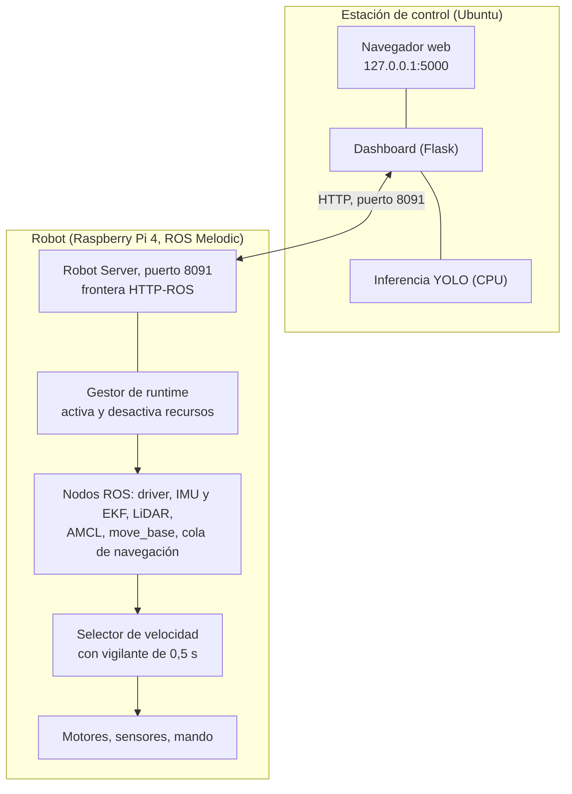

# SafeVision

## Sistema de navegación autónoma para la plataforma móvil ROSMASTER X3

Tecnológico Nacional de México — Instituto Tecnológico de Colima
Departamento de Ingeniería Eléctrica y Electrónica
Ingeniería Mecatrónica — Especialidad en Sistemas Mecatrónicos Inteligentes
Proyecto de Servicio Social en Investigación Tecnológica

---

## Contenido

1. [Propósito del proyecto](#1-propósito-del-proyecto)
2. [Descripción general del sistema](#2-descripción-general-del-sistema)
3. [Estructura del repositorio](#3-estructura-del-repositorio)
4. [Requisitos](#4-requisitos)
5. [Instalación de la estación de control](#5-instalación-de-la-estación-de-control)
6. [El robot](#6-el-robot)
7. [Conectividad entre la estación y el robot](#7-conectividad-entre-la-estación-y-el-robot)
8. [Puesta en marcha](#8-puesta-en-marcha)
9. [Operación](#9-operación)
10. [Normas de seguridad](#10-normas-de-seguridad)
11. [Diagnóstico de fallos](#11-diagnóstico-de-fallos)
12. [Prácticas de laboratorio](#12-prácticas-de-laboratorio)
13. [Información para desarrolladores](#13-información-para-desarrolladores)
14. [Documentación](#14-documentación)
15. [Créditos](#15-créditos)

---

## 1. Propósito del proyecto

### 1.1 Contexto

La especialidad en Sistemas Mecatrónicos Inteligentes de la carrera de Ingeniería
Mecatrónica del Instituto Tecnológico de Colima imparte la asignatura *Percepción e
Inteligencia Artificial*. Su enseñanza requiere una plataforma experimental sobre la que
los estudiantes puedan ejecutar, en condiciones reales, los algoritmos que estudian:
estimación de pose, construcción de mapas, planificación de trayectorias y evasión de
obstáculos.

Antes de este proyecto no existía una plataforma móvil autónoma completamente operativa
para ese fin. El robot Yahboom ROSMASTER X3 estaba disponible, pero sin un sistema
integrado que permitiera operarlo, mantenerlo y utilizarlo en docencia sin conocimiento
previo de su construcción.

### 1.2 Objetivo

Desarrollar e implementar un sistema de navegación autónoma para la plataforma ROSMASTER X3,
integrando sus sensores bajo el middleware ROS, con la finalidad de disponer de un prototipo
funcional para prácticas académicas. El proyecto se define en
`docs/propuesta-servicio-social.md`.

### 1.3 Qué hace el sistema

SafeVision integra el robot y una estación de control (una computadora con Ubuntu) en un
sistema que permite, desde el navegador web:

- pilotar el robot con mando o teclado;
- transmitir el vídeo de su cámara en directo;
- detectar objetos en ese vídeo mediante redes neuronales YOLO;
- construir mapas bidimensionales del entorno mediante SLAM;
- localizar el robot dentro de un mapa;
- enviarlo de forma autónoma a uno o varios puntos, evitando obstáculos;
- programar misiones en un lenguaje propio, validarlas y simularlas antes de ejecutarlas;
- administrar los mapas y los modelos de detección.

La documentación acompaña al sistema con manuales de instalación y operación, un protocolo
de validación y una guía de seis prácticas de laboratorio.

### 1.4 Alcance y limitaciones

El sistema está completo y verificado en su funcionamiento con LiDAR bidimensional. Es
importante conocer dos límites para utilizarlo correctamente:

- **Percepción en un solo plano.** El LiDAR barre un plano horizontal situado a 11 cm del
  suelo. Los obstáculos que no cortan ese plano —el tablero de una mesa con patas finas, un
  escalón, un objeto bajo— no son detectados. El robot lleva montada una cámara RGB-D cuyo
  canal de profundidad permitiría cubrir esos casos; su integración está especificada como
  trabajo futuro en `docs/analisis-alcance.md`.
- **Detección y navegación son independientes.** Las detecciones de YOLO se muestran en
  pantalla pero no modifican el movimiento del robot. Es una decisión de diseño orientada a
  la seguridad: ningún componente remoto ni estadístico cierra el lazo de control.

---

## 2. Descripción general del sistema

### 2.1 Arquitectura

El sistema se organiza en tres capas con una única frontera entre la estación de control y
el robot.



Cuatro principios rigen el diseño:

1. **Una sola frontera.** El dashboard nunca se comunica con ROS directamente; todo pasa
   por la API HTTP del Robot Server.
2. **Los lazos de control permanecen en el robot.** La orden de velocidad, el vigilante que
   detiene el robot ante la ausencia de órdenes, el planificador y la cancelación se ejecutan
   en la Raspberry Pi. Una pérdida de conexión con la estación no compromete la seguridad.
3. **El cómputo pesado permanece en la estación.** La inferencia de redes neuronales se
   ejecuta en la computadora, que dispone de más capacidad que el robot.
4. **Arranque seguro por defecto.** Al encenderse, el robot activa únicamente el ROS Master
   y el Robot Server. Los motores, el LiDAR y la navegación se activan a petición explícita
   del operador mediante un *perfil de runtime*.

La descripción detallada, con el grafo de nodos y tópicos ROS y los flujos de datos de cada
función, se encuentra en `docs/arquitectura.md`.

### 2.2 Hardware

| Componente | Descripción |
|---|---|
| Plataforma móvil | Yahboom ROSMASTER X3, tracción omnidireccional con ruedas mecanum |
| Computadora de a bordo | Raspberry Pi 4, Ubuntu 18.04.6 LTS (aarch64), ROS Melodic |
| LiDAR | RPLIDAR A1, montado a 11 cm del suelo, publicado como `/scan` |
| Cámara | Orbbec Astra Pro (RGB-D); se utiliza su canal RGB |
| Unidad inercial | Integrada en la plataforma, con calibración y filtro de Madgwick |
| Control manual | Mando Xbox 360 por USB |
| Estación de control | Computadora con Ubuntu 22.04 o 24.04; no requiere GPU |

### 2.3 Software

| Componente | Ubicación | Función |
|---|---|---|
| Robot Server | `misiones/pilotada/robot/sf_robot_server.py` | API HTTP del robot: vídeo, mapas, pose, navegación, mapeo, misiones, modelos |
| Gestor de runtime | `misiones/pilotada/robot/sf_runtime_manager.py` | Activa y desactiva los nodos ROS según el perfil solicitado |
| Gestor de mapeo | `misiones/pilotada/robot/sf_mapping_manager.py` | Sesiones de SLAM con transición segura desde y hacia la localización |
| Cola de navegación | `misiones/pilotada/robot/sf_nav_queue.py` | Secuencias de objetivos con validación previa de cada uno |
| Selector de velocidad | `misiones/pilotada/robot/sf_cmd_vel_selector.py` | Arbitra entre control manual y navegación; detiene el robot tras 0,5 s sin órdenes |
| Ejecutor de misiones | `misiones/automatica/robot/sf_mission_executor.py` | Ejecuta las misiones programadas |
| Dashboard | `misiones/pilotada/dashboard_src/` | Interfaz web, inferencia YOLO, editor y simulador de misiones |
| Servicios del sistema | `misiones/pilotada/systemd/` | Arranque automático del robot |

---

## 3. Estructura del repositorio

```
safevision/
├── README.md                      Esta guía
├── CLAUDE.md                      Reglas de trabajo para colaboradores y agentes
├── scripts/                       Instalación y arranque en la estación; utilidades para el robot
│   ├── install_dashboard.sh       Instala el dashboard (una sola vez)
│   ├── run_dashboard.sh           Arranca el dashboard y localiza el robot en la red
│   └── robot.env.example          Plantilla de configuración local
├── misiones/
│   ├── pilotada/
│   │   ├── robot/                 Runtime del robot (Robot Server, gestores, nodos, launch)
│   │   │   └── nav/               Parámetros de navegación
│   │   ├── dashboard_src/         Dashboard de la estación de control
│   │   └── systemd/               Unidades systemd e instalador
│   └── automatica/robot/          Ejecutor de misiones programadas
├── mapping/maps/                  Mapas, en parejas .yaml y .pgm
├── modelos/                       Catálogo de modelos YOLO (los pesos no se versionan)
├── docs/                          Documentación completa (índice en docs/README.md)
│   └── practicas/                 Guía de prácticas de laboratorio P01 a P06
├── api/                           Generación anterior del proyecto; no forma parte del sistema actual
├── auto_mapeo.sh, mapeo_*.sh      Experimentos de mapeo 3D; no integrados
└── grafo/                         Herramienta de análisis del repositorio
```

El sistema actual reside en `misiones/`. El directorio `api/` y los scripts de la raíz
pertenecen a una generación anterior; se conservan porque el robot mantiene referencias a
ellos y su clasificación completa está en `docs/inventory.md`. No deben eliminarse sin
seguir el procedimiento allí descrito.

---

## 4. Requisitos

### 4.1 Estación de control

- Ubuntu 22.04 LTS o 24.04 LTS. Ubuntu 20.04 es válido si dispone de Python 3.8 o superior.
- Python 3.8 o superior, con los paquetes `python3-venv` y `python3-pip`.
- Aproximadamente 3 GB de espacio libre para PyTorch y sus dependencias.
- Conexión a Internet durante la instalación.
- No se requiere tarjeta gráfica.

### 4.2 Robot

El robot se entrega instalado y configurado. Su estado verificado está documentado en
`docs/estado-actual.md`. Para su recuperación o reinstalación, véase la sección 6.

### 4.3 Conocimientos previos

No se requiere conocimiento de ROS para operar el sistema. Para modificarlo, consúltese
la sección 13.

---

## 5. Instalación de la estación de control

El procedimiento completo, con verificación y resolución de incidencias, se encuentra en
`docs/instalacion-pc.md`. Se resume a continuación.

### Paso 1. Instalar los requisitos del sistema

```bash
sudo apt update
sudo apt install -y python3 python3-venv python3-pip git curl
```

### Paso 2. Obtener el repositorio

```bash
git clone https://github.com/ToscanoID007/safevision.git
cd safevision
```

### Paso 3. Ejecutar el instalador

```bash
./scripts/install_dashboard.sh
```

El instalador comprueba la versión de Python, crea un entorno virtual aislado en
`misiones/pilotada/dashboard_src/.venv`, instala PyTorch en su variante para CPU y el resto
de dependencias, y verifica que todos los módulos se importan correctamente antes de dar la
instalación por terminada. La descarga puede tardar entre diez y treinta minutos. El
procedimiento es idempotente: puede repetirse sin efectos adversos.

Si el intérprete `python3` del sistema es anterior a 3.8 pero existe uno más reciente,
indíquese explícitamente:

```bash
PYTHON_BIN=python3.8 ./scripts/install_dashboard.sh
```

Si el instalador informa de que falta `ensurepip`, instálese el paquete que indique
(por ejemplo `sudo apt install -y python3.10-venv`) y repítase la orden.

### Paso 4. Crear la configuración local

```bash
cp scripts/robot.env.example scripts/robot.env
```

El archivo `scripts/robot.env` no se versiona. Por defecto localiza el robot como
`yahboom.local`, lo que funciona sin conocer su dirección IP mientras la estación y el
robot estén en la misma red.

---

## 6. El robot

### 6.1 Estado de la instalación

El robot arranca de forma autónoma al encenderse. Dos unidades de systemd,
`safevision-roscore` y `safevision-robot-server`, activan el ROS Master y el Robot Server
en el puerto 8091. Ambas están instaladas, habilitadas y verificadas.

| Elemento | Valor verificado |
|---|---|
| Sistema operativo | Ubuntu 18.04.6 LTS, arquitectura aarch64 |
| ROS | Melodic Morenia; 451 paquetes instalados (`docs/anexo-ros-melodic.txt`) |
| Intérpretes de Python | 3.7.3 en `/usr/local/bin/python3` para el Robot Server; 2.7.17 para `roscore` y el exportador de pose |
| Repositorio | `/home/pi/robot_custom`, copia de este repositorio |
| Acceso remoto | `ssh pi@yahboom.local` |

La explicación de por qué coexisten varios intérpretes de Python, y por qué uno de los
módulos debe permanecer en Python 2, se encuentra en `docs/anexo-dependencias-robot.md`.

### 6.2 Respaldo de la tarjeta de memoria

La tarjeta microSD del robot constituye un punto único de fallo. Se recomienda crear una
imagen de respaldo mientras el sistema funciona correctamente. El procedimiento completo,
tanto con Raspberry Pi Imager como con `dd`, está en `docs/instalacion-robot.md`, sección 2.
En síntesis, con la tarjeta conectada a la estación mediante un lector:

```bash
lsblk                                  # identificar el dispositivo (por ejemplo /dev/sdb)
sudo dd if=/dev/sdb of=~/safevision-robot-$(date +%F).img bs=4M status=progress conv=fsync
gzip -9 ~/safevision-robot-*.img
```

La restauración consiste en la operación inversa. Debe prestarse especial atención a no
invertir los parámetros `if` y `of`.

### 6.3 Reconstrucción desde cero

`docs/instalacion-robot.md`, sección 3, documenta la reconstrucción del robot sin imagen de
respaldo a partir del manifiesto de dependencias. Ese procedimiento no ha sido validado y
el sistema del robot contiene componentes difíciles de reproducir; la imagen de la tarjeta
es la vía recomendada.

### 6.4 Reinstalación de los servicios

Si las unidades de systemd deben reinstalarse:

```bash
ssh pi@yahboom.local
cd ~/robot_custom
./misiones/pilotada/systemd/install_services.sh
```

El instalador describe las acciones que va a realizar y solicita confirmación.

---

## 7. Conectividad entre la estación y el robot

El robot se utiliza en lugares distintos y no siempre dispone de una red inalámbrica
conocida. El sistema contempla tres situaciones y el robot selecciona automáticamente la
que corresponde. El detalle está en `docs/red.md`.

| Situación | Comportamiento del robot | Acción del operador |
|---|---|---|
| Existe una red Wi-Fi guardada al alcance | Se conecta a ella | Ninguna. `run_dashboard.sh` lo localiza como `yahboom.local` o explorando la red |
| No existe ninguna red conocida | Crea su propia red, `SafeVision-Robot`, y adopta la dirección fija `10.42.0.1` | Conectar la estación a esa red |
| Se ha perdido el acceso inalámbrico | El puerto Ethernet mantiene DHCP | Conectar un cable al robot |

Para añadir una red a la lista de redes conocidas, desde la estación:

```bash
ssh -t pi@yahboom.local 'sudo nmcli dev wifi connect "NOMBRE_DE_LA_RED" --ask'
```

La contraseña se solicita de forma interactiva y no queda registrada en el historial.

**Puertos.** El Robot Server escucha en el puerto 8091 y el ROS Master en el 11311. Ninguno
dispone de autenticación. **No deben exponerse a Internet en ningún caso**; el acceso remoto
debe realizarse exclusivamente a través de una red privada virtual. Véase la sección 10.

---

## 8. Puesta en marcha

Antes de comenzar, léase la sección 10. El robot debe estar en el suelo, en un área
despejada de al menos dos metros por dos, y una persona debe tener el mando a su alcance.

### Paso 1. Encender el robot

Accione el interruptor del ROSMASTER X3 y espere aproximadamente noventa segundos. Durante
ese tiempo la Raspberry Pi arranca, se conecta a la red y activa los servicios.

### Paso 2. Arrancar el dashboard

```bash
cd ~/safevision
./scripts/run_dashboard.sh
```

El script localiza el robot, consulta su estado y muestra la dirección de la interfaz y la
dirección del robot:

```
=======================================================
 Dashboard:  http://127.0.0.1:5000
 Robot:      192.168.1.15
=======================================================
```

### Paso 3. Abrir la interfaz

Abra `http://127.0.0.1:5000` en el navegador. La página inicial muestra el estado del robot
y el vídeo de la cámara.

### Paso 4. Aplicar un perfil de runtime

Tras el arranque, el robot dispone únicamente del ROS Master y del Robot Server. Los motores,
el LiDAR, la localización y la navegación permanecen desactivados hasta que el operador
aplica un perfil. Existen cuatro:

| Perfil | Recursos que activa | Uso |
|---|---|---|
| `libre` | Driver, unidad inercial, selector de velocidad y control manual | Teleoperación sin mapa |
| `pilotada` | Los anteriores, más LiDAR, localización, planificador y cola de navegación | Operación habitual |
| `automatica` | Idéntico a `pilotada` | Ejecución de misiones |
| `mapear` | No se aplica directamente; se activa al iniciar una sesión de mapeo | Construcción de mapas |

Desde el dashboard, en la página *Pilotada*: seleccione el mapa (`HAB2` es el de
referencia) y el tipo de control, y pulse *Aplicar*. La activación comprueba cada recurso
en secuencia y puede tardar hasta dos minutos.

Desde una terminal, el equivalente es:

```bash
curl -X POST http://<DIRECCION-DEL-ROBOT>:8091/runtime/profile \
     -H 'Content-Type: application/json' \
     -d '{"profile":"pilotada","map":"HAB2","control":"mando"}'
```

### Paso 5. Verificar el estado

```bash
curl -s http://<DIRECCION-DEL-ROBOT>:8091/runtime/status | python3 -m json.tool
```

El campo `profile.requested` debe indicar `"pilotada"` y los recursos `driver`, `lidar`,
`localization`, `navigation` y `nav_queue` deben mostrar `"active": true`. El LiDAR es
audible cuando está en funcionamiento.

### Paso 6. Comprobar el control manual

Accione el mando. El robot debe responder, y debe detenerse en menos de medio segundo al
soltarlo.

---

## 9. Operación

Cada procedimiento se describe con sus condiciones previas, pasos, resultado esperado y
acciones ante fallo en `docs/manual-operacion.md`. Esta sección presenta el resumen.

### 9.1 Teleoperación

**Con mando.** Aplique un perfil con `"control":"mando"`. El movimiento requiere mantener
accionado el control de habilitación del mando.

**Con teclado.** Cambie el modo con `POST /runtime/control {"mode":"teclado"}` y utilice
las teclas de la interfaz.

En ambos casos, el robot se mueve únicamente mientras recibe órdenes: el selector de
velocidad publica velocidad nula transcurridos 0,5 s sin recibir una orden válida. Este
mecanismo detiene el robot al soltar el mando y ante cualquier pérdida de comunicación.

### 9.2 Construcción de mapas

El mapeo se realiza pilotando el robot manualmente mientras Gmapping construye el mapa.

1. Aplique un perfil `pilotada` con cualquier mapa existente. El sistema necesita conocer el
   estado al que regresar cuando finalice la sesión.
2. En la página *Mapear*, indique un nombre e inicie la sesión. El sistema desactiva la
   localización y activa Gmapping.
3. Pilote el robot a velocidad reducida, recorriendo primero el perímetro y después el
   interior. Los giros bruscos degradan el resultado; regresar a zonas ya visitadas lo mejora.
4. Guarde el mapa, o descártelo y repita. En ambos casos el sistema restaura automáticamente
   el perfil anterior.

### 9.3 Localización

La navegación requiere que el robot conozca su posición en el mapa. AMCL supone
inicialmente que el robot se encuentra en el origen; si no es así, debe indicarse la pose
inicial.

1. En el mapa de la interfaz, señale la posición real del robot y su orientación. Por
   terminal: `POST /initialpose {"x":…,"y":…,"yaw":…}`, con `yaw` en radianes.
2. Desplace el robot aproximadamente un metro y gírelo. El estimador converge con el
   movimiento, no con el robot detenido.
3. Verifique con `GET /map_pose` que `"localized"` es `true`.

### 9.4 Navegación autónoma

1. Marque uno o varios puntos sobre el mapa de la interfaz.
2. Inicie la navegación. Cada punto se valida previamente mediante el servicio `make_plan`;
   los puntos sin ruta posible se rechazan sin mover el robot.
3. La navegación puede cancelarse en cualquier momento. La cancelación detiene el robot y
   devuelve el control al modo manual.

```bash
curl -X POST $R/nav/queue -H 'Content-Type: application/json' \
     -d '{"map":"HAB2","points":[{"id":"0x001","x":1.0,"y":0.5,"yaw":0.0}]}'
curl -X POST $R/nav/start
curl -X POST $R/nav/cancel
```

### 9.5 Misiones programadas

Las misiones se escriben en un lenguaje de dominio específico con tres acciones:

```python
for vuelta in range(3):
    ir("entrada")
    esperar(2)
    orientar(90)
ir("base")
```

`ir` navega a un punto definido sobre el mapa, identificado por su alias o por su
identificador; `esperar` pausa la ejecución el número de segundos indicado; `orientar`
ajusta la orientación. Se admiten variables, operaciones aritméticas, bucles `for` con
`range` y condicionales.

El flujo, en la página *Programar*, es: definir los puntos, escribir el programa, validar,
simular, guardar, preparar y ejecutar. Ninguna misión se envía al robot sin haber superado
la validación y la simulación. La referencia completa está en `docs/lenguaje-misiones.md`.

Las acciones `girar` y `relocalizar`, presentes en versiones anteriores del lenguaje, no
están implementadas en el ejecutor y han sido retiradas del validador.

### 9.6 Detección de objetos

La detección se activa desde la interfaz sobre el vídeo en directo. La inferencia se
ejecuta en la estación de control. El umbral de confianza es ajustable. Como se indica en la
sección 1.4, las detecciones no influyen en el movimiento del robot.

### 9.7 Gestión de mapas y modelos

Desde las páginas *Mapas* y *Redes* de la interfaz, o mediante la API, pueden listarse,
importarse, exportarse, renombrarse y eliminarse mapas y modelos. Los mapas se editan para
eliminar ruido; el editor conserva una copia previa. Los mapas son parejas de archivos
`.yaml` y `.pgm` que deben mantenerse juntas.

### 9.8 Apagado

1. Cancele cualquier navegación o misión en curso.
2. Cierre o descarte cualquier sesión de mapeo abierta.
3. Aplique el perfil `libre` para desactivar los recursos de movimiento.
4. Apague el sistema operativo: `ssh pi@yahboom.local 'sudo shutdown -h now'`.
5. Espere a que se apaguen los indicadores de actividad y, solo entonces, accione el
   interruptor.

Cortar la alimentación sin apagar el sistema operativo puede corromper la tarjeta de memoria.

---

## 10. Normas de seguridad

### 10.1 Seguridad física

El robot tiene una masa de varios kilogramos y se desplaza de forma autónoma. Las
siguientes normas son de obligado cumplimiento:

1. Operar únicamente en un área despejada de al menos dos metros por dos metros.
2. Mantener siempre a una persona con el mando al alcance; soltarlo detiene el robot en
   medio segundo y constituye la parada de emergencia más rápida.
3. No operar el robot sobre mesas ni superficies elevadas. El LiDAR no detecta bordes.
4. Retirar cables y objetos del área; las ruedas omnidireccionales los arrastran.
5. Avisar en voz alta antes de iniciar una navegación autónoma.
6. No permanecer entre el robot y su objetivo durante la navegación.

Medios de detención, del más rápido al más lento: soltar el mando; botón *Cancelar* de la
interfaz; `POST /nav/cancel`; interrupción de la alimentación.

### 10.2 Seguridad informática

Ningún servicio del sistema implementa autenticación. Cualquier equipo con acceso al puerto
8091 puede activar los motores y mover el robot. En consecuencia:

- No deben abrirse los puertos 8091 ni 11311 en el enrutador.
- El acceso remoto debe realizarse a través de una red privada virtual.
- La red local debe considerarse el único perímetro de seguridad.

El repositorio contiene credenciales históricas que deben renovarse antes de compartirlo.
Consúltese `docs/security-scan.md`.

---

## 11. Diagnóstico de fallos

Las cuatro comprobaciones básicas, con `R=http://<DIRECCION-DEL-ROBOT>:8091`:

```bash
ping -c 3 yahboom.local                                # conectividad
curl -s $R/health | python3 -m json.tool               # estado resumido
curl -s $R/runtime/status | python3 -m json.tool       # estado detallado de cada recurso
ssh pi@yahboom.local 'systemctl status safevision-*'   # servicios del sistema
```

| Síntoma | Causa habitual | Referencia |
|---|---|---|
| `/health` indica `"ok": false` tras el arranque | Comportamiento normal: no se ha aplicado ningún perfil | Sección 8, paso 4 |
| El robot no se mueve aunque el estado es correcto | Sin perfil, o vigilante activo ante órdenes aisladas | `docs/solucion-problemas.md`, sección 2 |
| La interfaz rechaza la dirección como inválida | Solo admite direcciones IPv4 numéricas, no nombres | `run_dashboard.sh` muestra la dirección |
| No se localiza el robot en la red | Cambio de red o de dirección | `docs/red.md`, sección 6 |
| La aplicación del perfil falla en `core` | El robot se movió durante la calibración del giróscopo | Repetir con el robot inmóvil |
| La aplicación del perfil falla en `lidar` | Conexión USB o puerto serie bloqueado por una sesión anterior | `docs/solucion-problemas.md`, sección 4.3 |
| Posición incorrecta en el mapa | Pose inicial errónea o estimador sin converger | Sección 9.3 |
| El robot gira sobre sí mismo sin avanzar | Comportamiento de recuperación del planificador | Cancelar y despejar el área |
| Colisión con un obstáculo no detectado | Obstáculo fuera del plano del LiDAR | Sección 1.4 |

La guía completa de diagnóstico está en `docs/solucion-problemas.md`.

---

## 12. Prácticas de laboratorio

Se proporcionan seis prácticas para la asignatura *Percepción e Inteligencia Artificial*.
Cada una incluye competencia, objetivo, marco teórico, material, normas de seguridad,
procedimiento, resultados a reportar, preguntas de análisis y rúbrica. Son acumulativas y
pueden completarse únicamente con el dashboard.

| Práctica | Título | Duración estimada |
|---|---|---|
| [P01](docs/practicas/P01-arranque-teleoperacion.md) | Arranque, teleoperación y anatomía de un sistema ROS | 2 h |
| [P02](docs/practicas/P02-percepcion-lidar.md) | Percepción con LiDAR: el tópico `/scan` y los mapas de coste | 2 h |
| [P03](docs/practicas/P03-mapeo-slam.md) | Mapeo SLAM con Gmapping | 2 a 3 h |
| [P04](docs/practicas/P04-localizacion-amcl.md) | Localización con AMCL y pose inicial | 2 h |
| [P05](docs/practicas/P05-navegacion-autonoma.md) | Navegación autónoma y evasión de obstáculos | 2 a 3 h |
| [P06](docs/practicas/P06-yolo-misiones.md) | Detección de objetos con YOLO y misiones programadas | 3 h |

La preparación previa del profesor y la rúbrica general se describen en
`docs/practicas/README.md`.

---

## 13. Información para desarrolladores

### 13.1 Interfaz de programación

El Robot Server expone 44 puntos de acceso HTTP, documentados con ejemplos en
`docs/api-robot-server.md`. Los principales:

| Método | Ruta | Función |
|---|---|---|
| GET | `/runtime/status` | Estado detallado de cada recurso |
| POST | `/runtime/profile` | Aplicación de un perfil |
| POST | `/runtime/control`, `/runtime/keyboard` | Cambio de modo de control; teclado web |
| GET | `/video_feed` | Vídeo MJPEG |
| POST | `/initialpose` | Pose inicial |
| GET | `/map_pose` | Pose actual |
| POST | `/nav/queue`, `/nav/start`, `/nav/cancel` | Navegación |
| POST | `/mapping/session/start`, `/save`, `/discard` | Mapeo |
| POST | `/mission/prepare`, `/start`, `/cancel` | Misiones |
| GET, POST, PUT, DELETE | `/maps`, `/models` | Catálogos |

### 13.2 Ramas del repositorio

`wip-handoff` es la rama de trabajo. Las ramas siguientes contienen trabajo terminado que,
conforme a las reglas del proyecto, se incorpora a `wip-handoff` únicamente tras su
validación en el robot.

| Rama | Contenido | Estado de verificación |
|---|---|---|
| `feature/red-autonoma-robot` | Conectividad autónoma: red conocida o punto de acceso propio | Verificada en el robot e instalada en él |
| `feature/dashboard-runtime-profiles` | Dashboard con aplicación de perfiles desde la interfaz | Arranque y servicio verificados; pendiente la aplicación de un perfil con el robot en el suelo |
| `chore/robot-alias` | Desactivación de alias heredados que interfieren con el runtime | Aplicada en el robot |
| `fix/dsl-acciones` | Retirada de `girar` y `relocalizar` del validador | Verificada localmente |
| `chore/mapas` | Depuración del catálogo de mapas | — |
| `docs/migracion-wifi`, `chore/empaquetado` | Documentación | — |

Para incorporar todas ellas a una copia local:

```bash
git checkout wip-handoff
for b in feature/red-autonoma-robot feature/dashboard-runtime-profiles chore/robot-alias \
         fix/dsl-acciones chore/mapas docs/migracion-wifi chore/empaquetado; do
  git merge --no-ff origin/$b -m "merge: $b"
done
```

### 13.3 Reglas de trabajo

- Cada cambio se desarrolla en su propia rama y aborda un único aspecto. No se realizan
  cambios directos sobre `wip-handoff` ni sobre `master`.
- Los parámetros de navegación en `misiones/pilotada/robot/nav/` permanecen congelados
  hasta disponer de una línea base medida en hardware.
- El módulo `sf_pose_exporter.py` debe permanecer en Python 2: depende de la biblioteca
  `tf`, cuya extensión nativa está compilada únicamente para esa versión.
- El contenido de `api/` no se elimina sin aplicar los criterios de `docs/inventory.md`.
- El alcance del proyecto excluye expresamente la infraestructura en la nube, la
  contenerización y la refactorización del código existente.
- Toda afirmación sobre el comportamiento del sistema se etiqueta con su grado de certeza:
  confirmado, implementado pendiente de revalidación, o recomendación.

Las reglas completas se encuentran en `CLAUDE.md`.

---

## 14. Documentación

El índice completo, con rutas de lectura según el perfil del lector, está en
[`docs/README.md`](docs/README.md).

| Documento | Contenido |
|---|---|
| [`docs/instalacion-pc.md`](docs/instalacion-pc.md) | Instalación de la estación de control |
| [`docs/instalacion-robot.md`](docs/instalacion-robot.md) | Respaldo, restauración y reconstrucción del robot |
| [`docs/red.md`](docs/red.md) | Conectividad, escenarios de red y diagnóstico |
| [`docs/manual-operacion.md`](docs/manual-operacion.md) | Manual técnico de operación |
| [`docs/solucion-problemas.md`](docs/solucion-problemas.md) | Diagnóstico de fallos |
| [`docs/lenguaje-misiones.md`](docs/lenguaje-misiones.md) | Referencia del lenguaje de misiones |
| [`docs/api-robot-server.md`](docs/api-robot-server.md) | Referencia de la API |
| [`docs/arquitectura.md`](docs/arquitectura.md) | Arquitectura, grafo ROS y flujos de datos |
| [`docs/runtime-boot.md`](docs/runtime-boot.md) | Secuencia de arranque del runtime |
| [`docs/estado-actual.md`](docs/estado-actual.md) | Estado verificado del robot |
| [`docs/anexo-dependencias-robot.md`](docs/anexo-dependencias-robot.md) | Manifiesto de dependencias |
| [`docs/practicas/`](docs/practicas/) | Guía de prácticas de laboratorio |
| [`docs/validacion.md`](docs/validacion.md) | Protocolo de validación |
| [`docs/reporte-final.md`](docs/reporte-final.md) | Reporte técnico final |
| [`docs/analisis-alcance.md`](docs/analisis-alcance.md) | Análisis del alcance frente a la propuesta |
| [`docs/security-scan.md`](docs/security-scan.md) | Auditoría de seguridad |
| [`docs/inventory.md`](docs/inventory.md) | Inventario del código de la generación anterior |
| [`docs/propuesta-servicio-social.md`](docs/propuesta-servicio-social.md) | Propuesta original del proyecto |
| [`docs/handoff-2026-09.md`](docs/handoff-2026-09.md) | Documento técnico de transferencia |

---

## 15. Créditos

**Institución:** Tecnológico Nacional de México — Instituto Tecnológico de Colima
**Departamento:** Ingeniería Eléctrica y Electrónica
**Carrera:** Ingeniería Mecatrónica, Especialidad en Sistemas Mecatrónicos Inteligentes
**Asignatura destinataria:** Percepción e Inteligencia Artificial
**Modalidad:** Servicio Social en Investigación Tecnológica

**Desarrollo:** [PENDIENTE: nombres de los prestadores de servicio social]
**Asesor responsable:** [PENDIENTE: nombre del profesor responsable]
**Periodo:** [PENDIENTE: fechas de inicio y término]

El código base de la plataforma (`yahboomcar_ws`) es material del fabricante Yahboom y no
forma parte de este repositorio.
