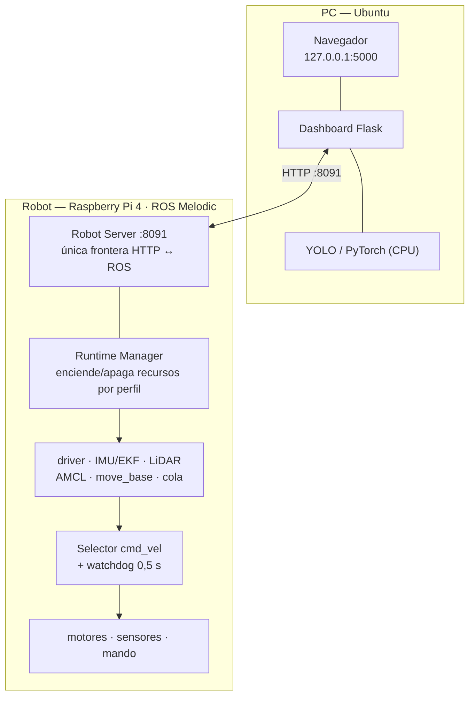

# SafeVision

### Sistema de navegación autónoma para plataforma móvil ROSMASTER X3

**Tecnológico Nacional de México — Instituto Tecnológico de Colima**
Departamento de Ingeniería Eléctrica y Electrónica · Ingeniería Mecatrónica
Especialidad en Sistemas Mecatrónicos Inteligentes · Servicio Social en Investigación Tecnológica

---

SafeVision convierte un robot móvil Yahboom ROSMASTER X3 en una **plataforma de prácticas
de robótica móvil**. Desde el navegador de tu PC puedes pilotarlo, construir un mapa del
entorno (SLAM), localizarlo en ese mapa, mandarlo solo a los puntos que marques, ver lo que
detecta con YOLO y ejecutar misiones escritas en un lenguaje propio.

Todo el control crítico vive **en el robot**. La PC observa y ordena; si el Wi-Fi se cae, el
robot sigue navegando y frenando por su cuenta.

> Esta guía está escrita para alguien que **no sabe nada del proyecto**. Sigue las secciones
> en orden la primera vez. Cada sección enlaza al documento detallado cuando lo hay.

---

## Índice

1. [Qué necesitas](#1-qué-necesitas)
2. [Cómo está organizado el repositorio](#2-cómo-está-organizado-el-repositorio)
3. [Instalación en la PC](#3-instalación-en-la-pc)
4. [El robot: cómo está instalado y cómo recuperarlo](#4-el-robot-cómo-está-instalado-y-cómo-recuperarlo)
5. [Red: cómo se encuentran la PC y el robot](#5-red-cómo-se-encuentran-la-pc-y-el-robot)
6. [Primer arranque, paso a paso](#6-primer-arranque-paso-a-paso)
7. [Usar cada herramienta](#7-usar-cada-herramienta)
8. [Seguridad](#8-seguridad)
9. [Cuando algo falla](#9-cuando-algo-falla)
10. [Prácticas de laboratorio](#10-prácticas-de-laboratorio)
11. [Para desarrolladores: arquitectura, API y ramas](#11-para-desarrolladores-arquitectura-api-y-ramas)
12. [Toda la documentación](#12-toda-la-documentación)
13. [Créditos](#13-créditos)

---

## 1. Qué necesitas

### Hardware

| Componente | Modelo | Estado |
|---|---|---|
| Plataforma | Yahboom **ROSMASTER X3** (tracción omnidireccional, ruedas mecanum) | ✅ |
| Computadora del robot | Raspberry Pi 4 · Ubuntu 18.04.6 `aarch64` · ROS Melodic | ✅ ya instalado |
| LiDAR | RPLIDAR A1 (`/dev/rplidar`) | ✅ integrado |
| Cámara | Orbbec **Astra Pro** RGB-D | ✅ canal RGB en uso · ⏳ profundidad pendiente |
| IMU | Integrada, con calibración y filtro de Madgwick | ✅ |
| Mando | Xbox 360 por USB (`/dev/input/js0`) | ✅ |
| **Tu PC** | Ubuntu 22.04 o 24.04, Python ≥ 3.8, ~3 GB libres | la instalas tú (§3) |

No hace falta GPU: la inteligencia artificial corre en la CPU de la PC.

### Conocimientos

Ninguno de ROS para **usar** el sistema. Para modificarlo, la §11 y `docs/arquitectura.md`.

---

## 2. Cómo está organizado el repositorio

```
safevision/
├── README.md                     ← esta guía
├── scripts/                      ← instalación y arranque (PC) y utilidades para el robot
│   ├── install_dashboard.sh      ← instala el dashboard en la PC (una vez)
│   ├── run_dashboard.sh          ← arranca el dashboard y encuentra el robot solo
│   └── robot.env.example         ← plantilla de configuración local
├── misiones/
│   ├── pilotada/
│   │   ├── robot/                ← RUNTIME DEL ROBOT: Robot Server, gestores, nodos, .launch
│   │   │   └── nav/              ← parámetros de navegación (congelados hasta validar)
│   │   ├── dashboard_src/        ← DASHBOARD de la PC (Flask + YOLO)
│   │   └── systemd/              ← servicios que arrancan el robot solo + instalador
│   └── automatica/robot/         ← ejecutor de misiones programadas
├── mapping/maps/                 ← mapas: parejas .yaml + .pgm
├── modelos/                      ← catálogo de modelos YOLO (los pesos no se versionan)
├── docs/                         ← TODA la documentación (índice en docs/README.md)
│   └── practicas/                ← seis prácticas de laboratorio P01–P06
├── api/                          ← 🕰️ generación ANTERIOR: menús de terminal, dashboard por SSH
├── auto_mapeo.sh, mapeo_*.sh …   ← 🕰️ experimentos 3D, no integrados
└── grafo/                        ← herramienta de análisis del repositorio
```

**Las dos carpetas que importan** son `misiones/pilotada/robot/` (lo que corre en el robot)
y `misiones/pilotada/dashboard_src/` (lo que corre en tu PC). Todo lo demás es datos,
documentación o historia.

> 🕰️ **`api/` y los scripts `.sh` de la raíz no participan del sistema actual**, pero
> tampoco son código muerto: 13 alias del `.bashrc` del robot los invocan. No borres nada
> de ahí sin leer `docs/inventory.md`.

---

## 3. Instalación en la PC

Cuatro órdenes. Detalle y solución de problemas en `docs/instalacion-pc.md`.

```bash
# 1. Requisitos del sistema (Ubuntu)
sudo apt update && sudo apt install -y python3 python3-venv python3-pip git curl

# 2. Clonar
git clone https://github.com/ToscanoID007/safevision.git
cd safevision

# 3. Instalar (crea un entorno aislado; tarda 10-30 min por PyTorch)
./scripts/install_dashboard.sh

# 4. Configurar la dirección del robot
cp scripts/robot.env.example scripts/robot.env
```

El instalador comprueba tu Python, crea `.venv` dentro de `dashboard_src/`, instala PyTorch
para CPU y el resto de dependencias, y **verifica que todo se importa** antes de decir que
terminó. Es idempotente: puedes repetirlo.

**Si tu `python3` es anterior a 3.8** (Ubuntu 18.04 trae 3.6) pero tienes otro instalado:

```bash
PYTHON_BIN=python3.8 ./scripts/install_dashboard.sh
```

**Si dice que falta `ensurepip`:** `sudo apt install -y python3.10-venv` (o la versión que
indique) y repite.

---

## 4. El robot: cómo está instalado y cómo recuperarlo

**Normalmente no tienes que hacer nada.** El robot ya viene instalado y arranca solo al
encenderlo: dos servicios systemd levantan el ROS Master y el Robot Server (puerto 8091).

Lo que hay dentro, verificado en el robot (`docs/estado-actual.md`):

| Elemento | Valor |
|---|---|
| Sistema | Ubuntu 18.04.6 LTS, `aarch64`, kernel 5.4 |
| ROS | Melodic, 451 paquetes (`docs/anexo-ros-melodic.txt`) |
| Python | tres intérpretes; el Robot Server usa `/usr/local/bin/python3` = 3.7.3 |
| Repositorio | `/home/pi/robot_custom` (este mismo repo) |
| Acceso | `ssh pi@yahboom.local` |

### Si la tarjeta se estropea o quieres un segundo robot

**Haz una imagen de la microSD hoy**, con el robot funcionando, no el día del desastre:

```bash
# En la PC, con la microSD del robot en un lector (cambia /dev/sdX por TU dispositivo)
lsblk
sudo dd if=/dev/sdX of=~/safevision-robot-$(date +%F).img bs=4M status=progress conv=fsync
gzip -9 ~/safevision-robot-*.img
```

Restaurar es el mismo `dd` al revés. Procedimiento completo, con Raspberry Pi Imager y los
avisos de `if=`/`of=`, en **`docs/instalacion-robot.md`** §2.

La reconstrucción desde cero (sin imagen) está documentada en el mismo fichero, §3, con el
manifiesto de dependencias — pero **no está validada** y el robot tiene piezas frágiles
(un Python compilado a mano, tres espacios de trabajo catkin, reglas `udev`). La imagen es
la vía.

### Reinstalar sólo los servicios

```bash
ssh pi@yahboom.local
cd ~/robot_custom && ./misiones/pilotada/systemd/install_services.sh
```

Muestra lo que va a hacer y pide confirmación.

---

## 5. Red: cómo se encuentran la PC y el robot

Hay **tres escenarios** y el robot elige solo en cuál está. Detalle en `docs/red.md`.

```
Enciendes el robot
   │
   ├─ ¿Hay una red Wi-Fi conocida?  →  se conecta.  La PC lo encuentra como yahboom.local
   │                                    (o run_dashboard.sh barre la red y te da la IP)
   │
   └─ ¿No hay ninguna?              →  crea su PROPIA red:   SafeVision-Robot
                                        y queda SIEMPRE en:  10.42.0.1
```

| Escenario | Qué haces |
|---|---|
| **Laboratorio o casa** (red guardada) | Nada. `./scripts/run_dashboard.sh` lo encuentra |
| **Sitio nuevo sin Wi-Fi** | Conecta la PC a la red `SafeVision-Robot`. El robot está en `10.42.0.1` |
| **Te quedaste fuera** | Cable Ethernet PC↔robot o robot↔módem. `eth0` siempre tiene DHCP |

**Añadir una red nueva para que la recuerde** (te pide la clave sin dejarla en el historial):

```bash
ssh -t pi@yahboom.local 'sudo nmcli dev wifi connect "NOMBRE_DE_LA_RED" --ask'
```

> ⚠️ **Regla que no se negocia:** nunca expongas los puertos **8091** ni **11311** a
> Internet. Ningún servicio tiene autenticación; quien alcance 8091 puede mover el robot.
> Acceso remoto sólo por VPN. Ver §8.

> 📌 La red autónoma vive en la rama `feature/red-autonoma-robot`, ya instalada y probada en
> el robot. Ver §11.3 para el estado de las ramas.

---

## 6. Primer arranque, paso a paso

**Antes de nada:** robot **en el suelo**, área despejada de 2×2 m, mando a mano. Ver §8.

```bash
# 1. Enciende el robot. Espera 90 segundos.

# 2. Arranca el dashboard en la PC
cd ~/safevision
./scripts/run_dashboard.sh
```

El script resuelve la dirección del robot, consulta su salud y te muestra algo así:

```
=======================================================
 Dashboard:  http://127.0.0.1:5000
 Robot:      192.168.1.15
=======================================================
```

```bash
# 3. Abre en el navegador
http://127.0.0.1:5000
```

**4. Deja el robot operable.** Recién encendido, el robot tiene ROS y el Robot Server, pero
**ni motores, ni LiDAR, ni navegación**. Es el diseño: no se mueve hasta que alguien lo
pide. Hay que **aplicar un perfil**:

- **Desde el dashboard** (rama `feature/dashboard-runtime-profiles`): página
  **Pilotada** → mapa `HAB2` → control `mando` → **Aplicar**. Tarda hasta 2 minutos.
- **Desde la terminal** (siempre funciona):

```bash
curl -X POST http://<IP-ROBOT>:8091/runtime/profile \
     -H 'Content-Type: application/json' \
     -d '{"profile":"pilotada","map":"HAB2","control":"mando"}'
```

**5. Comprueba:**

```bash
curl -s http://<IP-ROBOT>:8091/runtime/status | python3 -m json.tool | head -40
```

Debe decir `"requested": "pilotada"` y `driver`, `lidar`, `localization`, `navigation`,
`nav_queue` en `"active": true`. Oirás girar el LiDAR.

**6. Mueve el joystick.** El robot responde; al soltarlo, se para en medio segundo.

> Los perfiles son `libre` (sólo teleoperación), `pilotada` (todo: LiDAR, mapa, navegación),
> `automatica` (igual, para misiones) y `mapear` (se entra desde la sesión de mapeo).

---

## 7. Usar cada herramienta

Cada procedimiento, con precondiciones, pasos, resultado esperado y qué hacer si falla, está
en **`docs/manual-operacion.md`**. Aquí, la vista rápida.

### 7.1 Teleoperación

| Con | Cómo |
|---|---|
| **Mando** | Perfil con `"control":"mando"`. Gatillo de habilitación + joystick |
| **Teclado web** | `POST /runtime/control {"mode":"teclado"}` y las teclas del dashboard |

El robot **sólo se mueve mientras recibe órdenes**: un *watchdog* lo detiene a los 0,5 s sin
señal. Suelta el mando y se para. Se cae el Wi-Fi y se para.

### 7.2 Mapear una sala (SLAM)

Se hace **pilotando el robot a mano** con Gmapping construyendo el mapa en vivo.

1. Aplica un perfil `pilotada` con un mapa cualquiera (el sistema necesita saber a dónde volver).
2. Dashboard → **Mapear** → nombre → **Iniciar**. O: `POST /mapping/session/start {"name":"lab"}`.
3. Pilota **despacio**, pegado a las paredes primero, cierra bucles.
4. **Guardar** (o **Descartar** y repetir). El sistema vuelve solo al perfil anterior con el mapa nuevo.

Consejos y defectos típicos: `docs/manual-operacion.md` §6 y la práctica P03.

### 7.3 Localizar el robot en el mapa

**Obligatorio antes de navegar.** AMCL arranca suponiendo que el robot está en el origen del
mapa.

1. Dashboard → mapa → clic donde está el robot y arrastra para la orientación.
   O: `POST /initialpose {"x":0,"y":0,"yaw":0}` (yaw en radianes).
2. **Teleopera un metro y gira un poco.** AMCL converge con movimiento, no parado.
3. `GET /map_pose` → `"localized": true`.

### 7.4 Navegar por puntos

1. Marca uno o varios puntos en el mapa del dashboard.
2. **Iniciar.** Cada punto se valida antes (`make_plan`): si no hay ruta, se rechaza sin mover el robot.
3. **Cancelar** en cualquier momento: el robot se detiene y vuelve a manual.

```bash
curl -X POST $R/nav/queue -H 'Content-Type: application/json' \
     -d '{"map":"HAB2","points":[{"id":"0x001","x":1.0,"y":0.5,"yaw":0.0}]}'
curl -X POST $R/nav/start
curl -X POST $R/nav/cancel        # PARAR
```

El LiDAR barre **un plano a 11 cm del suelo**: el robot no ve mesas altas, escalones ni
objetos bajos. Despeja el área.

### 7.5 Misiones programadas

Un lenguaje de tres acciones, validado y simulado en la PC antes de llegar al robot:

```python
for vuelta in range(3):
    ir("entrada")        # navega a un punto (por alias o id 0x001)
    esperar(2)           # segundos
    orientar(90)         # ángulo
ir("base")
```

Flujo en el dashboard, página **Programar**: definir puntos → escribir → **Validar** →
**Simular** → **Guardar** → **Preparar** → **Ejecutar**. Referencia completa en
`docs/lenguaje-misiones.md`.

> `girar()` y `relocalizar()` **no existen**: el ejecutor nunca las implementó. En la rama
> `fix/dsl-acciones` el validador las rechaza con un mensaje claro.

### 7.6 Detección de objetos (YOLO)

Se activa en el dashboard sobre el vídeo. La inferencia corre **en la PC**. Ajusta el umbral
de confianza. **La detección no frena al robot**: dibuja, no actúa — es una decisión de
diseño, no un olvido.

### 7.7 Gestionar mapas y modelos

Todo desde el dashboard (páginas **Mapas** y **Redes**) o por API:

| Mapas | Modelos |
|---|---|
| listar, ver, renombrar, duplicar, exportar `.zip`, importar, **editar** (borrar ruido), borrar | listar, importar `.zip` (pesos + `.json`), renombrar, editar metadatos, exportar, borrar |

Los mapas son parejas `.yaml` + `.pgm`; nunca las separes. Referencia:
`docs/api-robot-server.md`.

### 7.8 Apagar

```bash
curl -X POST $R/nav/cancel; curl -X POST $R/mission/cancel
curl -X POST $R/runtime/profile -H 'Content-Type: application/json' -d '{"profile":"libre"}'
ssh pi@yahboom.local 'sudo shutdown -h now'
# espera a que se apaguen los LED y ENTONCES corta el interruptor
```

> Cortar la alimentación sin apagar corrompe la microSD.

---

## 8. Seguridad

> ⚠️ **El robot pesa varios kilos y se mueve solo.**

| Regla | Por qué |
|---|---|
| **Área despejada de 2×2 m** | Un objetivo mal puesto lo lanza en línea recta |
| **Siempre alguien con el mando** | Es la parada de emergencia: 0,5 s |
| **Nunca sobre una mesa** | El LiDAR no ve el borde. Se cae |
| **Avisa en voz alta** antes de iniciar navegación | Quien esté cerca debe saberlo |
| **Cables recogidos, nadie en el área** | Ruedas omnidireccionales + LiDAR que ve piernas tarde |

**Cómo parar, de más rápido a más lento:** soltar el mando → botón Cancelar → `POST /nav/cancel` → quitar la alimentación.

**Seguridad informática:** ningún servicio tiene autenticación. La red local es la única
frontera. **Nunca** abras 8091 ni 11311 en el router; acceso remoto sólo por VPN.
Hay credenciales históricas publicadas en este repositorio que **deben rotarse**:
lee `docs/security-scan.md` antes de compartir nada.

---

## 9. Cuando algo falla

Los cuatro comandos de diagnóstico, con `R=http://<IP-ROBOT>:8091`:

```bash
ping -c 3 yahboom.local                                # ¿está en la red?
curl -s $R/health | python3 -m json.tool               # ¿responde?
curl -s $R/runtime/status | python3 -m json.tool       # ¿qué está encendido?  ← el útil
ssh pi@yahboom.local 'systemctl status safevision-*'   # ¿y los servicios?
```

| Síntoma | Casi siempre es | Ve a |
|---|---|---|
| `/health` dice `"ok": false` recién encendido | **Normal**: no hay perfil aplicado | §6 paso 4 |
| No se mueve, todo parece bien | Sin perfil, o *watchdog* (órdenes sueltas) | `docs/solucion-problemas.md` §2 |
| `"IP inválida"` en el dashboard | Escribiste `yahboom.local`; sólo acepta IPv4 | `run_dashboard.sh` te da el número |
| No encuentro el robot | Cambió de red / IP | `docs/red.md` §6 |
| Perfil falla en `core` | **Moviste el robot** al arrancar (calibra el giróscopo) | reintenta quieto |
| Perfil falla en `lidar` | USB flojo, o puerto bloqueado por sesión anterior | `docs/solucion-problemas.md` §4.3 |
| Cree estar donde no está | Pose inicial mal, o AMCL sin converger | teleopera un metro |
| Gira sobre sí mismo | *Recovery*: se cree bloqueado | cancela, despeja |
| Chocó con algo que "no vio" | Obstáculo fuera del plano del LiDAR | `docs/analisis-alcance.md` §4 |
| Todo murió tras teclear `mapeo_denso` | Alias heredado que mata `roscore` | ya desactivados; `docs/solucion-problemas.md` §10.1 |

Guía completa síntoma → causa → solución: **`docs/solucion-problemas.md`**.

---

## 10. Prácticas de laboratorio

Seis prácticas acumulativas para la asignatura **Percepción e Inteligencia Artificial**,
con competencia, marco teórico, procedimiento, resultados a reportar, preguntas de análisis y
rúbrica. Se completan sólo con el dashboard; los apartados con SSH son ampliación.

| # | Práctica | Duración |
|---|---|---|
| [P01](docs/practicas/P01-arranque-teleoperacion.md) | Arranque, teleoperación y anatomía de un sistema ROS | 2 h |
| [P02](docs/practicas/P02-percepcion-lidar.md) | Percepción con LiDAR: `/scan` y costmaps — y sus límites | 2 h |
| [P03](docs/practicas/P03-mapeo-slam.md) | Mapeo SLAM con Gmapping | 2-3 h |
| [P04](docs/practicas/P04-localizacion-amcl.md) | Localización con AMCL y pose inicial | 2 h |
| [P05](docs/practicas/P05-navegacion-autonoma.md) | Navegación autónoma y evasión de obstáculos | 2-3 h |
| [P06](docs/practicas/P06-yolo-misiones.md) | Detección con YOLO y misiones programadas | 3 h |

Índice, preparación del profesor y rúbrica general: **`docs/practicas/README.md`**.

---

## 11. Para desarrolladores: arquitectura, API y ramas

### 11.1 Arquitectura en una imagen



Cuatro decisiones que sostienen el diseño y **no deben romperse** (`CLAUDE.md`):
una sola frontera HTTP↔ROS; los lazos críticos (`cmd_vel`, *watchdog*, `move_base`,
cancelación) siempre en el robot; la IA en la PC; una sola captura de cámara compartida.

Detalle, grafo ROS real y flujos de datos: **`docs/arquitectura.md`**. Cómo arranca el
runtime, paso a paso: `docs/runtime-boot.md`.

### 11.2 API del Robot Server

44 endpoints en `http://<IP-ROBOT>:8091`, documentados con ejemplos reales en
**`docs/api-robot-server.md`**. Los que más se usan:

| Método | Ruta | Para qué |
|---|---|---|
| GET | `/health`, `/runtime/status` | estado (el segundo es el fiable) |
| POST | `/runtime/profile` | **encender el robot** (`libre`/`pilotada`/`automatica`) |
| POST | `/runtime/control`, `/runtime/keyboard` | mando ↔ teclado; teclado web |
| GET | `/video_feed` | MJPEG |
| POST | `/initialpose` · GET `/map_pose` | localización |
| POST | `/nav/queue`, `/nav/start`, `/nav/cancel` | navegación |
| POST | `/mapping/session/start|save|discard` | mapeo |
| POST | `/mission/prepare|start|cancel` | misiones |
| GET/POST | `/maps…`, `/models…` | catálogos |

### 11.3 Estado de las ramas — léelo antes de clonar

`wip-handoff` es la rama de trabajo. `master` es histórica. Las siguientes ramas están
**terminadas y empujadas, pero sin fusionar** hasta que su prueba en hardware se confirme
(regla del proyecto: a `wip-handoff` sólo llega lo validado):

| Rama | Qué aporta | Verificación |
|---|---|---|
| `feature/red-autonoma-robot` | Red autónoma: Wi-Fi conocida o punto de acceso propio en `10.42.0.1` | ✅ **probada en el robot** (AP, vigilante, reinicio) y ya instalada en él |
| `feature/dashboard-runtime-profiles` | El dashboard real: página **Pilotada** con aplicación de perfiles; `run_dashboard.sh` con descubrimiento automático | ✅ arranca y sirve `/pilotada`; ⏳ falta la prueba V-1 (aplicar perfil con el robot en el suelo) |
| `chore/robot-alias` | Desactiva los 4 alias del robot que rompen el runtime | ✅ aplicado en el robot |
| `fix/dsl-acciones` | El validador rechaza `girar()`/`relocalizar()` al escribir | ✅ probado localmente |
| `chore/mapas` | Catálogo de mapas depurado: sólo `HAB2` | trivial |
| `docs/migracion-wifi` · `chore/empaquetado` | Documentación | — |

Para tener **todo** en tu clon:

```bash
git checkout wip-handoff
for b in feature/red-autonoma-robot feature/dashboard-runtime-profiles chore/robot-alias \
         fix/dsl-acciones chore/mapas docs/migracion-wifi chore/empaquetado; do
  git merge --no-ff origin/$b -m "merge: $b"
done
```

**[PENDIENTE: fusionar tras la prueba V-1 y retirar esta sección.]**

### 11.4 Reglas de trabajo

- Una rama por cambio, **un eje a la vez**. Nunca directo a `wip-handoff` ni `master`.
- Los parámetros de navegación (`robot/nav/*.yaml`) están **congelados** hasta tener línea base medida.
- `sf_pose_exporter.py` **debe** seguir en Python 2: `tf` arrastra una extensión C de Python 2.
- Nada de `api/` se borra sin seguir `docs/inventory.md`.
- Sin nube, sin contenedores, sin refactor: fuera del alcance por decisión del profesor.
- Todo en español. Las afirmaciones sobre comportamiento llevan etiqueta de certeza
  (`CONFIRMADO` / `PENDIENTE DE REVALIDACIÓN` / `RECOMENDACIÓN`).

Guía completa para agentes y colaboradores: **`CLAUDE.md`**.

---

## 12. Toda la documentación

Índice con rutas de lectura por perfil: **[`docs/README.md`](docs/README.md)**.

| Quiero… | Documento |
|---|---|
| Instalar la PC | [`docs/instalacion-pc.md`](docs/instalacion-pc.md) |
| Recuperar o reconstruir el robot | [`docs/instalacion-robot.md`](docs/instalacion-robot.md) |
| Entender la red y sus tres escenarios | [`docs/red.md`](docs/red.md) |
| **Operar el robot** | [`docs/manual-operacion.md`](docs/manual-operacion.md) |
| Arreglar algo | [`docs/solucion-problemas.md`](docs/solucion-problemas.md) |
| Escribir misiones | [`docs/lenguaje-misiones.md`](docs/lenguaje-misiones.md) |
| Ver los 44 endpoints | [`docs/api-robot-server.md`](docs/api-robot-server.md) |
| Entender cómo funciona por dentro | [`docs/arquitectura.md`](docs/arquitectura.md), [`docs/runtime-boot.md`](docs/runtime-boot.md) |
| Saber qué hay instalado de verdad | [`docs/estado-actual.md`](docs/estado-actual.md), [`docs/anexo-dependencias-robot.md`](docs/anexo-dependencias-robot.md) |
| Dar clase | [`docs/practicas/`](docs/practicas/) |
| Validar el sistema | [`docs/validacion.md`](docs/validacion.md) — 87 pruebas rellenables |
| Leer el reporte final | [`docs/reporte-final.md`](docs/reporte-final.md) |
| Ver qué falta frente a la propuesta | [`docs/analisis-alcance.md`](docs/analisis-alcance.md) |
| Revisar la seguridad | ⚠️ [`docs/security-scan.md`](docs/security-scan.md) |
| Saber qué es `api/` | [`docs/inventory.md`](docs/inventory.md) |
| El handoff técnico original | [`docs/handoff-2026-09.md`](docs/handoff-2026-09.md) |

---

## 13. Créditos

**Institución:** Tecnológico Nacional de México — Instituto Tecnológico de Colima
**Departamento:** Ingeniería Eléctrica y Electrónica
**Carrera:** Ingeniería Mecatrónica — Especialidad en Sistemas Mecatrónicos Inteligentes
**Asignatura destinataria:** Percepción e Inteligencia Artificial
**Modalidad:** Servicio Social en Investigación Tecnológica (6 meses, 2 prestadores)

- **Desarrollo:** `[PENDIENTE: nombres de los prestadores de servicio social]`
- **Asesor responsable:** `[PENDIENTE: nombre del profesor responsable]`
- **Periodo:** `[PENDIENTE: fechas de inicio y término]`

El código base de la plataforma (`yahboomcar_ws`) es material del fabricante **Yahboom** y
no forma parte de este repositorio.
