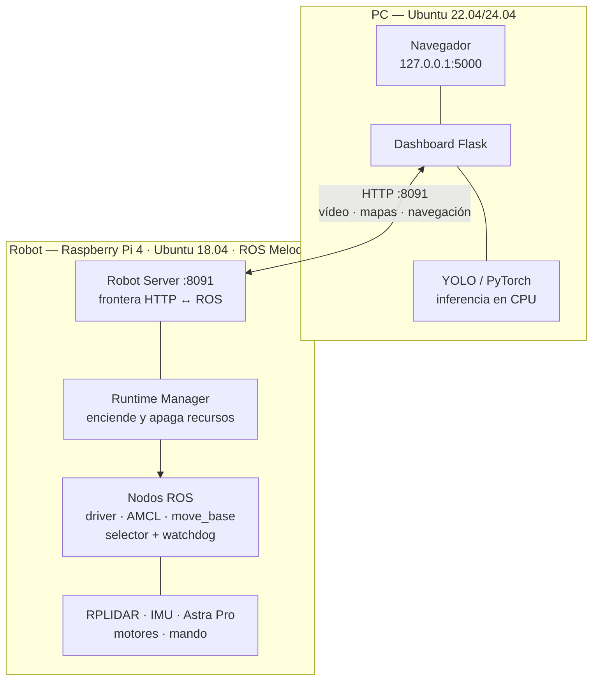

# SafeVision

### Sistema de navegación autónoma para plataforma móvil ROSMASTER X3

**Tecnológico Nacional de México — Instituto Tecnológico de Colima**
Departamento de Ingeniería Eléctrica y Electrónica · Ingeniería Mecatrónica
Especialidad en Sistemas Mecatrónicos Inteligentes
Proyecto de Servicio Social en Investigación Tecnológica

---

SafeVision convierte un robot móvil Yahboom ROSMASTER X3 en una **plataforma de prácticas
de robótica móvil**: se pilota desde el navegador, construye mapas del entorno por SLAM, se
localiza en ellos, navega solo hasta los puntos que le marques, detecta objetos con YOLO y
ejecuta misiones programadas en un lenguaje propio.

Todo el control crítico vive **en el robot**. El dashboard observa y ordena, pero si la red
se cae, el robot sigue navegando y frenando por su cuenta.

---

## Inicio rápido

```bash
git clone https://github.com/ToscanoID007/safevision.git && cd safevision
./scripts/install_dashboard.sh        # crea el entorno e instala dependencias
cp scripts/robot.env.example scripts/robot.env
# Enciende el robot y espera ~90 s
./scripts/run_dashboard.sh            # abre http://127.0.0.1:5000
# Escribe en la interfaz la IP que imprime el script
# Y deja el robot operable (tarda hasta 2 min):
curl -X POST http://<IP-ROBOT>:8091/runtime/profile \
     -H 'Content-Type: application/json' \
     -d '{"profile":"pilotada","map":"HAB2","control":"mando"}'
```

> ⚠️ **Ese último paso no se puede saltar.** Al encenderse, el robot levanta sólo el ROS
> Master y el Robot Server: no hay driver, ni LiDAR, ni navegación, y `/health` devuelve
> `ok: false`. Es el diseño — el robot no se mueve hasta que alguien lo pide.
> Ver [docs/estado-actual.md](docs/estado-actual.md) §1.

Instalación completa: **[docs/instalacion-pc.md](docs/instalacion-pc.md)**

---

## Arquitectura



Tres capas, una frontera. El dashboard **nunca** habla ROS directamente: todo pasa por el
Robot Server. Los lazos que mueven el robot (`cmd_vel`, *watchdog*, `move_base`,
cancelación) están **siempre en el robot**.

Detalle: **[docs/arquitectura.md](docs/arquitectura.md)**

---

## Qué sabe hacer

| Capacidad | Estado |
|---|---|
| Teleoperación por mando y por teclado web | ✅ funcionando |
| Vídeo RGB en directo (MJPEG) | ✅ funcionando |
| Detección de objetos con YOLO (en la PC) | ✅ funcionando |
| Mapeo SLAM 2D con Gmapping | ✅ funcionando |
| Localización con AMCL + pose inicial | ✅ funcionando |
| Navegación autónoma por puntos (`move_base` + DWA) | ✅ funcionando |
| Cola de navegación multipunto con prevalidación | ✅ funcionando |
| Evasión de obstáculos con LiDAR 2D | ✅ funcionando |
| Editor y gestor de mapas | ✅ funcionando |
| Gestión de modelos de IA | ✅ funcionando |
| Misiones programadas (DSL: `ir`, `esperar`, `orientar`) | ✅ funcionando |
| Acciones `girar()` y `relocalizar()` | ⚠️ se validan, **no se ejecutan** |
| **Fusión RGB-D + LiDAR en el costmap** | ❌ **pendiente** — el hardware ya está montado |

La brecha de RGB-D, con su análisis y una recomendación concreta, está en
**[docs/analisis-alcance.md](docs/analisis-alcance.md)**.

---

## El repositorio

| Ruta | Qué es |
|---|---|
| **`misiones/pilotada/robot/`** | **Runtime vigente.** Robot Server, gestores, nodos ROS y `.launch` |
| `misiones/pilotada/robot/nav/` | Parámetros de `move_base` y DWA — **congelados** |
| **`misiones/pilotada/dashboard_src/`** | **Dashboard** de la PC |
| `misiones/pilotada/systemd/` | Unidades systemd + instalador |
| `misiones/automatica/robot/` | Ejecutor de misiones automáticas |
| `mapping/maps/` | Mapas: parejas `.yaml` + `.pgm` |
| `modelos/` | Catálogo de modelos YOLO (los pesos no se versionan) |
| `scripts/` | Instalación y arranque en la PC |
| `docs/` | Toda la documentación |
| 🕰️ **`api/`** | **Generación anterior.** Menús de terminal y dashboard por SSH |
| 🕰️ `auto_mapeo.sh`, `mapeo_*.sh`, `emisor_sensores.sh` | **Experimentos 3D.** No integrados |
| `grafo/` | Herramienta de análisis del repositorio |

> 🕰️ **Sobre `api/` y los scripts de la raíz.** Son la generación anterior del proyecto y
> **no participan del runtime actual**. Tampoco son código muerto: 13 alias del `.bashrc`
> del robot los invocan. Nada de ahí debe borrarse sin seguir el procedimiento.
> El inventario completo, fichero por fichero y con la evidencia de quién los llama, está
> en **[docs/inventory.md](docs/inventory.md)**.

---

## Documentación

### Empezar aquí
| Documento | Para qué |
|---|---|
| **[docs/estado-actual.md](docs/estado-actual.md)** | Qué está realmente instalado y corriendo, verificado en el robot |
| [docs/instalacion-pc.md](docs/instalacion-pc.md) | De Ubuntu recién instalado a dashboard funcionando |
| [docs/instalacion-robot.md](docs/instalacion-robot.md) | Restaurar o reconstruir la Raspberry Pi |
| [docs/red.md](docs/red.md) | Cómo se encuentran PC y robot; qué no exponer |

### Operar
| Documento | Para qué |
|---|---|
| **[docs/manual-operacion.md](docs/manual-operacion.md)** | Manual técnico de operación, procedimiento a procedimiento |
| [docs/solucion-problemas.md](docs/solucion-problemas.md) | Síntoma → causa → solución |
| [docs/lenguaje-misiones.md](docs/lenguaje-misiones.md) | Referencia del DSL de misiones |

### Entender
| Documento | Para qué |
|---|---|
| [docs/arquitectura.md](docs/arquitectura.md) | Las tres capas, el grafo ROS y los flujos de datos |
| [docs/api-robot-server.md](docs/api-robot-server.md) | Los 44 endpoints del Robot Server |
| [docs/runtime-boot.md](docs/runtime-boot.md) | Cómo arranca el runtime, paso a paso |
| [docs/anexo-dependencias-robot.md](docs/anexo-dependencias-robot.md) | Manifiesto de dependencias y los tres Python |

### Docencia
| Documento | Para qué |
|---|---|
| **[docs/practicas/](docs/practicas/)** | Seis prácticas de laboratorio (P01–P06) |
| [docs/validacion.md](docs/validacion.md) | Protocolo de pruebas del sistema |

### Proyecto
| Documento | Para qué |
|---|---|
| [docs/reporte-final.md](docs/reporte-final.md) | Reporte técnico final |
| [docs/analisis-alcance.md](docs/analisis-alcance.md) | Propuesta frente a lo implementado |
| [docs/propuesta-servicio-social.md](docs/propuesta-servicio-social.md) | La propuesta original |
| [docs/inventory.md](docs/inventory.md) | Inventario de la generación anterior |
| [docs/security-scan.md](docs/security-scan.md) | ⚠️ Auditoría de credenciales |
| [docs/handoff-2026-09.md](docs/handoff-2026-09.md) | Handoff técnico auditado (referencia) |

Índice completo: **[docs/README.md](docs/README.md)**

---

## Aviso de seguridad

> 🔒 **Ningún servicio de SafeVision tiene autenticación.** Quien alcance el puerto 8091
> puede mover el robot, encender los motores y borrar mapas.
>
> - **Nunca** expongas los puertos **8091** ni **11311** a Internet.
> - Para acceso remoto usa VPN o Tailscale.
> - La red local es la **única** frontera de seguridad que existe.
>
> Además, hay credenciales históricas publicadas en el repositorio que **deben rotarse**.
> Léelo antes de entregar o publicar nada: **[docs/security-scan.md](docs/security-scan.md)**

---

## Hardware

| Componente | Modelo |
|---|---|
| Plataforma | Yahboom ROSMASTER X3 (tracción omnidireccional, ruedas mecanum) |
| Computadora | Raspberry Pi 4 · Ubuntu 18.04.6 LTS `aarch64` |
| Middleware | ROS Melodic Morenia (`ros_comm` 1.14.13) |
| LiDAR | RPLIDAR A1 (`/dev/rplidar`) |
| Cámara | Orbbec **Astra Pro** RGB-D — el canal RGB se usa; el de profundidad, todavía no |
| IMU | Integrada, con calibración y filtro de Madgwick |
| Control manual | Mando Xbox 360 por USB |

---

## Créditos

**Institución:** Tecnológico Nacional de México — Instituto Tecnológico de Colima
**Departamento:** Ingeniería Eléctrica y Electrónica
**Carrera:** Ingeniería Mecatrónica — Especialidad en Sistemas Mecatrónicos Inteligentes
**Asignatura destinataria:** Percepción e Inteligencia Artificial
**Modalidad:** Servicio Social en Investigación Tecnológica (6 meses, 2 prestadores)

- **Desarrollo:** `[PENDIENTE: nombres de los prestadores de servicio social]`
- **Asesor / responsable:** `[PENDIENTE: nombre del profesor responsable]`
- **Periodo:** `[PENDIENTE: fechas de inicio y término del servicio social]`

El código base de la plataforma (`yahboomcar_ws`) es material del fabricante **Yahboom** y
no forma parte de este repositorio.

---

## Estado del proyecto

Plataforma **funcional y documentada**. Lo pendiente, en orden de importancia, está en
[docs/analisis-alcance.md](docs/analisis-alcance.md) §6; lo verificado en el robot, en
[docs/estado-actual.md](docs/estado-actual.md).
