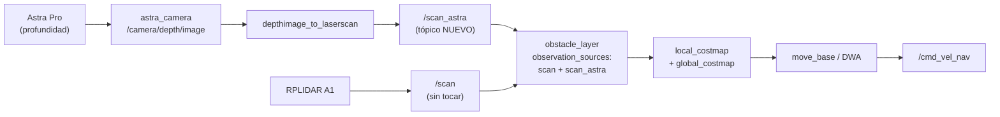

# Análisis de alcance — propuesta frente a lo que existe

**Para quién es y cuándo leerlo**
Para el profesor responsable y los prestadores de servicio social, antes de decidir qué se
entrega y qué se declara como trabajo futuro.
Léelo con `docs/propuesta-servicio-social.md` al lado; esa es la vara de medir. Se responde
a una sola pregunta: **¿qué falta realmente para cerrar el compromiso, y cuánto cuesta?**

---

**Fecha:** 2026-09-10 · **Rama:** `docs/entrega`
**Base de evidencia:** `docs/estado-actual.md` (verificado en el robot),
`docs/runtime-boot.md`, `docs/inventory.md`, `docs/anexo-dependencias-robot.md`.
Etiquetas: **CUMPLIDO** · **PARCIAL** · **NO INICIADO**, y para el comportamiento,
**CONFIRMADO** / **IMPLEMENTADO EN FUENTE, PENDIENTE DE REVALIDACIÓN** / **RECOMENDACIÓN**.

---

## 1. Resumen para decidir en cinco minutos

**El proyecto está mucho más cerca de lo que la propuesta haría temer, y la única brecha
conceptual real es una: la fusión sensorial RGB-D.**

| | |
|---|---|
| Objetivos específicos (§5) **cumplidos** | 8 de 10 |
| Objetivos específicos **parciales** | 2 de 10 |
| Objetivos específicos **no iniciados** | 0 de 10 |
| Productos esperados (§9) **cumplidos** | 3 de 6 |
| Productos esperados **parciales** | 3 de 6 (los tres documentales, que esta entrega cierra) |

Las dos brechas:

1. **Fusión sensorial RGB-D + LiDAR.** La propuesta la promete en el título. Hoy la
   navegación usa **sólo LiDAR**; la cámara RGB-D aporta **sólo su mitad RGB**, y para
   YOLO, no para navegar. **Ésta es la brecha honesta y hay que hablarla con el profesor.**
2. **Documentación.** Manual de operación, guía de prácticas y reporte final no existían.
   **Esta entrega los produce.**

Y una buena noticia que cambia el tamaño del problema 1:

> **El hardware RGB-D ya está montado, enumerado y en uso parcial.** La cámara que hoy
> alimenta el vídeo y YOLO **es** la Orbbec Astra Pro (`/dev/video0` → `Astra Pro HD
> Camera`, USB `2bc5:0501`). Y todo el software para cerrar la brecha —`astra_camera`
> compilado, `depthimage_to_laserscan` instalado, launches del fabricante— **ya está en el
> robot**. **CONFIRMADO** (§4).
>
> No hay que comprar nada, ni compilar nada, ni instalar nada. Hay que **conectar** lo que
> ya está.

---

## 2. Objetivos específicos (propuesta §5)

| # | Objetivo | Qué existe hoy | Estado |
|---|---|---|---|
| 1 | Integrar LiDAR y cámara RGB-D a la plataforma | LiDAR RPLIDAR integrado y en uso (`sf_runtime_lidar.launch`, `/dev/rplidar`→`ttyUSB0`). Astra Pro montada y enumerada; **su RGB se usa** (`sf_robot_server.py:124`, `CAMERA_DEVICE=/dev/video0`); **su profundidad no** | **PARCIAL** |
| 2 | Configurar el entorno de desarrollo bajo ROS | Ubuntu 18.04.6 aarch64 + ROS Melodic + 451 paquetes + `yahboomcar_ws`, `library_ws`, `world_canvas`. Manifiesto completo en `docs/anexo-dependencias-robot.md` | **CUMPLIDO** |
| 3 | Implementar algoritmos de percepción del entorno | LiDAR → `/scan`; IMU (`imu_calib` + Madgwick) → `/imu/imu_data`; odometría → `/odom_raw`; EKF (`robot_localization`) → `/odom`; cámara → MJPEG + YOLO en la PC | **CUMPLIDO** |
| 4 | Sistema de mapeo mediante SLAM | Gmapping vía `sf_mapeo_gmapping.launch`, orquestado por `sf_mapping_manager.py` (1.828 líneas) con sesión, guardado, descarte y *rollback*. 6 mapas guardados en el robot | **CUMPLIDO** |
| 5 | Algoritmos de localización | AMCL (`sf_localizacion_mapa.launch`, `odom_model_type: omni`), pose inicial por `POST /initialpose`, exportación de pose a 10 Hz (`sf_pose_exporter.py`) | **CUMPLIDO** |
| 6 | Planificación de trayectorias | `move_base` con *global planner* + DWA (`nav/sf_dwa.yaml`), prevalidación con `make_plan`, cola multipunto (`sf_nav_queue.py`, 1.260 líneas) | **CUMPLIDO** |
| 7 | Estrategias de evasión de obstáculos | Costmaps global y local (`rolling_window`, 3×3 m, 8 Hz), capa de inflado 0.30 m, DWA, *recovery behaviors*. **Sólo con LiDAR** | **PARCIAL** |
| 8 | Validar el sistema en entornos estructurados | Mapas reales construidos y navegados; registros de ejecución con `move_base` y cola activos. **Sin protocolo formal ni resultados registrados** → lo aporta `docs/validacion.md` (a rellenar) | **PARCIAL → CUMPLIDO al ejecutar** |
| 9 | Documentar la arquitectura del sistema | `docs/arquitectura.md`, `docs/runtime-boot.md`, `docs/api-robot-server.md`, `docs/estado-actual.md` | **CUMPLIDO** (esta entrega) |
| 10 | Manuales de uso para prácticas de laboratorio | `docs/manual-operacion.md` + `docs/practicas/` (P01–P06) | **CUMPLIDO** (esta entrega) |

**Lectura honesta:** 7 cumplidos sin matices, 1 que se cierra ejecutando las pruebas, y
2 parciales —el 1 y el 7— que son **la misma brecha vista dos veces**: la profundidad no
entra en el costmap.

---

## 3. Productos esperados (propuesta §9) — la lista que se califica

| # | Producto | Qué existe | Estado | Qué falta |
|---|---|---|---|---|
| 1 | **Plataforma ROSMASTER 3X con navegación autónoma** | Navegación autónoma funcionando: AMCL + `move_base` + DWA + cola de puntos, con selector de `cmd_vel` y *watchdog* de 0,5 s | **CUMPLIDO** con una salvedad | Tras arrancar, el robot **no queda operable solo**: falta aplicar un perfil. El botón existe en el dashboard **sin versionar** (`estado-actual.md` §5). **Publicarlo es el trabajo pendiente número uno** |
| 2 | **Mapa funcional del entorno** | 6 mapas en `mapping/maps/`, `HAB2` es el de referencia | **CUMPLIDO** | Depurar: 4 son pruebas y uno es `nombre_de_tu_mapa`. Dejar 1–2 buenos y documentarlos |
| 3 | **Sistema de evasión de obstáculos** | Costmaps + inflado + DWA + *recovery*, alimentados por LiDAR | **CUMPLIDO** como evasión 2D; **PARCIAL** frente al título de la propuesta | Añadir la profundidad como segunda fuente del costmap (§4). Sin ella, el robot no ve obstáculos por encima o por debajo del plano del LiDAR |
| 4 | **Manual técnico de operación** | `docs/manual-operacion.md`, `docs/instalacion-pc.md`, `docs/instalacion-robot.md`, `docs/red.md`, `docs/solucion-problemas.md`, `docs/api-robot-server.md` | **CUMPLIDO** (esta entrega) | Rellenar los `[PENDIENTE]` que requieren una persona frente al robot |
| 5 | **Guía de prácticas de laboratorio** | `docs/practicas/` P01–P06 con rúbrica | **CUMPLIDO** (esta entrega) | Pilotarlas con estudiantes reales y ajustar tiempos |
| 6 | **Reporte técnico final** | `docs/reporte-final.md` | **CUMPLIDO** en estructura | Resultados de `docs/validacion.md`, fotografías y fechas: sólo los aporta una persona |

**Traducción:** de los seis productos, **cuatro se entregan con este trabajo**, uno
(el mapa) sólo necesita limpieza, y uno (evasión) está cumplido en 2D pero abierto en su
promesa RGB-D.

---

## 4. La brecha RGB-D, sin adornos

### 4.1 Qué prometió la propuesta y qué hay

La propuesta se titula *"…mediante Fusión Sensorial RGB-D y LiDAR"*. Eso, en robótica
móvil, significa que **ambos sensores contribuyen a la representación del entorno que usa
el planificador**.

Lo que hay hoy (**CONFIRMADO**, `nav/sf_costmap_common.yaml`):

```yaml
observation_sources: scan          # ← una sola fuente

scan:
  sensor_frame: laser
  data_type: LaserScan
  topic: /scan                     # ← el RPLIDAR, y nada más
  marking: true
  clearing: true
```

La cámara aparece en otro circuito completamente distinto: `/video_feed` (MJPEG) → PC →
YOLO → superposición en el dashboard. **La detección de objetos no toca la navegación.**
Un objeto detectado por YOLO no frena ni desvía al robot.

**Consecuencia física concreta**, y es la que hay que contarle al profesor:
el RPLIDAR barre **un único plano horizontal a 11 cm del suelo**
(`sf_runtime_lidar.launch:22`, TF `base_link → laser` con z = 0.11). Por tanto el robot
**hoy no ve**:

- una mesa o repisa cuya superficie esté por encima de 11 cm pero cuyas patas sean finas;
- un escalón, un desnivel o un hueco de escalera;
- un objeto bajo, por debajo del plano del haz;
- un obstáculo colgante (una rama, un cable, una silla volcada).

Esto no es un defecto de implementación: es la limitación esperada de un LiDAR 2D. Es
exactamente lo que la fusión RGB-D viene a resolver, y es **el argumento pedagógico más
potente que tiene el proyecto**: se puede demostrar en el laboratorio, antes y después.

### 4.2 Lo que ya está listo en el robot (esto cambia la conversación)

**CONFIRMADO por inspección directa del robot:**

| Pieza | Estado | Evidencia |
|---|---|---|
| Cámara Orbbec Astra Pro | **conectada y enumerada** | `lsusb`: `2bc5:0501` y `2bc5:0403` |
| Su stream RGB | **ya en uso por SafeVision** | `/dev/video0` → `Card type: Astra Pro HD Camera` (driver `uvcvideo`) |
| Driver `astra_camera` | **compilado** en `/home/pi/software/library_ws/devel/` | `library_ws` está en el `CMAKE_PREFIX_PATH` del servicio |
| `astrapro.launch` | presente | `library_ws/src/astra_camera/launch/astrapro.launch` |
| `depthimage_to_laserscan` | **instalado** | `ros-melodic-depthimage-to-laserscan 1.0.8` |
| Launch de conversión del fabricante | presente | `yahboomcar_nav/launch/library/depthimage_to_laserscan.launch` |
| OpenNI | instalado | `libopenni`, `libopenni2`, `openni-utils` |
| RTAB-Map | instalado | `ros-melodic-rtabmap 0.20.16`, `rtabmap-ros 0.20.18` |

> Dicho de otro modo: **el 90 % del trabajo de la propuesta para RGB-D ya está hecho** —
> montaje, drivers, compilación, dependencias. Lo que falta es el cableado ROS y la
> validación.

### 4.3 Las cinco opciones del handoff §71, evaluadas con lo que ahora sabemos

| Opción | Qué implica | Esfuerzo | Riesgo | CPU/RAM en la Pi | Veredicto |
|---|---|---|---|---|---|
| **A. Profundidad → LaserScan → costmap** | Publicar la profundidad, convertirla a `LaserScan` en un tópico propio y añadirla como **segunda** `observation_source` | **Bajo**: 1 launch + ~8 líneas de YAML + 1 TF | **Bajo**: aditivo; si se apaga, el sistema vuelve exactamente a lo de hoy | Bajo — un `LaserScan` es un vector de ~640 flotantes | ✅ **RECOMENDADA** |
| B. Nube de puntos al costmap (`voxel_layer`) | `PointCloud2` completo como fuente 3D | Medio | Medio: `voxel_layer` reemplaza `obstacle_layer`; toca navegación a fondo | **Alto** — nube densa a 30 Hz en una Pi ARM | ❌ Desproporcionado |
| C. RTAB-Map (SLAM 3D) | Sustituir Gmapping por SLAM RGB-D | Alto | **Alto**: sustituye un subsistema que hoy funciona | Muy alto | ❌ No antes de la entrega |
| D. Distancia a detecciones YOLO | Cruzar *bounding boxes* con el mapa de profundidad | Medio | Bajo | Medio | ⚠️ Interesante, pero **no es fusión para navegar**: no cierra el objetivo 7 |
| E. Navegación 3D completa | Planificación en 3D | Muy alto | Muy alto | Prohibitivo | ❌ Fuera de alcance |

### 4.4 Recomendación: opción A

**RECOMENDACIÓN.** Es la única que cierra los objetivos 1 y 7 sin poner en riesgo lo que
ya funciona, y coincide con lo que el propio handoff §71 llama *"la estrategia incremental
más conservadora"*.



**La clave del diseño, y la razón de que sea de bajo riesgo:** la profundidad publica en
**`/scan_astra`, un tópico nuevo**, y se **añade** como segunda fuente. El LiDAR conserva
`/scan` intacto.

> ⚠️ **Cuidado con el launch del fabricante.** `astrapro_bringup.launch` de Yahboom
> publica la profundidad **en `/scan`** y crea un TF `camera_link → laser`: es decir,
> usa la cámara **en lugar del** LiDAR, no junto a él. Copiarlo tal cual **degradaría** el
> sistema. Hay que usar `depthimage_to_laserscan.launch` con
> `scan_topic:=scan_astra`. **CONFIRMADO** leyendo ambos launches en el robot.

#### El cambio exacto, para dimensionarlo

Un launch nuevo (`sf_runtime_astra.launch`, ~15 líneas) y, en
`nav/sf_costmap_common.yaml`:

```yaml
  observation_sources: scan scan_astra     # ← única línea modificada

  scan_astra:                              # ← bloque nuevo
    sensor_frame: camera_depth_frame
    data_type: LaserScan
    topic: /scan_astra
    marking: true
    clearing: true
    expected_update_rate: 0
    min_obstacle_height: 0.05
    max_obstacle_height: 1.20
```

Más un `static_transform_publisher` de `base_link → camera_link` con la posición real de
la cámara.

> ⚠️ **Esto toca `nav/*.yaml`, congelados por la regla 8 de `CLAUDE.md`** ("hasta que
> exista una línea base de hardware"). Es correcto que estén congelados y **ese es
> justamente el orden de trabajo**: primero la línea base (`docs/validacion.md` con el
> LiDAR solo), y sólo entonces se levanta el congelamiento para esta modificación, con
> medición antes/después. No al revés.

#### Validación en hardware que exigiría (y sin la cual no se puede afirmar nada)

| # | Prueba | Criterio de aceptación |
|---|---|---|
| D-1 | `/camera/depth/image` publica a ≥10 Hz con la cámara tapada y destapada | imagen válida, sin NaN masivos |
| D-2 | `/camera/depth/camera_info` presente y coherente | intrínsecos no nulos |
| D-3 | `/scan_astra` publica y **no** pisa `/scan` | `rostopic hz` en ambos; `rosnode info` |
| D-4 | TF `base_link → camera_link → camera_depth_frame` completo | `rosrun tf view_frames`, sin huecos |
| D-5 | **CPU y RAM en la Pi** con todo activo | carga < 80 %, sin pérdida de `/scan` ni de `/odom` |
| D-6 | Ancho de banda USB: LiDAR + Astra + cámara RGB a la vez | sin desconexiones USB en `dmesg` |
| D-7 | **Obstáculo alto** (mesa a 40 cm, patas finas): antes invisible, ahora en el costmap | aparece en `/local_costmap/costmap` |
| D-8 | Navegación con ambas fuentes: el robot rodea el obstáculo alto | objetivo alcanzado, sin colisión |
| D-9 | Falsos positivos por reflejo/suelo | el robot no se bloquea en suelo libre |
| D-10 | Degradación elegante: desconectar la cámara en marcha | sigue navegando sólo con LiDAR |

**D-5, D-6 y D-9 son los que realmente deciden.** Una Raspberry Pi moviendo LiDAR + dos
flujos de cámara + `move_base` es un escenario de recursos ajustado, y el suelo reflectante
es la causa clásica de falsos obstáculos con `depthimage_to_laserscan`.

**Estimación honesta:** entre media jornada y dos jornadas de trabajo con el robot
delante, casi todo en D-5/D-6/D-9. **[PENDIENTE: decisión de alcance del profesor sobre
si se acomete antes de la entrega o se declara trabajo futuro.]**

---

## 5. Tres caminos para el profesor

Nada aquí es irreversible. Las tres son defendibles; cambian el discurso, no la calidad.

### Camino 1 — Entregar lo que hay, declarar RGB-D como trabajo futuro
- **Esfuerzo:** sólo publicar el dashboard y ejecutar `docs/validacion.md`.
- **Discurso:** *"navegación autónoma con LiDAR 2D, plenamente operativa y documentada;
  la fusión RGB-D queda especificada, con el hardware y el software ya instalados, como
  siguiente etapa."*
- **Riesgo:** el título de la propuesta promete fusión. Hay que decirlo de frente en el
  reporte, no esconderlo.
- **Cuándo elegirlo:** si el plazo aprieta o no hay acceso continuado al robot.

### Camino 2 — Cerrar la opción A (RECOMENDADO)
- **Esfuerzo:** media a dos jornadas con el robot, más la validación D-1…D-10.
- **Discurso:** *"fusión sensorial LiDAR + RGB-D en el costmap, validada con obstáculos
  que el LiDAR 2D no detecta."* Cumple el título **literalmente**.
- **Riesgo:** bajo y reversible — si D-5/D-9 salen mal, se retira la segunda fuente y se
  vuelve al Camino 1 sin perder nada.
- **Cuándo elegirlo:** si hay dos o tres sesiones de laboratorio disponibles. **Es la
  mejor relación entre esfuerzo y cumplimiento**, y da la práctica P02 más vistosa que
  el curso puede tener.

### Camino 3 — RGB-D completo (RTAB-Map, navegación 3D)
- **Esfuerzo:** semanas. Sustituye subsistemas que hoy funcionan.
- **Riesgo:** alto. Puede dejar el robot peor que hoy.
- **Cuándo elegirlo:** como proyecto de titulación posterior, **no** como cierre de este
  servicio social.

---

## 6. Lo que hay que hacer sí o sí, se elija lo que se elija

Por orden de importancia:

1. **Versionar el dashboard de `~/SafeVision_Dashboard_dev/`.** Sin esto, el producto 1
   depende de un `curl` escrito a mano, y de un directorio en un portátil que nadie más
   tiene. Es el mayor riesgo del proyecto y el más barato de eliminar.
   → `docs/estado-actual.md` §5.5
2. **Ejecutar `docs/validacion.md`** y registrar resultados con fecha y responsable. Sin
   esto, el objetivo 8 y el producto 6 se quedan sin evidencia.
3. **Rotar las credenciales expuestas** (`docs/security-scan.md`): la contraseña SSH del
   robot y la PSK del Wi-Fi están publicadas en GitHub, en la rama por defecto. Es
   independiente del alcance técnico y **no debería entregarse el proyecto sin esto**.
4. **Depurar los mapas** y dejar uno de referencia documentado.
5. **Sincronizar el repositorio del robot** (`ec0c02b` → `HEAD`).

---

## 7. Qué NO conviene hacer antes de la entrega

Aunque el handoff los proponga, no son de este alcance y el profesor lo ha dicho
expresamente: **sin nube, sin contenedores, sin refactor**.

| Tentación | Por qué no ahora |
|---|---|
| Refactor de los monolitos (handoff fase 3) | `sf_robot_server.py` son 5.060 líneas que **funcionan**. Partirlas sin tests es cambiar riesgo por estética |
| Contenerizar (fase 6) | `sf_mapping_manager.py` inspecciona `/proc`; hay rutas absolutas por todas partes. Es un proyecto en sí mismo |
| Nube (fase 8) | Nada lo pide, y multiplicaría la superficie de seguridad de un sistema que hoy no tiene autenticación |
| Unificar los tres Python | `sf_pose_exporter.py` **debe** seguir en Python 2 (`estado-actual.md` §3.1). Tocarlo rompe la pose |
| Limpiar los tres OpenCV | Reversible sólo con una imagen de respaldo de la SD. Hoy el vídeo funciona |
| Borrar `api/` | 13 alias del `.bashrc` lo invocan. Ningún fichero cumple los criterios del handoff §77 |
| Desinstalar `torch` de la Pi | Libera espacio que sobra, y romperlo en ARM es fácil |

---

## 8. Trazabilidad propuesta → entregable

| Propuesta | Dónde se responde |
|---|---|
| §1 Datos generales | `docs/reporte-final.md` §1 |
| §2 Justificación | `docs/reporte-final.md` §2 |
| §3 Problema | `docs/reporte-final.md` §3 |
| §4 Objetivo general | `docs/reporte-final.md` §4 |
| §5 Objetivos específicos | **este documento §2** + `docs/reporte-final.md` §5 |
| §6 Metodología | `docs/reporte-final.md` §6 |
| §7 Actividades | `docs/reporte-final.md` §7 |
| §8 Impacto académico | `docs/practicas/` + `docs/reporte-final.md` §8 |
| §9 Productos esperados | **este documento §3** |
| §10 Cronograma | `docs/reporte-final.md` §7 |
