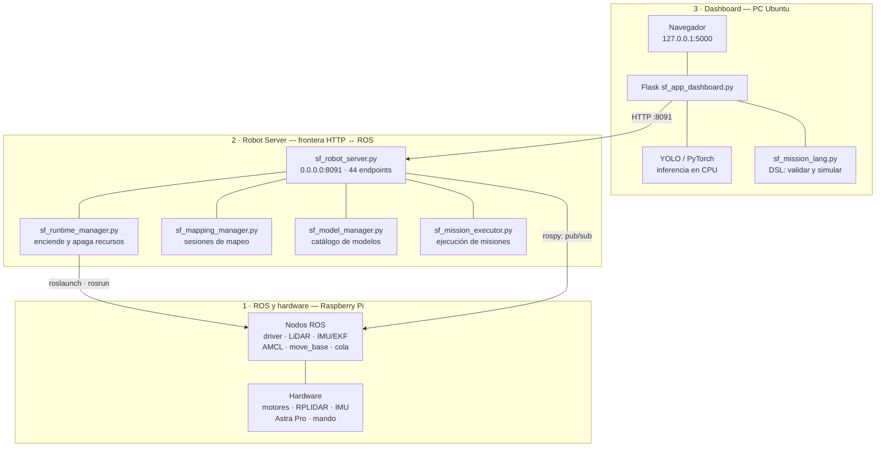
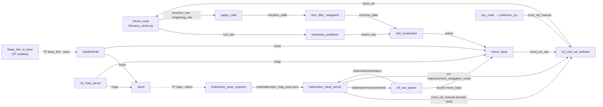
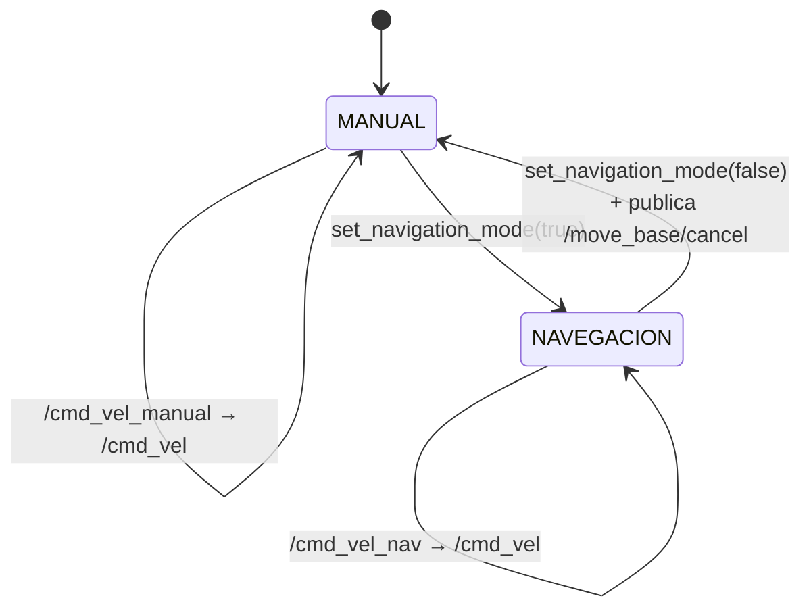
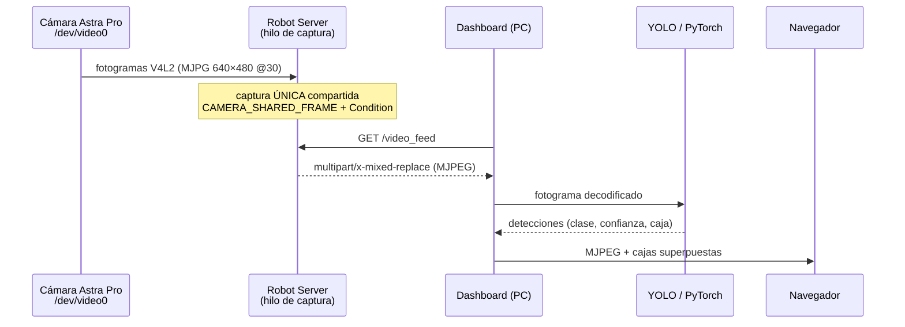
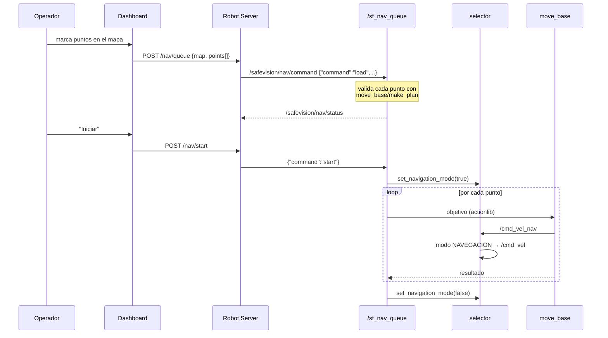
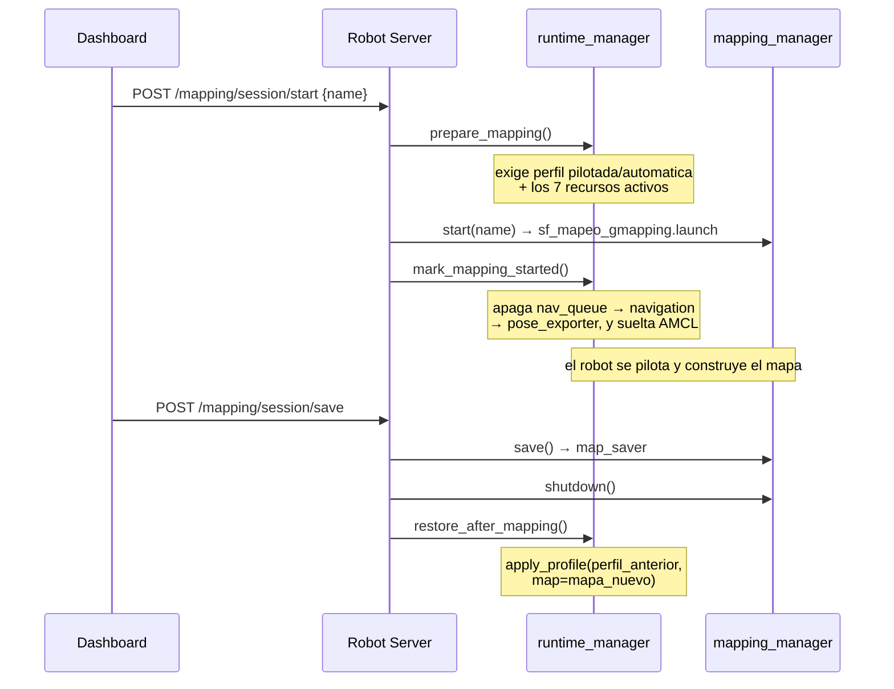
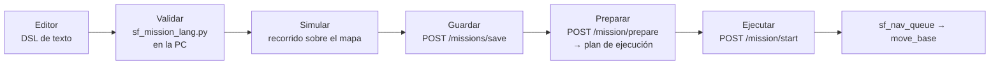

# Arquitectura del sistema

**Para quién es y cuándo leerlo**
Para quien necesite entender cómo encajan las piezas antes de tocar algo, o para explicar
el sistema en una revisión o en la defensa del reporte.
Léelo después del `README.md` y antes de `docs/manual-operacion.md`.

---

**Basado en:** el código de `HEAD` y la verificación en el robot de `docs/estado-actual.md`.
Etiquetas: **CONFIRMADO** · **IMPLEMENTADO EN FUENTE, PENDIENTE DE REVALIDACIÓN** ·
**RECOMENDACIÓN**.

---

## 1. Las tres capas

SafeVision separa deliberadamente tres responsabilidades. Esta separación es **la decisión
de diseño más valiosa del proyecto** y conviene preservarla (handoff §57, §78).

**Reglas que sostienen el diseño** (handoff §57 y §79; `CLAUDE.md` 3 y 4):

1. **El Robot Server es la única frontera HTTP↔ROS.** El dashboard nunca habla ROS
   directamente.
2. **Los lazos críticos viven en el robot:** `cmd_vel`, *watchdog*, `move_base`,
   cancelación, drivers, sensores. Nada remoto cierra el lazo de movimiento.
3. **La IA corre en la PC.** La Raspberry Pi no tiene potencia para YOLO en tiempo real;
   envía MJPEG y la PC infiere.
4. **Una sola captura física de cámara**, compartida por todos los clientes.

### 1.1 Por qué importa la regla 2

Si el Wi-Fi se cae con el robot navegando, el robot **sigue navegando y sigue frenando
ante obstáculos**, porque `move_base`, el selector y el *watchdog* están en la Pi. El
dashboard es un observador con mando a distancia, no el cerebro. Es lo que separa un
prototipo de laboratorio de un juguete teledirigido.

---

## 2. Grafo ROS: lo que corre de verdad

Nodos y tópicos **realmente usados** por el runtime vigente (**CONFIRMADO** en
`sf_runtime_manager.py` y `docs/runtime-boot.md`).

### 2.1 Tópicos y servicios

| Nombre | Tipo | Productor → consumidor |
|---|---|---|
| `/cmd_vel` | `geometry_msgs/Twist` | selector → driver. **El único que mueve el robot** |
| `/cmd_vel_manual` | `Twist` | mando o teclado web → selector |
| `/cmd_vel_nav` | `Twist` | `move_base` → selector |
| `/scan` | `sensor_msgs/LaserScan` | RPLIDAR → AMCL y costmaps |
| `/imu/imu_data` | `sensor_msgs/Imu` | Madgwick → EKF |
| `/odom` | `nav_msgs/Odometry` | EKF → `move_base` |
| `/map` | `nav_msgs/OccupancyGrid` | `map_server` o Gmapping → AMCL, costmaps, Robot Server |
| `/safevision/nav/command` | `std_msgs/String` (JSON) | Robot Server → cola |
| `/safevision/nav/status` | `std_msgs/String` (JSON) | cola → Robot Server |
| `/safevision/control_mode` | `String` (*latched*) | selector → quien observe |
| `/safevision/set_navigation_mode` | `std_srvs/SetBool` | **servicio**: conmuta manual ↔ navegación |
| `/move_base/cancel` | `actionlib_msgs/GoalID` | selector y cola → `move_base` |

### 2.2 El selector de `cmd_vel`: la pieza de seguridad

`sf_cmd_vel_selector.py` (181 líneas) es pequeño y es lo más importante del sistema.

Tres garantías (**CONFIRMADO**, `sf_cmd_vel_selector.py`):

1. **Exclusión mutua.** En modo manual, `/cmd_vel_nav` se descarta; en navegación, al
   revés. Nunca compiten dos fuentes por los motores (`:99-119`).
2. ***Watchdog* de 0,5 s.** Un temporizador a 20 Hz comprueba cuándo llegó la última orden
   válida; si se supera el plazo, publica un `Twist()` a cero (`:121-135`). **Si el
   dashboard se cae o el Wi-Fi se corta, el robot se detiene solo.**
3. **Cancelación explícita.** Al volver a manual, publica en `/move_base/cancel` y manda
   tres ceros consecutivos (`:84-90`, `:148-150`). El robot no "hereda" un objetivo
   anterior.

> **Para las prácticas:** ésta es la demostración más didáctica del sistema. Manda al
> robot a un punto, desconecta el Wi-Fi de la PC y observa: sigue navegando. Después
> ponlo en manual, mantén una tecla y suéltala: se para en medio segundo.

---

## 3. Flujo de vídeo e inferencia

**CONFIRMADO** (`sf_robot_server.py:99-105`, `:248-407`): captura a 640×480, 30 fps, FOURCC
`MJPG`, JPEG de calidad 70. Una sola captura física alimenta a todos los clientes mediante
`threading.Condition`; abrir dos pestañas **no** abre la cámara dos veces.

La cámara se abre **de forma perezosa**, en la primera petición a `/video_feed`
(`:405-407`). Por eso el vídeo funciona aunque no haya ningún perfil aplicado.

> **Dato importante para el alcance:** `/dev/video0` es la mitad RGB de la **Orbbec Astra
> Pro**, una cámara RGB-D. Su canal de profundidad existe físicamente pero **no se usa**.
> Ver `docs/analisis-alcance.md` §4.

> **La detección no frena al robot.** YOLO corre en la PC y sólo dibuja. No hay realimentación
> de la IA hacia la navegación. Es una decisión de diseño (la regla 2), no un olvido.

---

## 4. Flujo de navegación

Detalles que conviene conocer (**IMPLEMENTADO EN FUENTE**):

- **Prevalidación con `make_plan`.** Antes de aceptar la cola, se comprueba que existe un
  plan hacia cada punto. Un objetivo dentro de una pared se rechaza **antes** de mover el
  robot.
- **El mapa queda asociado a la cola.** Si cambia el mapa activo, la cola se invalida: no
  se pueden ejecutar puntos de otro mapa.
- **Cancelación en cualquier momento** (`POST /nav/cancel`): la cola vacía, publica
  `/move_base/cancel` y devuelve el selector a manual.
- **Planificador local:** DWA (`nav/sf_dwa.yaml`); *costmap* local de 3×3 m con
  `rolling_window` a 8 Hz; inflado de 0,30 m; huella del robot ±0.117 × ±0.100 m.

> ⚠️ Los ficheros de `robot/nav/*.yaml` están **congelados** (`CLAUDE.md` regla 8) hasta
> que exista una línea base de hardware medida. Ver `docs/validacion.md`.

---

## 5. Flujo de mapeo

Es el flujo más delicado del sistema, porque hay que **apagar AMCL para encender Gmapping**
y luego volver, sin dejar el robot en un estado intermedio.

**El orden no es arbitrario** (comentario en `sf_runtime_manager.py:1020-1022`): la cola de
navegación se mantiene viva **durante** `start()` porque el gestor de mapeo necesita
publicar la cancelación antes de retirar AMCL. Invertir el orden deja `move_base`
persiguiendo un objetivo sin mapa.

Hay ***rollback* en cada escalón**: si Gmapping arranca pero el gestor no puede confirmar
exclusividad, se descarta la sesión y se restaura el perfil anterior
(`sf_robot_server.py:4244-4380`). **No debe romperse** (handoff §57).

---

## 6. Flujo de misiones

**validar → simular → ejecutar** es una de las decisiones a preservar (handoff §57). Una
misión no llega al robot sin haber pasado el analizador sintáctico y el simulador.

El DSL es un subconjunto restringido de Python analizado con `ast` — **no se ejecuta
`eval`**. Detalle en `docs/lenguaje-misiones.md`.

> ⚠️ `girar()` y `relocalizar()` se aceptan al escribir y validar, pero **el ejecutor los
> rechaza**: `sf_mission_executor.py:596-615` sólo admite `{esperar, ir, orientar}` y
> lanza *"Acción todavía no habilitada"*. **CONFIRMADO.**

---

## 7. Puertos y ficheros usados como IPC

### 7.1 Puertos

| Puerto | Proceso | Escucha | Nota |
|---|---|---|---|
| 8091 | Robot Server | `0.0.0.0` | **No exponer.** Sin autenticación |
| 11311 | ROS Master | IP de LAN | **No exponer.** ROS 1 no cifra ni autentica |
| 5000 | Dashboard | `127.0.0.1` | Sólo local. Correcto |
| 8090 | Servidor de descarga | `0.0.0.0` | Entrega el `.tar.gz` del dashboard |

### 7.2 Ficheros en `/tmp` — el IPC informal

**CONFIRMADO** (`sf_runtime_manager.py:15-23`, `sf_pose_exporter.py`):

| Fichero | Lo escribe | Lo lee | Contenido |
|---|---|---|---|
| `/tmp/safevision_runtime_state.json` | `sf_runtime_manager` | él mismo | perfil, mapa, control, PIDs |
| `/tmp/safevision_active_map.json` | `sf_runtime_manager` | Robot Server | `{name, yaml}` del mapa activo |
| `/tmp/safevision_map_pose.json` | `sf_pose_exporter` (10 Hz) | Robot Server | pose `map → base_footprint` |
| `/tmp/safevision_runtime_logs/*.log` | `sf_runtime_manager` | persona | un log por recurso |

> **Consecuencia práctica:** `/tmp` se borra al reiniciar. Tras un arranque en frío el
> estado queda vacío aunque `roscore` siga vivo — es justamente lo observado en
> `docs/estado-actual.md`. Es deuda técnica conocida (handoff §49) y **RECOMENDACIÓN** de
> la fase 4 del refactor, fuera del alcance de esta entrega.

---

## 8. Arranque: los dos caminos

Resumen; el detalle completo está en `docs/runtime-boot.md`.

| | Camino vigente (systemd) | Camino heredado (script) |
|---|---|---|
| Entrada | `safevision-roscore` + `safevision-robot-server` | `sf_operacion_pilotada.sh teclado\|mando [mapa]` |
| Arranca al inicio | sólo `roscore` + Robot Server | **todo**, en 9 etapas |
| Resto de nodos | bajo demanda, `POST /runtime/profile` | de golpe |
| Estado | **es el que corre hoy** (verificado) | alcanzable por alias `.bashrc` |

Ambos **se excluyen**: el script aborta si `/driver_node` ya existe y reclamaría el
puerto 8091.

### 8.1 Perfiles de runtime

`sf_runtime_manager.apply_profile()` define cuatro:

| Perfil | Qué deja encendido |
|---|---|
| `libre` | driver + core + selector + control. **Sin** LiDAR ni navegación |
| `pilotada` | base + LiDAR + AMCL + pose + `move_base` + cola |
| `automatica` | idéntico a `pilotada` (sólo cambia la etiqueta) |
| `mapear` | no se aplica directamente: se entra por `/mapping/session/start` |

---

## 9. Mapa del repositorio

| Ruta | Qué es |
|---|---|
| `misiones/pilotada/robot/` | **Runtime vigente.** Robot Server, gestores, nodos, `.launch` |
| `misiones/pilotada/robot/nav/` | Parámetros de `move_base` y DWA (**congelados**) |
| `misiones/pilotada/dashboard_src/` | Dashboard de la PC |
| `misiones/pilotada/systemd/` | Unidades systemd + instalador |
| `misiones/automatica/robot/` | Ejecutor de misiones automáticas |
| `mapping/maps/` | Mapas (`.yaml` + `.pgm`, versionados en pareja) |
| `modelos/` | Catálogo de modelos YOLO (los pesos **no** se versionan) |
| `api/` | **Generación anterior.** Ver `docs/inventory.md` |
| `scripts/` | Instalación y arranque en la PC |
| `docs/` | Esta documentación |

---

## 10. Documentos relacionados

- `docs/runtime-boot.md` — arranque paso a paso.
- `docs/api-robot-server.md` — los 44 endpoints.
- `docs/manual-operacion.md` — cómo operar.
- `docs/lenguaje-misiones.md` — el DSL.
- `docs/analisis-alcance.md` — qué falta frente a la propuesta.
