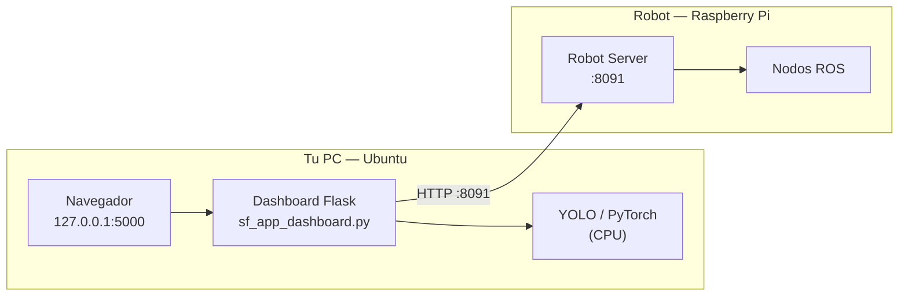

# Instalación del Dashboard en la PC

**Para quién es y cuándo leerlo**
Para quien tiene una PC con Ubuntu recién instalado y necesita dejar el dashboard de
SafeVision funcionando.
Léelo de arriba abajo la primera vez; después bastará con la §6 ("Uso diario").
Todas las órdenes se copian y pegan tal cual.

---

**Destino:** Ubuntu 22.04 LTS o 24.04 LTS (también sirve 20.04 con Python ≥ 3.8).
**Tiempo estimado:** 15-30 minutos, casi todo descargando PyTorch.
**No hace falta GPU.**

---

## 1. Qué vas a instalar

El dashboard es una aplicación web que corre **en tu PC**, no en el robot. Hace tres cosas:

- muestra el vídeo del robot y le superpone las detecciones de YOLO (la inferencia
  corre en la PC, que tiene más potencia que la Raspberry Pi);
- dibuja el mapa, la posición del robot y te deja mandarlo a puntos concretos;
- actúa de intermediario con el Robot Server del robot (puerto 8091).



## 2. Requisitos previos

| Requisito | Comprobación |
|---|---|
| Ubuntu 22.04 / 24.04 | `lsb_release -d` |
| Python ≥ 3.8 | `python3 --version` |
| Conexión a Internet | para descargar dependencias |
| Robot y PC en la **misma red** | ver `docs/red.md` |
| ~3 GB libres en disco | PyTorch ocupa bastante |

Instala lo básico del sistema:

```bash
sudo apt update
sudo apt install -y python3 python3-venv python3-pip git curl
```

## 3. Clonar el repositorio

```bash
cd ~
git clone https://github.com/ToscanoID007/safevision.git
cd safevision
```

Si ya lo tienes clonado:

```bash
cd ~/safevision
git pull
```

## 4. Instalar

Una sola orden:

```bash
./scripts/install_dashboard.sh
```

El script:

1. comprueba que Python es ≥ 3.8 y que existe el módulo `venv`;
2. crea un entorno virtual aislado en `misiones/pilotada/dashboard_src/.venv`;
3. instala **PyTorch en su versión para CPU** (es lo correcto: no necesitas GPU, y la
   versión CPU es mucho más ligera de descargar);
4. instala el resto de `requirements.txt` (Flask, requests, ultralytics,
   opencv-python-headless);
5. **verifica que todo se importa** e imprime las versiones;
6. avisa sobre la configuración de red.

Es **idempotente**: puedes ejecutarlo tantas veces como quieras. Si el entorno ya existe,
lo reutiliza.

> **¿Y si tengo GPU NVIDIA?** Funciona igual con la versión CPU. Si quieres aprovechar la
> GPU, instala después la variante CUDA siguiendo
> <https://pytorch.org/get-started/locally/> dentro del mismo entorno virtual. No es
> necesario para el laboratorio.

### Si algo falla

| Mensaje | Causa | Solución |
|---|---|---|
| `Falta el modulo venv` | Ubuntu no lo trae por defecto | `sudo apt install python3-venv` |
| `Python 3.x es demasiado antiguo` | Ubuntu anterior a 20.04 | Actualiza el sistema |
| `Fallo la instalacion de torch` | Sin Internet o proxy | Revisa la conexión y reintenta |
| `Existe .venv pero esta incompleto` | Instalación interrumpida | `rm -rf misiones/pilotada/dashboard_src/.venv` y reintenta |

## 5. Configurar la dirección del robot

```bash
cp scripts/robot.env.example scripts/robot.env
```

Ábrelo y ajusta `ROBOT_HOST` si hace falta. Por defecto es `yahboom.local`, que funciona
sin saber la IP mientras el robot y la PC estén en la misma red.

`scripts/robot.env` **no se versiona** (está en `.gitignore`): es configuración de tu PC.

## 6. Uso diario

Enciende el robot, espera ~1 minuto, y en la PC:

```bash
cd ~/safevision
./scripts/run_dashboard.sh
```

El script resuelve la dirección del robot, comprueba que responde, arranca el dashboard y
te dice **exactamente qué IP escribir**:

```
=======================================================
 Dashboard:  http://127.0.0.1:5000
 En la casilla 'IP del robot' escribe:  192.168.1.13

 (la interfaz solo acepta IPv4, no nombres como yahboom.local)
=======================================================
```

Abre <http://127.0.0.1:5000> en el navegador y escribe esa IP en la casilla de conexión.

> ⚠️ **Ésta es la trampa más común del sistema.** La casilla de conexión del dashboard
> valida con `ipaddress.ip_address()` (`sf_app_dashboard.py:506-518`) y **sólo acepta un
> IPv4 literal**. Si escribes `yahboom.local` dirá "IP inválida". Y como la IP la reparte
> el router por DHCP, **cambia**: el repositorio tiene escrito `192.168.1.75` en varios
> scripts antiguos, pero el robot estaba en `192.168.1.13` al escribir esto.
> Por eso `run_dashboard.sh` te la resuelve cada vez.

Para detenerlo: `Ctrl+C`.

## 7. Verificación

Cuatro comprobaciones, de menos a más.

### 7.1 El entorno está bien instalado

```bash
cd ~/safevision
source misiones/pilotada/dashboard_src/.venv/bin/activate
python -c "import flask, cv2, torch, ultralytics; print('todas las dependencias OK')"
deactivate
```

**Esperado:** `todas las dependencias OK`.

### 7.2 El robot responde

```bash
curl -s http://192.168.1.13:8091/health | python3 -m json.tool
```

(sustituye la IP por la tuya)

**Esperado:** un JSON con `"ros_master": true`. Que `"ok"` sea `false` **es normal** si no
se ha aplicado un perfil todavía — ver §7.4.

### 7.3 El dashboard arranca

Con `./scripts/run_dashboard.sh` en marcha, abre <http://127.0.0.1:5000>.

**Esperado:** carga la interfaz. Al escribir la IP y conectar, aparece el estado del robot
y el vídeo de la cámara.

**Si el vídeo no aparece** pero el estado sí: comprueba `curl -s -o /dev/null -w '%{http_code}\n'
http://<IP>:8091/video_feed` → debe dar `200`.

### 7.4 El robot puede moverse

Éste es el paso que **mucha gente olvida**. Tras arrancar, el robot levanta sólo el ROS
Master y el Robot Server: **no hay driver, ni LiDAR, ni navegación**, y por eso `/health`
devuelve `ok: false`.

Hace falta **aplicar un perfil de runtime**. Ver `docs/manual-operacion.md`, sección
"Aplicar un perfil", y `docs/estado-actual.md` §1 para la explicación completa.

> **[PENDIENTE: el botón para aplicar el perfil existe en una versión del dashboard que
> todavía no está versionada en este repositorio (`docs/estado-actual.md` §5). Hasta que
> se publique, el perfil se aplica con `curl` — ver `docs/manual-operacion.md`.]**

## 8. Desinstalar

```bash
rm -rf ~/safevision/misiones/pilotada/dashboard_src/.venv
rm -f  ~/safevision/scripts/robot.env
```

No queda nada fuera del repositorio: la instalación es completamente local.

## 9. Alternativa: el paquete precompilado para Ubuntu 18.04

**CONFIRMADO:** el robot sirve un paquete `.tar.gz` de 395 MB con el dashboard empaquetado
para Ubuntu 18.04 x86_64, en el puerto **8090**
(`misiones/pilotada/robot/sf_servidor_descarga.py`).

Sólo es útil si tu PC es Ubuntu 18.04 y no quieres instalar dependencias. Tiene dos
inconvenientes serios:

- es del **8 de agosto de 2026**, anterior a todo el desarrollo posterior del frontend;
- **no incluye la página `/pilotada`** ni los controles de perfil.

**RECOMENDACIÓN:** usa la instalación de este documento. El paquete queda como opción de
emergencia.
**[PENDIENTE: nadie ha verificado que ese paquete arranque en una PC limpia.]**

## 10. Documentos relacionados

- `docs/red.md` — cómo se encuentran la PC y el robot, y qué puertos no exponer.
- `docs/manual-operacion.md` — cómo operar el robot una vez conectado.
- `docs/solucion-problemas.md` — síntoma → causa → solución.
- `docs/instalacion-robot.md` — la otra mitad: el robot.
