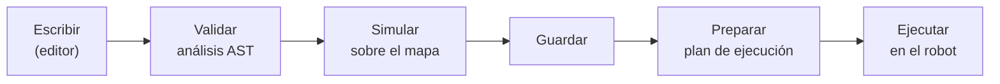

# Lenguaje de misiones (DSL)

**Para quién es y cuándo leerlo**
Para quien escriba misiones automáticas: estudiantes en la práctica P06 y quien programe
recorridos para una demo.
Consúltalo mientras escribes; la §3 es la referencia de las cinco acciones y la §7 la lista
de errores frecuentes.

---

**Origen:** `misiones/pilotada/dashboard_src/sf_mission_lang.py` (2.411 líneas, analizador y
simulador, corre en la PC) y `misiones/automatica/robot/sf_mission_executor.py` (ejecutor,
corre en el robot), ambos en `HEAD`.

---

## 1. Qué es

Un subconjunto restringido de Python para describir recorridos. Se escribe en el editor del
dashboard, se valida y se simula **en la PC**, y sólo entonces se envía al robot.



> **No se usa `eval` ni `exec`.** El código se analiza con el módulo `ast` de Python y sólo
> se acepta una lista blanca de construcciones (`sf_mission_lang.py:21-57`). Un programa de
> misión **no puede** abrir ficheros, importar módulos ni ejecutar órdenes del sistema. Es
> una decisión de seguridad deliberada.

---

## 2. Dos acciones retiradas del lenguaje

`girar()` y `relocalizar()` **ya no forman parte del lenguaje**. El validador las rechaza
al escribirlas, con un mensaje que explica la alternativa:

```
girar() no esta implementada: el robot no la ejecuta.
Para cambiar la orientacion usa orientar().

relocalizar() no esta implementada: el robot no la ejecuta.
Fija la pose inicial desde el dashboard antes de lanzar la mision.
```

**Por qué se retiraron.** Existían en el analizador pero el ejecutor nunca las implementó:
`sf_mission_executor.py:596-615` sólo admite `{esperar, ir, orientar}` y **rechaza la misión
entera** al arrancar con *"Acción todavía no habilitada"*. El resultado era una trampa: el
editor las aceptaba, el validador las daba por buenas, el simulador las dibujaba, y el fallo
aparecía al final, después de preparar la misión.

Ahora el error llega **en el momento de escribirlas**, que es cuando sirve de algo.

> Los nombres siguen reservados: no se puede llamar `girar` a una variable. Y el ejecutor
> del robot no se ha tocado, así que sigue rechazando cualquier misión antigua que las use.

> Si algún día se implementan físicamente, hay que revertir este cambio en `sf_mission_lang.py` (`RETIRED_COMMANDS`) y reactivar las ramas correspondientes del ejecutor.

## 3. Las tres acciones

### 3.1 `ir(destino)` ✅ funciona

Navega hasta un punto definido sobre el mapa.

```python
ir("0x001")      # por identificador
ir("cocina")     # por alias
```

| | |
|---|---|
| Parámetros | exactamente 1, cadena literal |
| Identificador | `0x` + 3 dígitos hexadecimales (`^0[xX][0-9A-Fa-f]{3}$`) |
| Alias | empieza por letra o `_`, luego letras, dígitos o `_` |
| Validación | el punto **debe existir** en la misión, o error |
| Estado durante | `navigating` |

Internamente encola el punto y lo entrega a `move_base` a través de `sf_nav_queue`, con
prevalidación `make_plan`.

### 3.2 `esperar(segundos)` ✅ funciona

Pausa la misión.

```python
esperar(3)
esperar(0.5)
```

| | |
|---|---|
| Parámetros | exactamente 1, número **literal** |
| Restricción | finito y **≥ 0** |
| Estado durante | `waiting` |

> Debe ser un literal: `esperar(t)` con una variable **no** se acepta
> (`sf_mission_lang.py:1026-1060`).

La espera es cancelable: `POST /mission/cancel` la interrumpe al instante.

### 3.3 `orientar(angulo, velocidad=…)` ✅ funciona

Orienta el robot respecto a un punto de referencia.

```python
orientar(90)
orientar(-45, velocidad=0.5)
```

| | |
|---|---|
| Parámetros | 1 posicional (ángulo, número literal) |
| Opcional | `velocidad=` (número literal), un solo keyword |
| Estado durante | `orienting` |

**[PENDIENTE: confirmar en el robot el signo y el origen del ángulo — si es absoluto en el
marco `map` o relativo al punto anterior, y si los grados son positivos en sentido
antihorario. Requiere la prueba V-8 de `docs/validacion.md`.]**

### 3.4 Acciones retiradas

`girar()` y `relocalizar()` ya no existen en el lenguaje. Ver §2.

---

## 4. Estructuras de control permitidas

El DSL admite un subconjunto de Python:

### Variables

```python
vueltas = 3
pausa = 2
```

Nombres: letra inicial, después letras, dígitos o `_`. **No** pueden llamarse como una
acción ni `range`, `True`, `False`, `None` (`sf_mission_lang.py:29-37`).

### Operadores

| Grupo | Permitidos |
|---|---|
| Aritméticos | `+` `-` `*` `/` `//` `%` |
| Asignación compuesta | `+=` `-=` `*=` `/=` `//=` `%=` |
| Comparación | `==` `!=` `<` `<=` `>` `>=` |

### Bucles `for` con `range()`

```python
for i in range(3):
    ir("0x001")
    esperar(1)
    ir("0x002")
```

> **Límite duro: `MAX_RANGE_ITERATIONS = 10000`** (`sf_mission_lang.py:59`). Evita que una
> misión mal escrita genere un plan infinito.

### Condicionales

```python
if vueltas > 2:
    esperar(5)
else:
    esperar(1)
```

### Lo que NO se permite

`import`, `def`, `class`, `while`, `lambda`, `try`, `with`, indexación, llamadas a
funciones que no sean las cinco acciones y `range`, y cualquier acceso a atributos.
Todo lo no listado explícitamente se rechaza.

---

## 5. Ejemplo completo

```python
# Ronda de vigilancia: tres pasadas por el pasillo,
# con parada y orientación en cada extremo.

pausa = 2

for vuelta in range(3):
    ir("entrada")
    esperar(pausa)
    orientar(0)

    ir("fondo_pasillo")
    esperar(pausa)
    orientar(180)

ir("base")
```

---

## 6. Puntos de la misión

Los puntos se definen **gráficamente sobre el mapa**, no en el código.

| Campo | Descripción |
|---|---|
| `id` | asignado automáticamente: `0x001`, `0x002`… |
| `alias` | nombre legible que pones tú: `cocina`, `base` |
| `x`, `y` | metros, en el marco `map` |
| `yaw` | orientación en radianes |

En el código puedes referirte a un punto por su `id` o por su alias. El alias es más
legible y sobrevive mejor a la reordenación.

**Punto inicial:** una misión puede declarar un punto de partida. El ejecutor navega a él
**antes** de empezar el programa, usando internamente la misma acción `ir()`
(`sf_mission_executor.py:630-635`).

---

## 7. Errores frecuentes

| Mensaje | Causa | Solución |
|---|---|---|
| `girar() no esta implementada…` | La misión usa `girar()` | Usa `orientar()`. §2 |
| `relocalizar() no esta implementada…` | La misión usa `relocalizar()` | Fija la pose inicial desde el dashboard. §2 |
| `El punto 'X' no existe en esta misión.` | Alias o id mal escrito, o punto borrado | Revisa la lista de puntos |
| `Uso: ir("0x000") o ir("alias").` | Cero o varios argumentos, o keyword | `ir()` toma exactamente una cadena |
| `La referencia de ir() debe ser texto.` | Se pasó una variable o un número | Debe ser literal entre comillas |
| `El tiempo debe ser un número literal mayor o igual a 0.` | Variable, negativo o expresión | `esperar(3)`, no `esperar(t)` |
| `El ángulo debe ser un número literal.` | Variable o expresión | Usa un número |
| `Solo se permite el parámetro velocidad.` | Más de un keyword | Sólo `velocidad=` |
| **`Acción todavía no habilitada: girar`** | Misión antigua guardada antes del cambio | Ábrela, quita esas líneas y vuelve a validarla |
| `La misión no está en estado ready` | Falta `POST /mission/prepare` | Prepara antes de ejecutar |

---

## 8. Validación y simulación

**Validar** (en la PC, sin tocar el robot) comprueba:

1. que el código analiza como AST válido;
2. que sólo hay construcciones de la lista blanca;
3. que las acciones existen y reciben los argumentos correctos;
4. que **todos los puntos referenciados existen**;
5. que los bucles no superan el límite de iteraciones.

**Simular** despliega el programa en una secuencia lineal de acciones y dibuja el recorrido
sobre el mapa. Produce el *plan de ejecución* que consume el robot.

> **Simula siempre antes de ejecutar.** Es gratis, es instantáneo, y es donde se ven los
> bucles que no hacen lo que creías.

> **Nota técnica:** la validación está **duplicada** entre el dashboard
> (`sf_mission_lang.py`) y el Robot Server (`validate_mission_data()` en
> `sf_robot_server.py:976`). Es deuda técnica conocida (handoff §46); la solución propuesta
> —un paquete compartido `safevision_protocol`— pertenece a la fase 2 del refactor y está
> **fuera del alcance de esta entrega**.

---

## 9. Formato de fichero

Las misiones se guardan en el robot como `<nombre>.sfmision` (JSON) en el directorio de
misiones. Contienen nombre, mapa asociado, lista de puntos y el código fuente del programa.

Se gestionan con `GET /missions`, `POST /missions/save` y `POST /missions/delete`
(`docs/api-robot-server.md` §9).

---

## 10. Documentos relacionados

- `docs/manual-operacion.md` §8 — cómo ejecutar una misión.
- `docs/api-robot-server.md` §9 — endpoints de misiones.
- `docs/practicas/P06-yolo-misiones.md` — práctica que usa el DSL.
- `docs/arquitectura.md` §6 — dónde encaja en el sistema.
