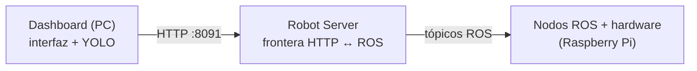

# P01 — Arranque, teleoperación y anatomía de un sistema ROS

**Para quién es y cuándo leerlo**
Para el estudiante, antes y durante la primera sesión de laboratorio con el robot.
Es la práctica de entrada: no supone ningún conocimiento previo de ROS.

---

**Duración:** 2 horas · **Requisitos previos:** ninguno

## 1. Competencia

Identifica los componentes de un sistema robótico distribuido basado en ROS y opera una
plataforma móvil real de forma segura, reconociendo los mecanismos que garantizan que el
robot se detenga ante la pérdida de control.

## 2. Objetivo

Al terminar, el estudiante será capaz de:

- arrancar el sistema completo (robot + estación de control) y verificar su estado;
- explicar por qué el robot **no se mueve** justo después de encenderse;
- teleoperar el robot con mando y con teclado;
- **demostrar experimentalmente** el funcionamiento del *watchdog* de seguridad;
- describir las tres capas de la arquitectura y qué corre en cada una.

## 3. Marco teórico

**ROS (Robot Operating System)** no es un sistema operativo, sino un middleware: un
conjunto de convenciones y herramientas para que programas independientes —los **nodos**—
se comuniquen. Un nodo publica mensajes en un **tópico** (canal con nombre y tipo, p. ej.
`/scan` de tipo `LaserScan`) y otros nodos se suscriben. El registro lo lleva el **ROS
Master**. Es un modelo *publicador–suscriptor*: quien publica no sabe quién le escucha.

En SafeVision hay **tres capas**:



La separación importa: **los lazos que mueven el robot viven en el robot**. Si la PC se
apaga o el Wi-Fi se cae, el robot sigue comportándose de forma segura por sí mismo.

**El selector de velocidad y el *watchdog*.** Todas las órdenes de movimiento llegan a un
nodo intermedio, `sf_cmd_vel_selector`, que decide cuál pasa a los motores. Ese nodo tiene
un temporizador: **si pasan más de 0,5 s sin recibir una orden válida, publica velocidad
cero**. Es lo que hace que el robot se detenga al soltar el mando, y también si se corta la
comunicación. Un robot que sigue avanzando cuando pierde a su operador es un robot
peligroso; el *watchdog* es lo que lo impide.

**Arranque en dos tiempos.** Al encenderse, el robot levanta sólo el ROS Master y el Robot
Server. Los nodos que mueven el robot (driver, LiDAR, navegación) **se encienden bajo
demanda** al aplicar un *perfil*. Es una decisión de seguridad: el robot no puede moverse
hasta que alguien lo pide explícitamente.

## 4. Material

- Robot SafeVision / ROSMASTER X3 con batería cargada
- PC con el dashboard instalado
- Mando (joystick) USB
- Cinta métrica
- Área despejada de 2 × 2 m

## 5. Seguridad

> ⚠️ Antes de empezar, lee [`README.md`](README.md) §4.

- Robot **en el suelo**, nunca sobre una mesa.
- **Una persona con el mando en las manos** durante toda la práctica.
- Avisa en voz alta antes de cualquier movimiento.
- En el paso 6 el robot se moverá: comprueba que el área está despejada.

## 6. Procedimiento

### Parte A — Arranque y observación (30 min)

**A.1** Enciende el robot y **espera 90 segundos** sin tocar nada. Mientras esperas, anota
qué crees que está ocurriendo.

**A.2** Comprueba que la PC lo encuentra:

```bash
ping -c 3 yahboom.local
```

*Resultado esperado:* responde. Si no, consulta [`../red.md`](../red.md) §6.

**A.3** Arranca el dashboard:

```bash
cd ~/safevision
./scripts/run_dashboard.sh
```

Anota la **IP** que imprime. Abre <http://127.0.0.1:5000> y conéctate con esa IP.

**A.4** Consulta la salud del robot:

```bash
export R=http://<IP-DEL-ROBOT>:8091
curl -s $R/health | python3 -m json.tool
```

> 📝 **Anota la respuesta completa.** Fíjate en que `"ok"` vale `false`.
> **Pregunta para pensar mientras sigues:** ¿es un fallo?

**A.5** Consulta el estado detallado:

```bash
curl -s $R/runtime/status | python3 -m json.tool
```

Anota el valor de `profile.requested` y de `profile.inferred`, y **cuántos recursos están
en `"active": false`**.

### Parte B — Aplicar un perfil (20 min)

**B.1** Avisa en voz alta: *"voy a encender los motores"*. Comprueba el área.

**B.2** Aplica el perfil de pilotaje:

```bash
curl -X POST $R/runtime/profile \
     -H 'Content-Type: application/json' \
     -d '{"profile":"pilotada","map":"<MAPA>","control":"mando"}'
```

> ⏱️ **Tarda hasta 2 minutos y no imprime nada mientras trabaja. No lo interrumpas.**
> Observa el robot: oirás arrancar el LiDAR.

**B.3** Vuelve a consultar `runtime/status` y `health`. Compara con A.4 y A.5.

> 📝 **Anota qué recursos cambiaron de `false` a `true`.** Deben ser al menos ocho.

### Parte C — Teleoperación con mando (20 min)

**C.1** Comprueba que el mando está reconocido:

```bash
curl -s $R/runtime/status | python3 -m json.tool | grep -A3 '"mando"'
```

*Esperado:* `"active": true` y `"connected": true`.

**C.2** Con el robot en el suelo y el área despejada, mueve el joystick. Familiarízate con
la respuesta.

**C.3** Mide: marca un punto de salida, avanza en línea recta durante 3 segundos y mide la
distancia recorrida. Repite tres veces.

> 📝 **Anota las tres distancias** y calcula la velocidad media.

### Parte D — El watchdog (20 min) ⭐

**Es la parte más importante de la práctica.**

**D.1** Pon el robot en movimiento continuo hacia adelante.

**D.2** **Suelta el mando de golpe** (deja de accionar el control).

**D.3** Observa y mide: ¿cuánto tarda en detenerse? Usa el cronómetro del teléfono o
estima con la distancia recorrida tras soltar.

> 📝 **Anota el tiempo y la distancia de parada.** Repite tres veces a distintas
> velocidades.

**D.4** *Ampliación (requiere SSH).* Observa el mecanismo por dentro:

```bash
ssh pi@yahboom.local
source /opt/ros/melodic/setup.bash
rostopic echo /cmd_vel
```

Mueve el robot y suéltalo. Verás cómo, al soltar, aparecen mensajes con todos los campos a
cero.

### Parte E — Teleoperación con teclado (15 min)

**E.1** Cambia el modo de control:

```bash
curl -X POST $R/runtime/control -H 'Content-Type: application/json' -d '{"mode":"teclado"}'
```

**E.2** Usa el control por teclado del dashboard.

**E.3** Consulta `/health` de nuevo.

> 📝 **`"ok"` valdrá `false` aunque el robot funcione.** Anótalo: es una inconsistencia
> conocida del sistema (`/health` espera un nodo ROS de teclado que en este modo no
> existe). Lo correcto es mirar `/runtime/status`. Es un buen ejemplo de que **un
> indicador puede estar mal aunque el sistema esté bien**.

### Parte F — Anatomía del sistema (15 min) — *ampliación con SSH*

```bash
ssh pi@yahboom.local
source /opt/ros/melodic/setup.bash
rosnode list      # nodos activos
rostopic list     # tópicos
rostopic hz /scan # frecuencia del LiDAR
rqt_graph         # si hay entorno gráfico
```

> 📝 **Anota cuántos nodos y cuántos tópicos hay.** Identifica al menos: el driver, el
> LiDAR, AMCL, `move_base` y el selector.

## 7. Resultados a reportar

1. Las respuestas de `/health` y `/runtime/status` **antes** y **después** de aplicar el
   perfil (capturas o texto).
2. Tabla con los recursos que cambiaron de estado.
3. Las tres medidas de distancia de la parte C y la velocidad media calculada.
4. **Tabla del watchdog:** tres medidas de tiempo y distancia de parada.
5. Captura de la interfaz con el robot conectado y el vídeo visible.
6. *(Si se hizo F)* Lista de nodos y tópicos.

## 8. Preguntas de análisis

1. Tras encender el robot, `/health` devolvía `"ok": false` y ningún recurso de movimiento
   estaba activo. **¿Por qué está diseñado así?** ¿Qué pasaría si el robot aplicara un
   perfil automáticamente al arrancar?
2. El *watchdog* detiene el robot tras 0,5 s sin órdenes. **¿Por qué 0,5 s?** ¿Qué
   problema tendría un valor de 5 s? ¿Y uno de 0,05 s?
3. En la parte E, `/health` daba `"ok": false` con el robot funcionando bien.
   **¿Qué diferencia hay entre "el sistema está mal" y "el indicador está mal"?**
   ¿Cómo afecta esto a la confianza en un sistema automático?
4. El dashboard corre en la PC y los nodos de control en el robot. **¿Qué ocurriría si el
   control de velocidad se calculara en la PC** y se enviara por Wi-Fi cada 50 ms?
5. Describe con tus palabras el camino completo de una orden desde que mueves el joystick
   hasta que giran las ruedas, nombrando al menos tres componentes intermedios.

## 9. Rúbrica

| Criterio | Peso | Excelente | Suficiente | Insuficiente |
|---|---:|---|---|---|
| Arranque y verificación | 25 % | Arranca y verifica sin ayuda; interpreta correctamente `/runtime/status` | Lo consigue con ayuda | No completa el arranque |
| Medición del watchdog | 25 % | Tres medidas coherentes, con método descrito | Medidas presentes pero sin método | Sin medidas |
| Evidencias | 15 % | Capturas claras, antes y después | Incompletas | Ausentes |
| Análisis (preguntas) | 25 % | Responde con fundamento técnico | Responde correctamente sin profundizar | No responde o es incorrecto |
| Seguridad | 10 % | Cumple el protocolo sin recordatorios | Necesita recordatorios | Pone en riesgo al equipo |

---

**Siguiente práctica:** [P02 — Percepción con LiDAR](P02-percepcion-lidar.md)
