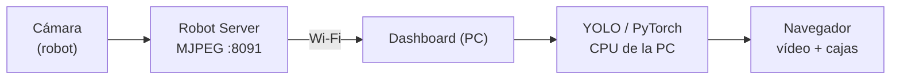

# P06 — Detección de objetos con YOLO y misiones programadas

**Para quién es y cuándo leerlo**
Para el estudiante, en la última sesión. Integra todo lo anterior y añade la parte de
inteligencia artificial.
Requiere P01-P05.

---

**Duración:** 3 horas · **Requisitos previos:** P01, P02, P03, P04, P05

## 1. Competencia

Integra un modelo de detección de objetos en un sistema robótico distribuido y programa
comportamientos autónomos mediante un lenguaje de dominio específico, evaluando
críticamente el grado de integración entre percepción visual y control del movimiento.

## 2. Objetivo

Al terminar, el estudiante será capaz de:

- explicar por qué la inferencia corre en la PC y no en el robot;
- evaluar el rendimiento de un detector YOLO sobre el flujo de vídeo del robot;
- programar, validar, simular y ejecutar una misión en el DSL de SafeVision;
- **argumentar la diferencia entre "el robot detecta" y "el robot reacciona"**;
- reconocer las limitaciones declaradas del lenguaje de misiones.

## 3. Marco teórico

**YOLO** (*You Only Look Once*) es un detector de una etapa: una sola pasada de la red
produce, a la vez, las cajas delimitadoras y las clases. Divide la imagen en una rejilla y
cada celda predice cajas con su confianza. Es rápido, lo que lo hace apto para vídeo.

Salida por detección: **clase**, **confianza** (0-1) y **caja** $(x, y, w, h)$. El **umbral
de confianza** filtra: subirlo reduce falsos positivos y aumenta falsos negativos.

**Dónde corre la inferencia.** La Raspberry Pi no tiene potencia para YOLO en tiempo real.
SafeVision reparte el trabajo:



Es un ejemplo clásico de **cómputo distribuido**: el sensor está donde debe estar, el
cómputo pesado donde hay recursos. Tiene un coste: **latencia** de red y de inferencia.

> **Dato relevante que descubrirás:** el robot **sí** tiene `torch` y `ultralytics`
> instalados, restos de una versión anterior que intentaba inferir localmente. El runtime
> actual **no los usa**. Merece la pena preguntarse por qué se abandonó ese camino.

**El DSL de misiones.** Un subconjunto restringido de Python, analizado con `ast` — **no se
usa `eval`**. Un programa de misión no puede abrir ficheros ni ejecutar órdenes del
sistema: es una decisión de seguridad.

Acciones:

| Acción | Estado |
|---|---|
| `ir("punto")` | ✅ funciona |
| `esperar(segundos)` | ✅ funciona |
| `orientar(angulo)` | ✅ funciona |
| `girar(angulo)` | ❌ **retirada del lenguaje**: el validador la rechaza |
| `relocalizar()` | ❌ **retirada del lenguaje**: el validador la rechaza |

Permite variables, aritmética, `for ... in range(...)` (máximo 10 000 iteraciones) e `if`.

**Flujo obligatorio:** escribir → **validar** → **simular** → guardar → preparar → ejecutar.
Una misión no llega al robot sin pasar el analizador y el simulador.

**La pregunta importante de esta práctica:** la detección y la navegación **no están
conectadas**. YOLO dibuja cajas en la pantalla; no frena ni desvía al robot. Es una decisión
arquitectónica deliberada, y vas a razonar sobre ella.

## 4. Material

- Robot localizado en su mapa (P04, P05)
- PC con dashboard y **un modelo YOLO cargado**
- Objetos correspondientes a las clases del modelo
- Mando
- Cronómetro

**[PENDIENTE: anotar aquí el modelo disponible y sus clases. En el robot verificado había
uno con las clases: persona, teléfono, lentes, botas.]**

## 5. Seguridad

> ⚠️ Lee [`README.md`](README.md) §4 y el protocolo de [P05](P05-navegacion-autonoma.md) §5.

- La parte C (misiones) **mueve el robot de forma autónoma**: aplica el mismo protocolo que
  P05, incluida la persona dedicada al mando y el área delimitada.
- **Simula siempre antes de ejecutar.** Es gratis y evita sorpresas.
- La parte B (YOLO) es estática y de bajo riesgo.

## 6. Procedimiento

### Parte A — El catálogo de modelos (20 min)

**A.1** Consulta los modelos disponibles:

```bash
export R=http://<IP-DEL-ROBOT>:8091
curl -s $R/models | python3 -m json.tool
```

> 📝 **Anota:** nombre, versión, **clases** y tamaño de cada artefacto.

**A.2** Identifica los formatos: `.pt` (PyTorch) y `.torchscript`.

> 📝 **Investiga y explica en el reporte** la diferencia entre ambos formatos y por qué un
> proyecto podría querer los dos.

**A.3** Consulta los metadatos de un modelo concreto:

```bash
curl -s $R/models/<nombre> | python3 -m json.tool
```

### Parte B — Detección (50 min)

**B.1** Con el dashboard conectado y el vídeo visible, activa la inferencia.

**B.2** Presenta un objeto de una clase entrenada.

> 📝 **Captura con la caja y la etiqueta visibles.**

**B.3** **Tabla de detección.** Para cada clase del modelo, preséntala cinco veces en
condiciones distintas (cerca/lejos, bien/mal iluminada, de frente/de lado):

| Clase | Intentos | Detecciones correctas | Tasa | Confianza media |
|---|---:|---:|---:|---:|
| | 5 | | | |

**B.4** **Umbral de confianza.** Fija un objeto a distancia media y varía el umbral:

| Umbral | ¿Se detecta? | Falsos positivos en escena |
|---|---|---|
| 0,25 | | |
| 0,50 | | |
| 0,75 | | |
| 0,90 | | |

> 📝 **Explica el compromiso.** ¿Qué umbral elegirías para una aplicación de seguridad
> donde no detectar es peor que una falsa alarma? ¿Y al revés?

**B.5** **Latencia.** Mueve un objeto rápidamente ante la cámara y estima el retardo entre
el movimiento real y la caja en pantalla.

> 📝 **Anota el retardo estimado** y enumera sus tres componentes (captura, red,
> inferencia).

**B.6** **Falsos positivos.** Apunta la cámara a una escena sin objetos de las clases
entrenadas y observa un minuto.

> 📝 **¿Aparecen detecciones falsas? ¿Sobre qué?**

### Parte C — Misiones (70 min)

**C.1** En el dashboard, página "Programar", define **tres puntos** sobre tu mapa y dales
**alias** con significado (`entrada`, `centro`, `salida`).

**C.2** Escribe una primera misión sencilla:

```python
ir("entrada")
esperar(3)
ir("centro")
esperar(3)
ir("salida")
```

**C.3** **Valida.** Corrige los errores hasta que pase.

**C.4** **Provoca errores a propósito** y anota el mensaje exacto de cada uno:

| Código | Mensaje de error |
|---|---|
| `ir("no_existe")` | |
| `ir()` | |
| `esperar(-5)` | |
| `esperar(t)` (con `t` variable) | |
| `orientar(90, velocidad=1, otro=2)` | |

> 📝 **Tabla completa.** Los mensajes de error son parte del diseño de una herramienta:
> valora si son claros.

**C.5** **Simula** la misión correcta y captura el recorrido dibujado.

**C.6** **Avisa en voz alta**, comprueba el área, y ejecuta:

```bash
curl -X POST $R/mission/prepare -H 'Content-Type: application/json' -d '{...}'
curl -X POST $R/mission/start
```

Sigue el progreso:

```bash
watch -n 1 "curl -s $R/mission/status | python3 -m json.tool"
```

> 📝 **Anota los estados por los que pasa:** `ready` → `navigating` → `waiting` → … →
> `done`.

**C.7** **Misión con bucle.** Escribe y ejecuta:

```python
for vuelta in range(2):
    ir("entrada")
    esperar(2)
    ir("salida")
    esperar(2)
```

> 📝 **Captura del recorrido simulado.** ¿Cuántas acciones genera el plan? Compáralo con lo
> que esperabas.

**C.8** **Las acciones retiradas.** Escribe:

```python
ir("entrada")
girar(90)
```

y **valida**.

> 📝 **Anota el mensaje exacto.** Debe rechazarla al validar, diciendo que `girar()` no
> está implementada y sugiriendo `orientar()`.
>
> **Contexto para la pregunta 4 del análisis:** hasta hace poco esta misión *pasaba* la
> validación y la simulación, y sólo fallaba al arrancar, con el mensaje *"Acción todavía
> no habilitada"*. Se retiró del lenguaje precisamente para que el error llegue antes.

**C.9** Cancela una misión a mitad y anota el estado resultante.

### Parte D — Integración percepción-acción (20 min)

**D.1** Con una misión en ejecución y la detección activa, coloca un objeto de una clase
entrenada **en el camino del robot** (con el mando en la mano, listo para parar).

**D.2** Observa.

> 📝 **Responde:** ¿el robot detectó el objeto? ¿Modificó su comportamiento por la
> detección? ¿Lo esquivó?

> ⚠️ Si el objeto es alto, el robot lo esquivará — **pero por el LiDAR, no por YOLO.**
> Ésa es exactamente la distinción que hay que entender.

**D.3** Repite con un objeto **bajo** (por debajo del plano del LiDAR) que sí detecte YOLO.

> 📝 **¿Qué pasa?** Detén el robot antes del contacto.

## 7. Resultados a reportar

1. Catálogo de modelos con clases y formatos, y explicación de `.pt` vs `.torchscript`.
2. **Tabla de detección** por clase con tasa de acierto y confianza media.
3. **Tabla de umbral** con la discusión del compromiso.
4. Estimación de latencia con sus tres componentes.
5. Código de al menos dos misiones, con capturas de la simulación.
6. **Tabla de mensajes de error** del validador.
7. Evidencia del rechazo de `girar()` con el mensaje exacto y el momento en que ocurre.
8. Resultado de la parte D, con conclusión sobre la integración percepción-acción.

## 8. Preguntas de análisis

1. La inferencia corre en la PC, no en el robot, aunque el robot **tiene** `torch` y
   `ultralytics` instalados. **Enumera tres ventajas y tres inconvenientes** de esa
   decisión. ¿Qué cambiaría si el robot llevara una unidad de cómputo acelerada?
2. En la parte D comprobaste que la detección **no** modifica el comportamiento del robot.
   **¿Es un defecto o una decisión de diseño?** Argumenta a favor y en contra, pensando en
   seguridad: ¿qué pasaría si un falso positivo de YOLO pudiera frenar el robot?
3. El DSL se analiza con `ast` y **no** usa `eval`. **¿Qué riesgo concreto evita?** Escribe
   un ejemplo de lo que un usuario malintencionado podría hacer si se usara `eval`.
4. `girar()` y `relocalizar()` se aceptaban al escribir y al simular, pero fallaban al
   ejecutar; ahora se rechazan al escribir. **¿Por qué es mejor fallar antes?** Argumenta
   desde el diseño de herramientas, y di qué se pierde con el cambio.
5. **Diseña** (sólo en papel) una modificación que conecte percepción y acción: por ejemplo,
   que el robot se detenga al detectar una persona. Indica: qué componente lo decidiría,
   **dónde debería ejecutarse** (PC o robot), y por qué. Relaciónalo con el principio de que
   los lazos críticos viven en el robot.

## 9. Rúbrica

| Criterio | Peso | Excelente | Suficiente | Insuficiente |
|---|---:|---|---|---|
| Evaluación de YOLO | 25 % | Tablas completas de detección, umbral y latencia | Tablas incompletas | Sin datos |
| Programación de misiones | 25 % | Dos misiones ejecutadas, bucle incluido, con simulación | Una misión simple | No ejecuta ninguna |
| Tabla de errores del DSL | 15 % | Completa, con valoración de la claridad de los mensajes | Completa sin valorar | Incompleta |
| Análisis (preguntas) | 25 % | Argumenta P2 y P5 con criterio de ingeniería | Responde sin profundizar | No responde |
| Seguridad | 10 % | Simula antes de ejecutar; protocolo impecable | Con recordatorios | Ejecuta sin simular o pone en riesgo al equipo |

---

## 10. Cierre del curso

Con esta práctica has recorrido el sistema completo:

| Práctica | Capa |
|---|---|
| P01 | Arquitectura y seguridad del control |
| P02 | Percepción — y sus límites |
| P03 | Construcción del mundo (SLAM) |
| P04 | Saber dónde estás (localización) |
| P05 | Decidir cómo llegar (planificación) |
| P06 | Reconocer qué hay y programar qué hacer |

**La pregunta que queda abierta** —y que aparece en P02, P05 y P06— es la misma: el robot
tiene una cámara RGB-D montada cuyo canal de profundidad no se usa para navegar.
Resolverlo es el siguiente paso del proyecto, y está especificado en
[`../analisis-alcance.md`](../analisis-alcance.md) §4. Si te interesa, habla con tu
profesor: es un buen tema de residencia o de titulación.

---

**Anterior:** [P05](P05-navegacion-autonoma.md) · **Índice:** [README](README.md)
