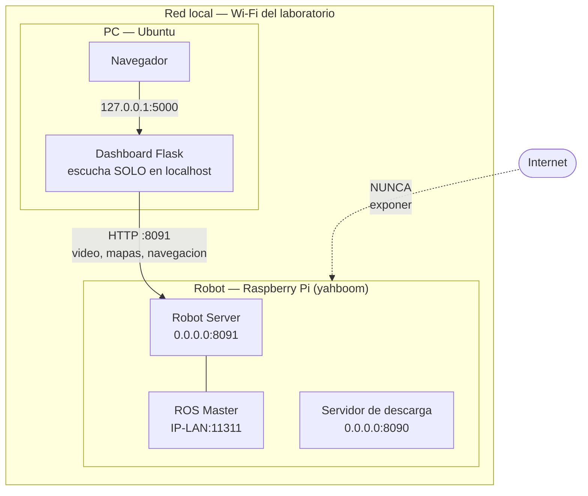
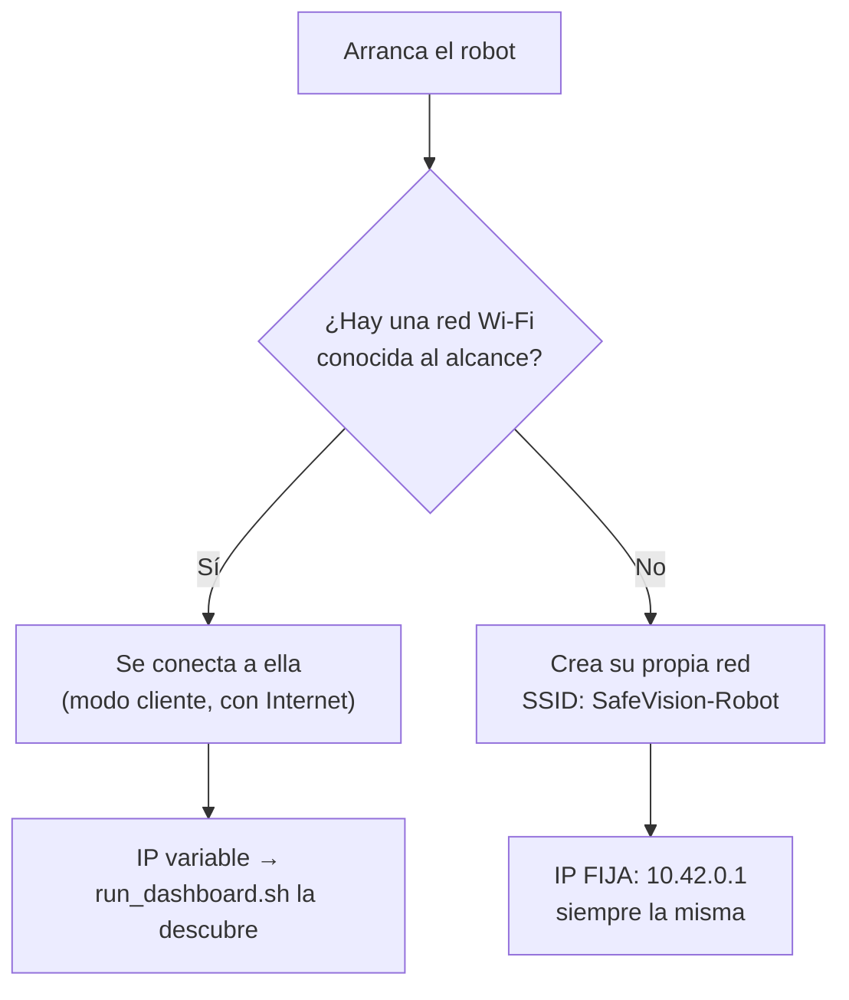

# Red: cómo se encuentran la PC y el robot

**Para quién es y cuándo leerlo**
Para quien conecta la PC con el robot por primera vez, o cuando "ayer funcionaba y hoy no
lo encuentra".
Léelo entero una vez; después normalmente basta con la §2 y la §6 (diagnóstico).

---

## 1. El mapa completo



| Servicio | Dónde corre | Escucha en | Para qué |
|---|---|---|---|
| **Robot Server** | robot | `0.0.0.0:8091` | API HTTP↔ROS: vídeo, mapas, pose, navegación, misiones |
| **ROS Master** | robot | `<IP-LAN>:11311` | registro de nodos y tópicos ROS |
| Servidor de descarga | robot | `0.0.0.0:8090` | entrega el `.tar.gz` del dashboard |
| **Dashboard** | PC | `127.0.0.1:5000` | interfaz web |

> **Detalle de seguridad bien resuelto:** el dashboard escucha **sólo en `127.0.0.1`**
> (`sf_app_dashboard.py`), así que no es accesible desde otras máquinas de la red.
> Es correcto y no debe cambiarse.

## 2. Uso normal: mDNS (`yahboom.local`)

El robot se anuncia por mDNS/Avahi con el nombre **`yahboom`**, de modo que responde a
`yahboom.local` sin que nadie sepa su IP.

```bash
ping -c 3 yahboom.local
```

Es lo que usa `scripts/robot.env` por defecto, y funciona mientras la PC y el robot estén
en la **misma red local**.

### 2.1 La trampa: el dashboard NO acepta nombres

**CONFIRMADO** (`sf_app_dashboard.py:506-518`): la casilla "IP del robot" valida con
`ipaddress.ip_address()` y acepta **únicamente un IPv4 literal**. Escribir `yahboom.local`
devuelve *"IP inválida"*.

Por eso `./scripts/run_dashboard.sh` resuelve el nombre y te imprime el número exacto:

```
 En la casilla 'IP del robot' escribe:  192.168.1.13
```

### 2.2 Y la IP cambia

El router la asigna por DHCP. **Ya ha cambiado al menos dos veces** en la historia de este
proyecto:

| Dónde aparece | IP | Estado |
|---|---|---|
| Scripts antiguos (`auto_mapeo.sh`, `mapeo_denso.sh`, `api/*`) | `192.168.1.75` | **obsoleta** |
| `backups/start_hybrid_mapping.sh.old` | `192.168.1.69` | **obsoleta** |
| Robot verificado el 2026-09-10 | `192.168.1.13` | vigente ese día |

**Conclusión: no escribas IPs en ningún sitio.** Deja que `run_dashboard.sh` la resuelva,
o fija una reserva DHCP (§3). Las IP de los scripts antiguos son sólo *fallbacks* de
código heredado; ver `docs/security-scan.md` H-8.

## 3. Opción recomendada: reserva DHCP en el router

Más estable que una IP estática en el robot, porque no se rompe al cambiar de red.

1. Consigue la MAC del robot:

```bash
ssh pi@yahboom.local "ip -o link show wlan0 | awk '{print \$17}'"
```

2. En el router: *DHCP* → *Reserva de direcciones* / *Static Lease* → asocia esa MAC a una
   IP fuera del rango dinámico (por ejemplo `192.168.1.50`).
3. Reinicia el robot y comprueba: `ping -c 3 192.168.1.50`
4. Fíjala en la PC:

```bash
echo "ROBOT_HOST=192.168.1.50" > scripts/robot.env
```

**Decisión tomada:** sí conviene la reserva DHCP. **[PENDIENTE (estudiante): configurarla en el módem y anotar aquí la IP.]** Mientras tanto la red autónoma y `run_dashboard.sh` hacen que no sea imprescindible.

## 4. Alternativa: IP estática en el robot

Sólo si no hay acceso al router. El robot usa **netplan**.

> ⚠️ Una IP estática mal puesta **te deja sin acceso al robot por red**. Hazlo con teclado
> y pantalla conectados, o teniendo a mano cómo sacar la tarjeta.

```bash
sudo nano /etc/netplan/02-wifi.yaml
```

```yaml
network:
  version: 2
  wifis:
    wlan0:
      dhcp4: no
      addresses: [192.168.1.50/24]
      gateway4: 192.168.1.1
      nameservers:
        addresses: [192.168.1.1, 8.8.8.8]
      access-points:
        "NOMBRE_DE_LA_RED":
          password: "LA_CONTRASEÑA"
```

```bash
sudo netplan try      # revierte solo a los 120 s si pierdes la conexion
sudo netplan apply
```

> 🔒 Ese fichero contiene la contraseña del Wi-Fi **en claro**. Una copia suya
> (`backups/02-wifi.yaml.bak`) está publicada en GitHub con la PSK real. Ver
> `docs/security-scan.md` H-2: **hay que rotar esa contraseña**.
> **Nunca versiones un netplan con contraseña.**

## 4-bis. Migrar de Ethernet a Wi-Fi (procedimiento para las pruebas)

**Estado verificado el 2026-09-10:** el robot estaba conectado **sólo por Ethernet**
(`eth0` = 192.168.1.13) y `wlan0` **caída** (sin portadora, sin SSID). Para cualquier prueba
con movimiento hay que pasarlo a Wi-Fi y desconectar el cable: un robot atado por Ethernet
se lleva por delante el cable, el módem, o a sí mismo.

### 4-bis.1 Por qué no basta con conectar el Wi-Fi y tirar del cable

**CONFIRMADO** leyendo `sf_roscore_service.sh:7-24` y `sf_robot_server_service.sh:7-24`:
ambos servicios resuelven la IP así:

```bash
ip -4 -o addr show dev wlan0 scope global   # primero wlan0
hostname -I                                  # y si no hay, lo que haya (eth0)
```

y con ella exportan `ROS_IP` y `ROS_MASTER_URI` **una sola vez, al arrancar**.

Ahora mismo, con `wlan0` caída, el ROS Master está publicado en la IP de `eth0`. Si
conectas el Wi-Fi y desenchufas el cable **sin reiniciar**, el Master sigue anunciado en una
IP que ya no existe y los nodos no podrán registrarse.

> **Por eso el procedimiento termina en un reinicio.** Además, ese reinicio **es** el
> arranque en frío que piden las pruebas A-1 y V-1 de `docs/validacion.md`: se aprovecha.

### 4-bis.2 Perfiles Wi-Fi ya guardados en el robot

**CONFIRMADO** (`nmcli connection show`): `wlan0` la gestiona **NetworkManager** (`eth0` es
`unmanaged`, lo lleva netplan/cloud-init), y hay tres perfiles guardados con
`autoconnect=yes`:

| Perfil guardado | Notas |
|---|---|
| `INFINITUMEB8A` | Es la red cuya contraseña está filtrada en el repositorio (`security-scan.md` H-2) |
| `Red_local_luis` | — |
| `Y_Lab_de_Control` | Por el nombre, la del laboratorio |

⚠️ **Ninguno de los tres aparecía en el último escaneo**, que veía
`Mega_5G_38FE`, `Mega_2.4G_38FE`, `INFINITUM2204`, `INFINITUM0F9D_2.4` y `INFINITUM3BF3`.
El escaneo puede estar caducado (`wlan0` lleva tiempo desconectada), así que **lo primero
es un rescan**.

### 4-bis.3 Procedimiento

Todo esto se ejecuta **en el robot**, con el cable Ethernet todavía puesto.

```bash
ssh pi@192.168.1.13        # o la IP que tenga por Ethernet

# 1. Refrescar el escaneo y ver que hay de verdad
sudo nmcli dev wifi rescan
sleep 5
nmcli -f SSID,SIGNAL,SECURITY dev wifi list

# 2a. Si aparece un perfil YA GUARDADO, basta con activarlo:
sudo nmcli connection up "Y_Lab_de_Control"

# 2b. Si la red NO esta guardada, anadirla (te pedira la clave sin dejarla
#     en el historial ni en la lista de procesos):
sudo nmcli dev wifi connect "NOMBRE_DE_LA_RED" --ask

# 3. Comprobar que wlan0 tiene IP y ANOTARLA
ip -brief -4 addr show wlan0
iwgetid -r

# 4. Asegurar que el perfil se reconecta solo al arrancar
nmcli -g connection.autoconnect connection show "NOMBRE_DE_LA_RED"
# si dice "no":
sudo nmcli connection modify "NOMBRE_DE_LA_RED" connection.autoconnect yes

# 5. Apagar limpiamente
sudo shutdown -h now
```

Cuando se apaguen los LED de actividad:

6. **Desconecta el cable Ethernet.**
7. **Pon el robot en el suelo**, en el área despejada.
8. Enciéndelo y espera **90 segundos**.

### 4-bis.4 Verificación desde la PC

```bash
./scripts/run_dashboard.sh
```

El script resuelve `yahboom.local` y, si el nombre no responde, **barre la red buscando
quién contesta en `:8091`** y te dice la IP encontrada. No hay ninguna IP escrita en el
repositorio.

Comprobación manual equivalente:

```bash
curl -s http://<IP-NUEVA>:8091/runtime/status | python3 -m json.tool | head -20
```

Debe mostrar `ros_master_uri` con la **IP de Wi-Fi**, no la de Ethernet. Si todavía muestra
la de Ethernet, el robot no reinició o `wlan0` no subió a tiempo.

### 4-bis.5 Si algo sale mal y pierdes el acceso

El robot sigue teniendo el puerto Ethernet: vuelve a enchufar el cable, espera un minuto y
entra por la IP de `eth0`. Por eso **el cable se retira sólo después** de comprobar que el
Wi-Fi funciona.

**Ejecutado el 2026-09-11:** red `Mega_2.4G_38FE` guardada con `autoconnect` y prioridad 10; el robot arranca sin cable y obtiene su dirección por DHCP (`.15`, después `.10`), que `run_dashboard.sh` resuelve por `yahboom.local`.
## 4-ter. Red autónoma: el robot crea su propia red cuando no hay ninguna

**El problema.** El robot cambia de sitio: laboratorio, casa, un pasillo, un patio sin
cobertura. Reconfigurar la red en cada traslado no es viable.

**La solución implementada.** El robot pasa a tener dos modos y elige solo:



> **La consecuencia práctica:** en cualquier sitio sin Wi-Fi conocida, enciendes el robot,
> conectas el portátil a **`SafeVision-Robot`**, y el robot está en **`10.42.0.1`**.
> Siempre. Sin escanear, sin preguntarle al módem, sin cables.

### 4-ter.1 Qué se instala

| Pieza | Dónde | Qué hace |
|---|---|---|
| Perfil `SafeVision-AP` | NetworkManager | Punto de acceso WPA2, 2.4 GHz, `ipv4.method shared` con la dirección **fijada** a `10.42.0.1/24` (reparte DHCP; no se deja al valor por defecto de NetworkManager) |
| `sf_red_watchdog.sh` | `misiones/pilotada/robot/` | Vigila `wlan0`; si se queda sin red, prueba las conocidas y si no levanta el AP |
| `safevision-red.service` | `misiones/pilotada/systemd/` | Ejecuta el vigilante al arrancar |

**Verificado en el robot antes de diseñarlo:** NetworkManager 1.10.6, `dnsmasq-base` 2.79
instalado, chip `brcmfmac` con **modo AP soportado** (`iw list` → `* AP`).

### 4-ter.2 Instalación (una sola vez)

Desde la PC, con el robot accesible:

```bash
cd ~/safevision
git pull                                  # el robot necesita el codigo nuevo
ssh pi@<IP-ROBOT> 'cd ~/robot_custom && git pull'
ssh -t pi@<IP-ROBOT> '~/robot_custom/scripts/robot_configurar_red.sh'
```

El script pide confirmación, te pide **una clave para el punto de acceso** (mínimo 8
caracteres, no se guarda en el repositorio) y explica al final cómo deshacerlo todo.

**No cambia la conexión en ese momento**: surte efecto al reiniciar o cuando `wlan0` se
quede sin red.

### 4-ter.3 Uso diario

| Situación | Qué haces |
|---|---|
| **En el laboratorio o en casa** (red conocida) | Nada. El robot se conecta solo. `./scripts/run_dashboard.sh` encuentra su IP |
| **En un sitio nuevo sin red** | Conecta el portátil a `SafeVision-Robot`. El robot está en `10.42.0.1` |
| **Red nueva que quieres que recuerde** | `sudo nmcli dev wifi connect "<SSID>" --ask` en el robot. Queda guardada y tendrá prioridad sobre el AP |
| **Estás en modo AP y quieres pasar a una red** | `sudo nmcli connection up "<NOMBRE>"` |
| **Te quedaste fuera** | Cable Ethernet. `eth0` sigue con DHCP y no depende de nada de esto |

### 4-ter.4 Límites conocidos, dichos de frente

1. **En modo punto de acceso el robot no tiene Internet**, y el portátil conectado a él
   tampoco. Es el precio de no depender de infraestructura.
2. **No hay modo cliente y AP a la vez.** El chip `brcmfmac` de la Raspberry Pi lo admite
   sobre el papel, pero es inestable. Se eligió uno u otro, nunca ambos.
3. **Estando en modo AP el robot no busca redes.** Escanear mientras se hace de punto de
   acceso tira a los clientes conectados. Para volver a modo cliente: reinicia o usa
   `nmcli connection up`.
4. **El AP tarda entre 20 y 40 segundos** en aparecer tras el arranque: el vigilante espera
   primero a que NetworkManager intente las redes conocidas.
5. **`ROS_MASTER_URI` se fija al arrancar.** Si el robot cambia de red *mientras está
   encendido*, los servicios siguen anunciando la IP vieja. La solución es reiniciar; ver
   §4-bis.1.

### 4-ter.5 Alternativas descartadas, y por qué

| Alternativa | Por qué no |
|---|---|
| Cable Ethernet directo PC↔robot | Determinista y rápido, pero el robot **no puede moverse**. Queda como vía de rescate |
| Router de viaje dedicado | Funciona bien, pero es hardware extra que alimentar y transportar |
| Compartir datos del teléfono | Sirve como red conocida más (añádela con `nmcli`), pero depende del teléfono y su batería |
| Tailscale / VPN | Resuelve el acceso remoto, **no** el problema de no haber red local. Además añade superficie a un sistema sin autenticación |
| IP estática en `wlan0` | Rompe en cuanto cambias de red. La reserva DHCP del módem es mejor, pero sólo sirve en esa red |

> **Combinación recomendada:** punto de acceso propio como respaldo universal + las redes
> del laboratorio y de casa guardadas + el cable como rescate. Cubre los tres escenarios sin
> hardware adicional.

### 4-ter.6 Resultado de la puesta en marcha (verificado en el robot)

Ejecutado el **2026-09-11** sobre el robot real, con el cable conectado como red de
seguridad. Las cuatro comprobaciones pasaron:

| # | Prueba | Resultado |
|---|---|---|
| 1 | Punto de acceso activado a mano | `wlan0` en `type AP`, SSID `SafeVision-Robot`, canal 6, **IP `10.42.0.1/24`**, `dnsmasq` repartiendo, y `GET http://10.42.0.1:8091/health` respondiendo |
| 2 | El vigilante no molesta a una conexión sana | 25 s con `wlan0` conectada: no intervino |
| 3 | Recuperación con red conocida al alcance | Tras `nmcli device disconnect wlan0`, reconectó a `Mega_2.4G_38FE` en **~10 s** |
| 4 | Caída al punto de acceso sin red conocida | Falseando el SSID del perfil, levantó el AP en **~10 s** y quedó en `10.42.0.1` |

Y tras un **reinicio en frío**:

```
safevision-roscore        enabled / active
safevision-robot-server   enabled / active
safevision-red            enabled / active
wlan0  192.168.1.15   SSID Mega_2.4G_38FE     (reconectó sola)
```

> **Validación adicional del caso "sin cable".** Sin poder desconectar el cable físicamente,
> se simuló entrando por Wi-Fi, bajando `eth0` y reiniciando los dos servicios de ROS. El
> resultado, leído del entorno real de los procesos (`/proc/<pid>/environ`), fue el correcto:
>
> ```
> ROS_MASTER_URI=http://192.168.1.15:11311
> ROS_IP=192.168.1.15
> ```
>
> Es decir: **al arrancar sin cable, ROS se anuncia en la dirección de Wi-Fi.** El paso
> físico pendiente es sólo retirar el cable y arrancar.

### 4-ter.7 Aviso: `ros_master_uri` de `/runtime/status` puede mentir

**CONFIRMADO.** El campo `ros_master_uri` que devuelve `GET /runtime/status` **no** es el que
usan los servicios: `sf_runtime_manager._robot_ip()` lo **recalcula en cada llamada** abriendo
un socket UDP hacia `8.8.8.8` y mirando qué dirección local elige el sistema, es decir, la de
la **ruta por defecto de ese instante**.

Con las dos interfaces levantadas se observó exactamente esta discrepancia:

| Fuente | Valor |
|---|---|
| Entorno real de `roscore` (`/proc/<pid>/environ`) | `http://192.168.1.15:11311` ✅ |
| Campo `ros_master_uri` de `/runtime/status` | `http://192.168.1.13:11311` ❌ |

**Consecuencia práctica:** si diagnosticas un problema de ROS guiándote por ese campo, o lo
copias para configurar `ROS_MASTER_URI` en otra máquina, puedes acabar apuntando a la
interfaz equivocada.

**La fuente fiable** mientras esto no se corrija:

```bash
sudo tr '\0' '\n' < /proc/$(systemctl show -p MainPID --value safevision-roscore)/environ \
  | grep ROS_MASTER_URI
```

**[PENDIENTE: corregir `sf_runtime_manager.py` para que informe del `ROS_MASTER_URI` real del
proceso en lugar de recalcularlo. Es un fichero del runtime y toca hacerlo en su propia rama,
con validación en hardware.]**

---

## 5. Cambiar de red Wi-Fi

Con acceso por SSH o por teclado:

```bash
sudo nmcli dev wifi rescan
sudo nmcli dev wifi list
sudo nmcli dev wifi connect "NOMBRE_DE_LA_RED" --ask
```

`--ask` pide la contraseña de forma interactiva, **sin dejarla en el historial ni en la
lista de procesos**. El script del repositorio `network/wifi_manager.sh:22` la pasa en la
línea de órdenes, lo que la hace visible a cualquier usuario local
(`docs/security-scan.md` H-4): prefiere `--ask`.

Sin acceso por red: conecta teclado y pantalla HDMI al robot, o edita el netplan montando
la microSD en otro equipo.

## 6. Diagnóstico: "no encuentro el robot"

Por orden. No saltes pasos.

### 6.1 ¿Está encendido y en la red?

```bash
ping -c 3 yahboom.local
```

- **Responde** → ve a §6.3.
- **`Name or service not known`** → mDNS no resuelve; §6.2.
- **`Destination Host Unreachable`** → no está en tu red: comprueba que ambos estéis en el
  mismo Wi-Fi (no uno en la red de invitados).

### 6.2 Cuando `yahboom.local` no resuelve

```bash
# ¿Tiene la PC el resolutor mDNS?
systemctl status avahi-daemon
sudo apt install -y avahi-daemon libnss-mdns

# Buscar el robot por descubrimiento
avahi-browse -art | grep -i yahboom

# O barrer la red (ajusta el prefijo al tuyo)
ip route | grep default
sudo apt install -y nmap
nmap -sn 192.168.1.0/24 | grep -B2 -i "raspberry\|yahboom"
```

Causas frecuentes: el punto de acceso tiene activado el *aislamiento de clientes*
(*AP isolation*), o la PC y el robot están en VLAN/bandas distintas.

### 6.3 ¿Responde el Robot Server?

```bash
curl -s --max-time 5 http://<IP>:8091/health | python3 -m json.tool
```

- **Devuelve JSON** → la red está bien. Si algo falla, es del robot:
  `docs/solucion-problemas.md`.
- **`Connection refused`** → el servicio no corre:

```bash
ssh pi@yahboom.local 'systemctl status safevision-robot-server'
```

- **Se queda colgado sin responder** → cortafuegos intermedio, o `ping` funciona pero el
  puerto está bloqueado.

### 6.4 Responde pero `"ok": false`

**Es lo normal recién arrancado.** No es un fallo de red. El robot levanta sólo el ROS
Master y el Robot Server; falta aplicar un perfil de runtime. Ver
`docs/manual-operacion.md` y `docs/estado-actual.md` §1.

## 7. Lo que NO debe exponerse a Internet

> 🔒 **Regla dura. No es una recomendación.**
> Está en `CLAUDE.md` (regla 5) y en el handoff §50 y §64.

| Puerto | Servicio | Riesgo si se expone |
|---|---|---|
| **8091** | Robot Server | **Control total del robot sin contraseña.** `POST /runtime/keyboard` lo mueve; `POST /runtime/profile` enciende motores; `POST /maps/…/delete` borra mapas |
| **11311** | ROS Master | ROS 1 **no tiene autenticación ni cifrado**. Cualquiera puede publicar en `/cmd_vel` y mover el robot |
| 8090 | Descarga | Entrega un paquete de 395 MB a quien lo pida |

**Ningún servicio de SafeVision tiene autenticación.** Se verificó: `git grep` de
`secret_key|auth|login` no devuelve una sola línea en el código del proyecto
(`docs/security-scan.md` H-6). **La frontera de la red es la única frontera de seguridad
que hay.**

Por tanto:

- ❌ **Nunca** abras puertos en el router hacia el robot (*port forwarding*).
- ❌ **Nunca** pongas el robot en la DMZ.
- ❌ Desactiva UPnP en el router si no lo necesitas.
- ✅ Para acceso remoto legítimo, usa **VPN o Tailscale**, y sólo eso.
- ✅ En un laboratorio compartido, considera una red o VLAN separada para los robots.

### 7.1 Acceso remoto correcto: Tailscale

```bash
# En el robot y en la PC
curl -fsSL https://tailscale.com/install.sh | sh
sudo tailscale up
```

Ambos quedan en una red privada cifrada. El robot sigue **sin** exponer nada a Internet:
sólo es accesible desde los dispositivos de tu cuenta.

**Decisión tomada:** no se instala Tailscale por ahora; añadiría superficie a un sistema sin autenticación. La red autónoma cubre el uso sin infraestructura.

## 8. Referencia rápida

```bash
# ¿Está vivo?
ping -c 3 yahboom.local

# ¿Qué IP tiene?
getent ahostsv4 yahboom.local | head -1

# ¿Responde el Robot Server?
curl -s http://$(getent ahostsv4 yahboom.local | awk 'NR==1{print $1}'):8091/health \
  | python3 -m json.tool

# Arrancar el dashboard (resuelve la IP solo)
./scripts/run_dashboard.sh
```

## 9. Documentos relacionados

- `docs/instalacion-pc.md` — instalar el dashboard.
- `docs/instalacion-robot.md` — restaurar o reconstruir el robot.
- `docs/solucion-problemas.md` — síntoma → causa → solución.
- `docs/security-scan.md` — credenciales expuestas y qué rotar.
