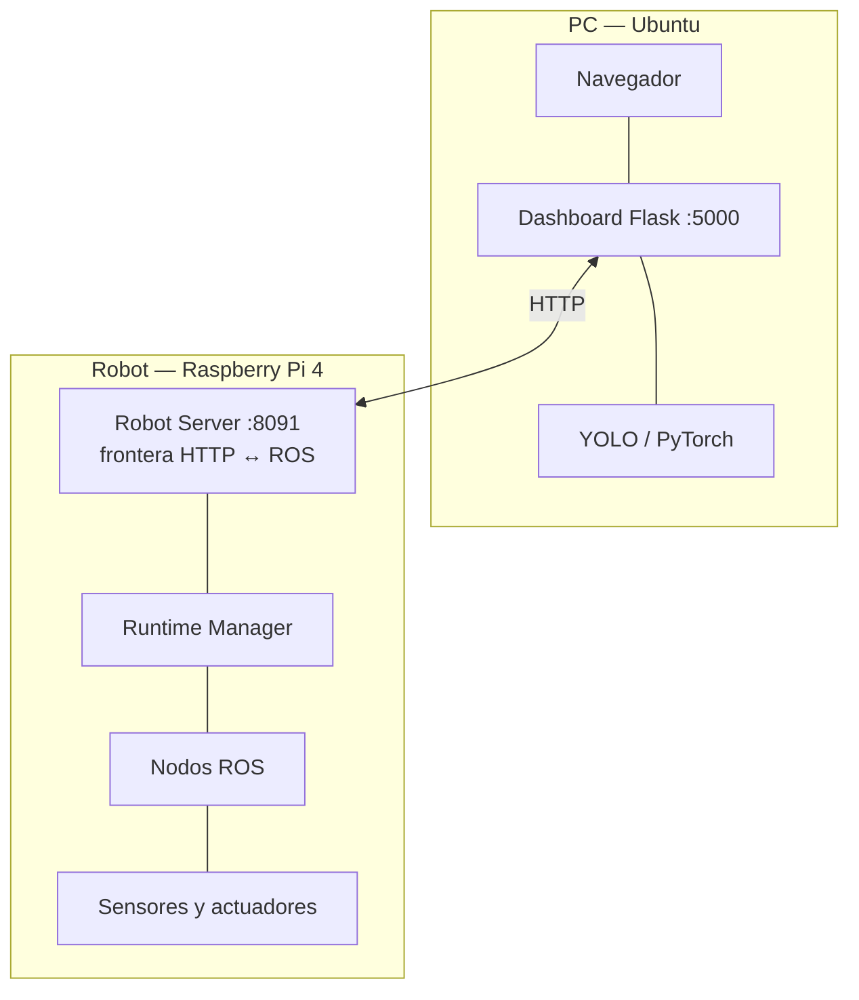
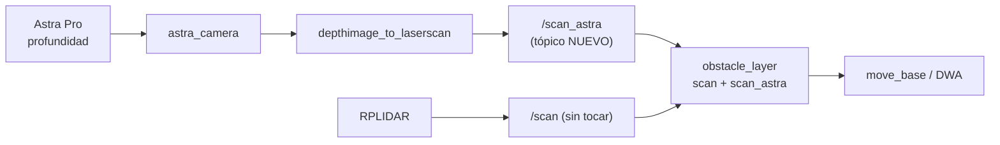

# Reporte técnico final

### Desarrollo de un Sistema de Navegación Autónoma para Plataforma Móvil ROSMASTER X3 mediante Fusión Sensorial RGB-D y LiDAR bajo ROS

**Para quién es y cuándo leerlo**
Para el profesor responsable, la academia que evalúa el servicio social y quien continúe el
proyecto.
Es el documento de cierre: resume qué se hizo, qué se logró, qué no, y por qué.
Los detalles técnicos viven en los documentos anexos; aquí está el argumento.

---

> **Estado de este documento.** La estructura, el contenido técnico y el análisis están
> completos y verificados contra el sistema real. Lo que falta es lo que **sólo puede
> aportar una persona**: nombres, fechas, fotografías y los resultados de ejecutar el
> protocolo de validación. Cada uno de esos huecos está marcado como `[PENDIENTE: ...]` y
> se puede localizar con `grep -rn "PENDIENTE" docs/`.

---

## 1. Datos generales

| Campo | Valor |
|---|---|
| Institución | Tecnológico Nacional de México — Instituto Tecnológico de Colima |
| Departamento | Ingeniería Eléctrica y Electrónica |
| Carrera | Ingeniería Mecatrónica |
| Especialidad | Sistemas Mecatrónicos Inteligentes |
| Modalidad | Servicio Social en Investigación Tecnológica |
| Duración | 6 meses · 20 horas semanales por prestador |
| Prestadores | `[PENDIENTE: nombres y números de control]` |
| Asesor responsable | `[PENDIENTE: nombre y cargo]` |
| Periodo | `[PENDIENTE: fecha de inicio y de término]` |
| Asignatura destinataria | Percepción e Inteligencia Artificial |
| Repositorio | <https://github.com/ToscanoID007/safevision> |

---

## 2. Introducción y justificación

La robótica móvil autónoma exige resolver simultáneamente tres problemas acoplados:
**percibir** el entorno, **saber dónde se está** en él y **decidir cómo moverse**. Cada uno
tiene soluciones maduras, pero integrarlos sobre hardware real —con sus latencias, su ruido
y sus fallos— es donde aparece la ingeniería.

En la especialidad de Sistemas Mecatrónicos Inteligentes se necesitaba una **plataforma
experimental funcional** que permitiera a los estudiantes ejecutar algoritmos modernos en
condiciones reales, y no sólo en simulación. La diferencia no es menor: en simulación las
ruedas no patinan, los sensores no mienten y la red no se cae.

El proyecto SafeVision da respuesta a esa necesidad sobre una plataforma Yahboom ROSMASTER
X3. El resultado es un sistema operativo de extremo a extremo —del sensor al motor, y del
robot al navegador— acompañado de la documentación necesaria para **operarlo, repararlo y
enseñarlo**.

El valor didáctico está tanto en lo que el sistema hace como **en lo que no hace**: sus
limitaciones son medibles, explicables y, por tanto, enseñables. La práctica P02, por
ejemplo, se construye alrededor de determinar experimentalmente qué obstáculos un LiDAR 2D
no puede detectar.

---

## 3. Planteamiento del problema

No se disponía de una plataforma móvil autónoma completamente operativa para prácticas de
percepción robótica e inteligencia artificial. Sin ella, los estudiantes no podían
desarrollar competencias prácticas en estimación de pose, construcción de mapas,
planificación de trayectorias y evasión autónoma de obstáculos.

El problema, además, tenía tres dimensiones que la propuesta original no anticipaba por
completo y que este trabajo tuvo que abordar:

1. **Integración**, no sólo implementación. Los algoritmos (Gmapping, AMCL, `move_base`)
   existen como paquetes de ROS; el trabajo real es hacerlos convivir sobre una Raspberry
   Pi con recursos limitados, con transiciones seguras entre modos incompatibles.
2. **Operabilidad**. Un sistema que sólo funciona en manos de quien lo construyó no sirve
   para docencia. Hacía falta que arrancara solo, se documentara y se pudiera reparar.
3. **Reproducibilidad**. Una plataforma de prácticas que no se puede reinstalar tras un
   fallo de la tarjeta de memoria es un punto único de fallo para toda una asignatura.

---

## 4. Objetivos

### 4.1 Objetivo general

Desarrollar e implementar un sistema de navegación autónoma para la plataforma móvil
ROSMASTER X3 mediante la integración de sensores LiDAR y cámara RGB-D utilizando el
middleware ROS, con la finalidad de generar un prototipo funcional para prácticas
académicas en la asignatura de Percepción e Inteligencia Artificial.

### 4.2 Objetivos específicos y su cumplimiento

| # | Objetivo | Estado |
|---|---|---|
| 1 | Integrar los sensores LiDAR y cámara RGB-D | **PARCIAL** — LiDAR integrado; de la RGB-D se usa el canal RGB, no el de profundidad (§9) |
| 2 | Configurar el entorno de desarrollo bajo ROS | **CUMPLIDO** |
| 3 | Implementar algoritmos de percepción del entorno | **CUMPLIDO** |
| 4 | Desarrollar un sistema de mapeo mediante SLAM | **CUMPLIDO** |
| 5 | Implementar algoritmos de localización | **CUMPLIDO** |
| 6 | Diseñar e implementar planificación de trayectorias | **CUMPLIDO** |
| 7 | Desarrollar estrategias de evasión de obstáculos | **PARCIAL** — evasión 2D completa; sin contribución de la profundidad (§9) |
| 8 | Validar el sistema en entornos estructurados | **PENDIENTE DE EJECUCIÓN** — protocolo listo (`validacion.md`) |
| 9 | Documentar la arquitectura del sistema | **CUMPLIDO** |
| 10 | Elaborar manuales de uso para prácticas | **CUMPLIDO** |

Análisis detallado con referencias a fichero y línea: `docs/analisis-alcance.md`.

---

## 5. Marco teórico

### 5.1 ROS como middleware

ROS (*Robot Operating System*) es un middleware que estructura un sistema robótico como un
grafo de procesos independientes —**nodos**— que se comunican por **tópicos** con un modelo
publicador–suscriptor. El **ROS Master** actúa de registro.

La ventaja para un sistema como éste es el desacoplamiento: el nodo que lee el LiDAR no sabe
quién consume `/scan`, y pueden ser a la vez el algoritmo de localización y el de
planificación. La contrapartida es que ROS 1 **no ofrece autenticación ni cifrado**, lo que
tiene consecuencias de seguridad que se tratan en §7.8.

### 5.2 SLAM y Gmapping

SLAM resuelve un problema circular: localizarse requiere un mapa, y mapear requiere saber
dónde se está. **Gmapping** lo aborda con un *Rao-Blackwellized Particle Filter*: mantiene
múltiples hipótesis de trayectoria, cada una con su mapa asociado, y pondera cada una según
la verosimilitud de las observaciones del LiDAR.

La odometría por sí sola deriva —especialmente con ruedas omnidireccionales sobre suelo
liso, como en esta plataforma—; el *scan matching* corrige esa deriva, y el **cierre de
bucle** permite corregir el error acumulado de golpe al reconocer un lugar ya visitado.

El resultado es una **rejilla de ocupación**: `.pgm` (imagen) + `.yaml` (metadatos),
inseparables.

### 5.3 Localización: AMCL

**AMCL** (*Adaptive Monte Carlo Localization*) es un filtro de partículas sobre un mapa
conocido. Cada partícula es una hipótesis $(x, y, \theta)$; en cada ciclo se propagan con la
odometría, se ponderan comparando el `/scan` real con el esperado desde cada hipótesis, y se
remuestrean.

Dos propiedades importantes en la práctica:

- **Requiere movimiento para converger.** Con el robot parado, la información no aumenta.
- **No corrige la odometría:** publica la transformada `map → odom`, que representa
  exactamente cuánto se ha desviado la odometría. La pose final es la composición
  `map → odom → base_footprint`.

### 5.4 Planificación: `move_base` y DWA

La navegación se estructura en dos niveles sobre **costmaps** —rejillas de coste construidas
por capas: estática (el mapa), de obstáculos (lo que el sensor ve ahora, marcando y
limpiando) y de inflado (margen de seguridad):

| Nivel | Alcance | Función |
|---|---|---|
| **Global** | Todo el mapa | Traza la ruta completa |
| **Local (DWA)** | Ventana 3 × 3 m | Decide la velocidad instantánea |

**DWA** (*Dynamic Window Approach*) evalúa, en cada ciclo, el conjunto de velocidades
$(v, \omega)$ alcanzables dadas las aceleraciones máximas del robot; simula la trayectoria
de cada una, descarta las que colisionan según el costmap local y puntúa el resto por
proximidad a la ruta global, avance hacia el objetivo y holgura frente a obstáculos.

La **capa de inflado** (radio 0,30 m) permite tratar el robot como un punto: al engordar los
obstáculos por el tamaño del robot más un margen, el planificador puede razonar sin
considerar la geometría en cada evaluación.

### 5.5 Detección de objetos: YOLO

**YOLO** (*You Only Look Once*) es un detector de una etapa: una sola pasada de la red
produce cajas delimitadoras y clases simultáneamente, lo que lo hace apto para vídeo. Cada
detección aporta clase, confianza y caja; el umbral de confianza gobierna el compromiso
entre falsos positivos y falsos negativos.

En este sistema la inferencia se ejecuta **en la PC**, no en el robot: la Raspberry Pi no
tiene capacidad para inferencia en tiempo real. Es un reparto de cómputo característico de
la arquitectura *edge*: el sensor donde debe estar, el cómputo pesado donde hay recursos.

### 5.6 Fusión sensorial

Fusionar sensores significa combinar fuentes con características complementarias para
obtener una estimación mejor que la de cualquiera por separado. En este sistema hay
**fusión efectiva en la estimación de pose**: un filtro de Kalman extendido
(`robot_localization`) combina odometría de ruedas con IMU filtrada por Madgwick, y AMCL
añade la corrección del LiDAR contra el mapa.

**No hay fusión en la representación del entorno para navegación.** El costmap se alimenta
de una única fuente: el LiDAR 2D. Es la brecha que se analiza en §9.

La complementariedad que quedaría por explotar es clara:

| Sensor | Fuerte en | Débil en |
|---|---|---|
| LiDAR 2D | Precisión métrica, 360°, robusto a iluminación | **Un solo plano**; ciego a lo que no lo corta |
| Cámara RGB-D | Volumen 3D, textura y color | Campo limitado, sensible a iluminación y a superficies reflectantes |

---

## 6. Metodología

Se siguió la metodología de la propuesta, en seis etapas:

| Etapa | Actividades |
|---|---|
| Análisis y configuración | Auditoría del estado del sistema, inventario del código, verificación del entorno ROS |
| Integración sensorial | LiDAR, IMU con calibración, odometría, cámara |
| Percepción y mapeo | Gmapping, gestión de sesiones de mapeo con *rollback* |
| Localización y navegación | AMCL, `move_base` + DWA, cola de navegación con prevalidación |
| Validación experimental | Protocolo de 87 pruebas (`docs/validacion.md`) |
| Documentación | Manuales, guía de prácticas y este reporte |

**Nota metodológica relevante.** El trabajo partió de un sistema **preexistente y en
evolución**, no de cero. Una parte sustancial del esfuerzo consistió en **auditar qué
funcionaba realmente**, separando lo implementado de lo documentado. Esa auditoría produjo
hallazgos que cambiaron el plan de trabajo —notablemente el descrito en §8.3— y está
registrada en `docs/runtime-boot.md`, `docs/inventory.md` y `docs/estado-actual.md`.

**Principio de verificación aplicado.** Toda afirmación sobre el comportamiento del sistema
se etiquetó con uno de tres niveles: **CONFIRMADO** (evidencia directa en código o en el
robot), **IMPLEMENTADO EN FUENTE, PENDIENTE DE REVALIDACIÓN** (el código existe pero no se
ha probado físicamente) y **RECOMENDACIÓN**. Esta disciplina evita el error más común en
proyectos heredados: confundir *"existe código"* con *"funciona"*.

---

## 7. Desarrollo

### 7.1 Arquitectura general

El sistema se organiza en tres capas con una frontera explícita:

Cuatro decisiones de diseño la sostienen:

1. **El Robot Server es la única frontera HTTP↔ROS.** Una sola superficie que documentar,
   asegurar y versionar.
2. **Los lazos críticos viven en el robot.** `cmd_vel`, *watchdog*, `move_base`,
   cancelación y drivers no dependen de la red. Si el Wi-Fi cae con el robot navegando,
   el robot sigue navegando y sigue frenando ante obstáculos.
3. **El cómputo pesado vive en la PC.**
4. **Captura de cámara única y compartida**, para que varios clientes no multipliquen el
   consumo.

### 7.2 Arranque y gestión de recursos

El robot arranca mediante dos unidades systemd (`safevision-roscore` y
`safevision-robot-server`), verificadas como instaladas, habilitadas e idénticas a las del
repositorio.

Tras arrancar, el sistema levanta **sólo** el ROS Master y el Robot Server. Los recursos que
mueven el robot se encienden **bajo demanda** mediante *perfiles*
(`POST /runtime/profile`), gestionados por `sf_runtime_manager.py`.

Ese gestor no se limita a lanzar procesos: **verifica** que cada recurso está realmente
vivo. Para un nodo no basta con que aparezca en el ROS Master: consulta su `getPid()`. Para
el LiDAR, exige además que `/scan` **entregue un mensaje real**, y si el nodo está registrado
pero mudo lo reinicia automáticamente (hasta dos intentos). Es una lección aprendida de un
modo de fallo real: el RPLIDAR puede quedar vivo y silencioso tras una transición.

> **Consecuencia operativa, verificada en el robot:** tras un arranque en frío el robot
> queda encendido pero **no operable** hasta que alguien aplica un perfil. Es un
> comportamiento **seguro por defecto**, y tiene una implicación práctica que se aborda en
> §8.3.

### 7.3 Integración de sensores

| Sensor | Integración |
|---|---|
| **RPLIDAR A1** | `/dev/rplidar` (regla `udev` estable) → `/scan` a ~10 Hz, con TF estática `base_link → laser` a 11 cm de altura |
| **IMU** | Calibración de fábrica (`imu_calib`) → filtro de **Madgwick** → `/imu/imu_data` |
| **Odometría** | Encoders del chasis → `/odom_raw` |
| **EKF** | `robot_localization` fusiona odometría e IMU → `/odom` |
| **Cámara Orbbec Astra Pro** | Canal **RGB** por V4L2 (`/dev/video0`) → MJPEG 640×480 @30 fps. Canal de **profundidad: no integrado** |

La calibración del giróscopo se ejecuta al arrancar, lo que exige que **el robot esté quieto
durante el arranque**. Es la causa número uno de fallo al aplicar un perfil, y está
documentada en `docs/solucion-problemas.md` §4.2.

### 7.4 Mapeo

Se implementó SLAM 2D con Gmapping, orquestado por `sf_mapping_manager.py`.

La dificultad real no es ejecutar Gmapping, sino **la transición**: mapear y localizarse son
incompatibles, porque ambos publican `/map`. La secuencia implementada:

1. Se exige un perfil activo con mapa (para saber a qué estado volver).
2. Se lanza Gmapping **manteniendo viva la cola de navegación**, porque el gestor necesita
   publicar la cancelación antes de retirar AMCL.
3. Sólo entonces se apagan cola, `move_base`, exportador de pose y AMCL.
4. Al guardar o descartar, se restaura automáticamente el perfil anterior con el mapa que
   corresponda.

Cada escalón tiene ***rollback***: si algo falla a medias, el sistema restaura el estado
anterior en lugar de quedarse en un estado intermedio. En un sistema que controla hardware,
un estado intermedio puede significar un robot con motores activos y sin planificador.

### 7.5 Localización

AMCL sobre el mapa activo, con `odom_model_type: omni` (coherente con la tracción
omnidireccional) y parámetros ajustados para seguimiento reactivo
(`update_min_d: 0.10`, `update_min_a: 0.10`).

La pose se exporta a 10 Hz mediante `sf_pose_exporter.py`, que consulta la transformada
`map → base_footprint` y la escribe en un fichero que el Robot Server publica por HTTP.

> **Nota técnica de interés.** Este es el **único** fichero del runtime que debe ejecutarse
> bajo Python 2.7, porque `tf` depende de una extensión C compilada sólo para Python 2. Se
> verificó experimentalmente: bajo Python 3.7 la importación falla con
> `ImportError: ... PyInit__tf2`. Todo lo demás corre bajo Python 3.7.3. Documentado en
> `docs/anexo-dependencias-robot.md` §2.

### 7.6 Navegación y evasión

`move_base` con planificador global y **DWA** local. Parámetros:
huella del robot ±0,117 × ±0,100 m; costmap local de 3 × 3 m con `rolling_window` a 8 Hz;
`inflation_radius` 0,30 m; `obstacle_range` 3,0 m; `raytrace_range` 3,5 m.

Sobre `move_base`, SafeVision añade dos mecanismos propios:

- **Cola de navegación** (`sf_nav_queue.py`) que encadena puntos y **prevalida cada uno con
  el servicio `make_plan`**: un objetivo inalcanzable se rechaza **antes** de mover el
  robot. La cola queda además atada al mapa activo.
- **Selector de `cmd_vel` con *watchdog***: garantiza exclusión mutua entre mando y
  navegación, detiene el robot tras 0,5 s sin órdenes válidas, y al volver a modo manual
  publica explícitamente la cancelación del objetivo.

> El *watchdog* es, en pocas líneas de código, la pieza de seguridad más importante del
> sistema: hace que la pérdida de comunicación se traduzca en **parada**, no en
> continuación.

### 7.7 Inteligencia artificial

Inferencia YOLO sobre el flujo MJPEG, ejecutada en la PC. El robot mantiene un **catálogo de
modelos** con metadatos (nombre, versión, clases) gestionable por API: importar, exportar,
renombrar, editar metadatos y eliminar.

**Limitación deliberada:** la detección **no realimenta** la navegación. Un objeto detectado
por YOLO no frena ni desvía el robot. Es coherente con el principio de que los lazos
críticos no dependan de la red ni de un modelo estadístico ejecutado remotamente, y se
discute como pregunta de análisis en la práctica P06.

### 7.8 Misiones programadas

Lenguaje de dominio específico con cinco acciones (`ir`, `esperar`, `orientar`, `girar`,
`relocalizar`), variables, aritmética, bucles `for ... range` acotados y condicionales.

El código se analiza con el módulo `ast` y **no se ejecuta con `eval`**: sólo se acepta una
lista blanca de construcciones. Un programa de misión no puede abrir ficheros, importar
módulos ni ejecutar órdenes del sistema.

El flujo es **validar → simular → ejecutar**: ninguna misión llega al robot sin pasar el
analizador y el simulador.

> **Limitación declarada:** `girar()` y `relocalizar()` se aceptan al escribir y validar,
> pero el ejecutor las **rechaza** con *"Acción todavía no habilitada"*. La misión no se
> ejecuta a medias: no arranca. Está documentado en `docs/lenguaje-misiones.md` §2.

### 7.9 Seguridad del sistema

La auditoría de seguridad (`docs/security-scan.md`) encontró y documentó:

- **Ningún servicio tiene autenticación.** Quien alcance el puerto 8091 puede mover el
  robot. La frontera de red es la única frontera de seguridad.
- **ROS 1 no cifra ni autentica.** El `roscore` escucha en la IP de LAN.
- **Credenciales históricas publicadas** en el repositorio (contraseña SSH del robot y
  clave Wi-Fi), presentes en la rama por defecto de GitHub.

> **`[PENDIENTE: rotar la contraseña del robot y la clave del Wi-Fi.` Es independiente del
> alcance técnico y debe resolverse antes de dar por cerrado el proyecto. Procedimiento en
> `docs/security-scan.md` §5.]**

---

## 8. Resultados

### 8.1 Sistema entregado

| Componente | Estado |
|---|---|
| Arranque automático por systemd | ✅ verificado en el robot |
| Teleoperación (mando y teclado web) | ✅ funcionando |
| Vídeo RGB en directo | ✅ verificado (≈4 Mbit/s) |
| Detección YOLO en la PC | ✅ funcionando |
| Mapeo SLAM con sesiones y *rollback* | ✅ funcionando |
| Localización AMCL + pose inicial | ✅ funcionando |
| Navegación autónoma por puntos | ✅ funcionando |
| Cola multipunto con prevalidación | ✅ funcionando |
| Evasión de obstáculos (LiDAR 2D) | ✅ funcionando |
| Gestión de mapas y de modelos | ✅ funcionando |
| Misiones (`ir`, `esperar`, `orientar`) | ✅ funcionando |
| Fusión RGB-D en el costmap | ❌ no integrada (§9) |

### 8.2 Estado verificado del robot

Verificación de sólo lectura realizada sobre el robot el **2026-09-10**:

| Elemento | Valor |
|---|---|
| Sistema | Ubuntu 18.04.6 LTS `aarch64`, kernel 5.4.0-1050-raspi |
| ROS | Melodic, `ros_comm` 1.14.13, **451** paquetes |
| Intérpretes | 3.7.3 (Robot Server), 2.7.17 (roscore y pose exporter), 3.6.9 (sistema) |
| Servicios | Ambos `enabled` y `active (running)` desde el arranque |
| Unidades | Idénticas a las del repositorio |
| Catálogo | 6 mapas, 2 modelos YOLO, 1 misión |

Detalle completo en `docs/estado-actual.md` y `docs/anexo-dependencias-robot.md`.

### 8.3 Hallazgo relevante: el dashboard operativo no estaba versionado

Durante la auditoría se detectó que **el dashboard versionado en el repositorio no puede
aplicar un perfil de runtime**, lo que hacía que el robot, tras arrancar, no fuera operable
desde la interfaz.

La causa resultó no ser una carencia funcional sino **de gestión de versiones**: existe en
el equipo de desarrollo una versión del dashboard **un día más reciente** que la versionada,
con una página dedicada y los cuatro proxies necesarios. Comparada con la versionada, es un
**superconjunto estricto**: 71 rutas frente a 66, sin ninguna eliminada.

> **Lección de ingeniería, y probablemente la más útil del proyecto:** el trabajo del
> frontend se respaldaba copiando directorios con marca de tiempo (38 copias entre el 18 y
> el 20 de agosto) en lugar de versionarlo. El resultado es que **el código que funciona no
> es el código que se entrega**. Es un fallo de proceso, no de programación, y es
> exactamente el tipo de problema que un sistema de control de versiones existe para evitar.

**Resuelto el 2026-09-13:** la prueba V-1 se superó (perfil aplicado en 51 s con los nueve recursos activos) y esa versión del dashboard está integrada en `wip-handoff` desde la etiqueta `v1-validado-pilotada`.

### 8.4 Resultados de la validación

**[PENDIENTE: ejecutar el protocolo de `docs/validacion.md` (87 pruebas agrupadas en 11
bloques) y trasladar aquí el resumen: total de pruebas superadas, fallidas y no aplicables,
con las observaciones relevantes.]**

**[PENDIENTE: incorporar fotografías del robot en operación, capturas del dashboard, del
mapa construido y del costmap con y sin obstáculo.]**

Pruebas cuyo resultado tiene especial valor para este reporte:

| Prueba | Qué demuestra |
|---|---|
| C-2 | El *watchdog* detiene el robot en ≤0,5 s al soltar el control |
| C-6 | El robot sigue navegando con seguridad tras perder la conexión con la PC |
| N-3 | Los objetivos inalcanzables se rechazan **sin mover el robot** |
| M-7 | El *rollback* de mapeo restaura el estado anterior ante un fallo |
| **N-9** | **El LiDAR 2D no detecta obstáculos fuera de su plano** — evidencia de §9 |

---

## 9. Discusión: el alcance de la fusión RGB-D

Es la discusión más importante del reporte y merece ser explícita.

### 9.1 Lo que se prometió y lo que hay

El título del proyecto compromete *"Fusión Sensorial RGB-D y LiDAR"*. En robótica móvil eso
significa que **ambos sensores contribuyen a la representación del entorno que usa el
planificador**.

Lo implementado: el costmap declara **una sola fuente de observación**, el LiDAR. La cámara
participa en un circuito distinto —vídeo hacia la PC, inferencia YOLO, superposición en la
interfaz— que **no toca la navegación**.

Hay fusión sensorial real en la **estimación de pose** (EKF sobre odometría e IMU, más la
corrección de AMCL con el LiDAR), pero no en la **representación del entorno**.

### 9.2 La consecuencia física

El RPLIDAR barre un único plano horizontal a 11 cm del suelo. El robot, por tanto, **no
detecta**: mesas y repisas por encima de ese plano con patas fuera de trayectoria;
escalones, desniveles y huecos; objetos por debajo del haz; y obstáculos colgantes.

No es un defecto de implementación: es la limitación intrínseca de un LiDAR 2D, y es
exactamente lo que la fusión RGB-D resuelve.

### 9.3 Lo que sí está listo

La verificación del robot arrojó un resultado que **redimensiona la brecha**:

| Pieza | Estado |
|---|---|
| Cámara Orbbec Astra Pro | **conectada y enumerada** (USB `2bc5:0501`) |
| Su canal RGB | **ya en uso** — es la cámara que alimenta el vídeo y YOLO |
| Driver `astra_camera` | **compilado** en `library_ws`, dentro del `CMAKE_PREFIX_PATH` |
| `depthimage_to_laserscan` | **instalado** (`ros-melodic-depthimage-to-laserscan 1.0.8`) |
| Launches del fabricante | presentes |
| OpenNI y RTAB-Map | instalados |

**No hay que adquirir, compilar ni instalar nada.** El montaje y la preparación —la parte
más laboriosa del objetivo 1— están hechos. Lo que falta es el cableado ROS y su validación.

### 9.4 Recomendación técnica

De las cinco estrategias consideradas (handoff §71), se recomienda la **opción A:
profundidad → `LaserScan` → costmap**, por ser la única que cierra los objetivos 1 y 7 sin
poner en riesgo lo que ya funciona:

Clave del diseño: la profundidad publica en un **tópico nuevo** y se **añade** como segunda
fuente. El LiDAR conserva `/scan` intacto, de modo que **desactivar la nueva fuente devuelve
el sistema exactamente al estado actual**.

> ⚠️ **Advertencia documentada:** el launch `astrapro_bringup.launch` del fabricante
> publica la profundidad **en `/scan`** y remapea `camera_link → laser`, es decir, usa la
> cámara **en lugar del** LiDAR. Copiarlo tal cual **degradaría** el sistema.

El cambio se reduce a un launch nuevo, una línea modificada y un bloque añadido en
`sf_costmap_common.yaml`, más una transformada estática. Requeriría **10 pruebas de
hardware** (`docs/analisis-alcance.md` §4.4), de las cuales las decisivas son: carga de CPU
y RAM en la Raspberry Pi, ancho de banda USB con LiDAR y dos flujos de cámara simultáneos, y
falsos positivos por reflejos del suelo.

Estimación: **entre media jornada y dos jornadas** de trabajo con el robot presente.

### 9.5 Tres caminos

| Camino | Esfuerzo | Discurso |
|---|---|---|
| **1.** Entregar lo actual y declarar RGB-D como trabajo futuro | Nulo | Navegación autónoma con LiDAR 2D, operativa y documentada; fusión especificada con el hardware ya instalado |
| **2.** Cerrar la opción A *(recomendado)* | ½ a 2 jornadas | Fusión LiDAR + RGB-D validada con obstáculos que el LiDAR 2D no ve. **Cumple el título literalmente** |
| **3.** RGB-D completo (RTAB-Map, navegación 3D) | Semanas | Fuera del alcance de un servicio social |

**Decisión tomada:** camino 2, opción A, a acometer tras la validación con LiDAR solo; en esta entrega se declara como trabajo futuro con el hardware y el software ya instalados.

---

## 10. Conclusiones

1. **Se logró una plataforma funcional para prácticas**, que cubre el ciclo completo de la
   robótica móvil: percepción, mapeo, localización, planificación, evasión, detección de
   objetos y programación de comportamientos. Ocho de los diez objetivos específicos están
   cumplidos; los dos parciales corresponden a la misma brecha, analizada en §9.

2. **La arquitectura en tres capas con frontera explícita demostró ser la decisión más
   valiosa.** Mantener los lazos de control en el robot hace que el sistema se comporte de
   forma segura ante fallos de red, y permite que la carga de inteligencia artificial se
   ejecute donde hay recursos.

3. **Los mecanismos de seguridad son simples y efectivos.** El *watchdog* de 0,5 s, la
   exclusión mutua del selector, la prevalidación con `make_plan` y el *rollback* del mapeo
   suman pocas líneas de código y evitan las familias de fallo más peligrosas: robot sin
   operador, dos fuentes disputando los motores, objetivos imposibles y estados intermedios.

4. **Las limitaciones del sistema son medibles y, por tanto, enseñables.** Que el LiDAR 2D
   no vea una mesa no es sólo una carencia: es la práctica P02 y la justificación de la
   fusión sensorial. Un sistema cuyos límites se conocen y se documentan es mejor material
   didáctico que uno que aparenta no tenerlos.

5. **El principal riesgo detectado no fue técnico sino de proceso.** El código que operaba
   el robot no coincidía con el versionado (§8.3). La documentación y el control de
   versiones no son trabajo accesorio: son lo que separa un prototipo de un entregable.

6. **La documentación producida convierte el sistema en transferible.** Antes, operar el
   robot requería el conocimiento tácito de quien lo construyó; ahora existen manuales de
   instalación, operación y diagnóstico, un manifiesto de dependencias, un protocolo de
   validación y una guía de prácticas.

**[PENDIENTE: añadir una conclusión sobre los resultados cuantitativos de la validación, una
vez ejecutada.]**

---

## 11. Trabajo futuro

En orden de prioridad.

### 11.1 Inmediato (antes de cerrar el proyecto)

| # | Tarea | Por qué |
|---|---|---|
| 1 | Versionar el dashboard operativo (§8.3) | El producto 1 depende hoy de un directorio sin versionar |
| 2 | Ejecutar `docs/validacion.md` | Sin ello, el objetivo 8 no tiene evidencia |
| 3 | **Rotar las credenciales expuestas** | Están publicadas en la rama por defecto de GitHub |
| 4 | Depurar el catálogo de mapas | Quedan mapas de prueba sin limpiar |
| 5 | Crear la imagen de respaldo de la microSD | Hoy la plataforma tiene un punto único de fallo |

### 11.2 Corto plazo

| # | Tarea |
|---|---|
| 6 | **Fusión RGB-D, opción A** (§9.4) |
| 7 | Implementar `girar()` y `relocalizar()`, o retirarlas del lenguaje |
| 8 | Unificar la semántica de `/health` con la del gestor de runtime |
| 9 | Aplicación automática de un perfil por defecto tras el arranque |

### 11.3 Medio plazo — deuda técnica

Resumen del plan de refactorización del handoff técnico (§62), **expresamente fuera del
alcance de este servicio social**:

| Fase | Contenido |
|---|---|
| 1 | Limpieza del repositorio: separar vigente, heredado, herramientas y despliegue |
| 2 | Contratos compartidos (`safevision_protocol`) para eliminar la validación duplicada |
| 3 | División de los monolitos por dominio (`sf_robot_server.py` son 5.060 líneas) |
| 4 | Centralizar la configuración: eliminar rutas, IP y puertos incrustados |
| 5 | Tests: unitarios, de integración y de hardware |

### 11.4 Largo plazo

Contenerización en el robot, desacoplamiento del frontend, y —si algún día se justifica— un
plano de control en la nube con autenticación, identidad de robot y telemetría. Cualquiera
de estas líneas debe abordarse **de una en una** y sólo sobre una línea base validada.

> **Una advertencia para quien continúe.** El sistema funciona. La tentación de reescribirlo
> "bien" antes de tener tests y una línea base medida es el camino más rápido a un sistema
> que ya no funciona. El propio handoff técnico lo formula como regla: no cambiar ROS,
> Python, contenedores, dashboard, navegación y profundidad a la vez.

---

## 12. Referencias

1. Quigley, M. et al. (2009). *ROS: an open-source Robot Operating System*. ICRA Workshop
   on Open Source Software.
2. Grisetti, G., Stachniss, C., Burgard, W. (2007). *Improved Techniques for Grid Mapping
   with Rao-Blackwellized Particle Filters*. IEEE Transactions on Robotics, 23(1), 34-46.
3. Fox, D., Burgard, W., Dellaert, F., Thrun, S. (1999). *Monte Carlo Localization:
   Efficient Position Estimation for Mobile Robots*. AAAI.
4. Fox, D., Burgard, W., Thrun, S. (1997). *The Dynamic Window Approach to Collision
   Avoidance*. IEEE Robotics & Automation Magazine, 4(1), 23-33.
5. Thrun, S., Burgard, W., Fox, D. (2005). *Probabilistic Robotics*. MIT Press.
6. Redmon, J., Divvala, S., Girshick, R., Farhadi, A. (2016). *You Only Look Once: Unified,
   Real-Time Object Detection*. CVPR.
7. Madgwick, S., Harrison, A., Vaidyanathan, R. (2011). *Estimation of IMU and MARG
   orientation using a gradient descent algorithm*. IEEE ICORR.
8. Moore, T., Stouch, D. (2014). *A Generalized Extended Kalman Filter Implementation for
   the Robot Operating System*. IAS-13.
9. Marder-Eppstein, E. et al. (2010). *The Office Marathon: Robust Navigation in an Indoor
   Office Environment*. ICRA.
10. Documentación oficial de ROS Melodic: `navigation`, `gmapping`, `amcl`, `move_base`,
    `robot_localization`, `depthimage_to_laserscan`. <http://wiki.ros.org>
11. Yahboom. *ROSMASTER X3 — documentación del fabricante y paquetes `yahboomcar_ws`*.

**[PENDIENTE: completar con las referencias específicas que se hayan consultado durante el
desarrollo, en el formato que exija la academia.]**

---

## 13. Anexos

Toda la documentación técnica forma parte de este reporte por referencia:

### A. Estado y verificación
| Anexo | Documento |
|---|---|
| A.1 | [`estado-actual.md`](estado-actual.md) — estado operativo verificado |
| A.2 | [`anexo-dependencias-robot.md`](anexo-dependencias-robot.md) — manifiesto de dependencias |
| A.3 | [`anexo-ros-melodic.txt`](anexo-ros-melodic.txt) — 451 paquetes ROS con versión |
| A.4 | [`anexo-pip-freeze.txt`](anexo-pip-freeze.txt) — 106 paquetes de Python |

### B. Arquitectura y referencia técnica
| Anexo | Documento |
|---|---|
| B.1 | [`arquitectura.md`](arquitectura.md) — capas, grafo ROS y flujos |
| B.2 | [`runtime-boot.md`](runtime-boot.md) — arranque del runtime |
| B.3 | [`api-robot-server.md`](api-robot-server.md) — los 44 endpoints |
| B.4 | [`lenguaje-misiones.md`](lenguaje-misiones.md) — el DSL |

### C. Instalación y operación
| Anexo | Documento |
|---|---|
| C.1 | [`instalacion-pc.md`](instalacion-pc.md) |
| C.2 | [`instalacion-robot.md`](instalacion-robot.md) |
| C.3 | [`red.md`](red.md) |
| C.4 | [`manual-operacion.md`](manual-operacion.md) — **manual técnico de operación** |
| C.5 | [`solucion-problemas.md`](solucion-problemas.md) |

### D. Validación y docencia
| Anexo | Documento |
|---|---|
| D.1 | [`validacion.md`](validacion.md) — protocolo de 87 pruebas |
| D.2 | [`practicas/`](practicas/) — **guía de prácticas P01-P06** |

### E. Análisis y auditoría
| Anexo | Documento |
|---|---|
| E.1 | [`analisis-alcance.md`](analisis-alcance.md) — propuesta frente a lo implementado |
| E.2 | [`inventory.md`](inventory.md) — inventario del código heredado |
| E.3 | [`security-scan.md`](security-scan.md) — auditoría de credenciales |
| E.4 | [`handoff-2026-09.md`](handoff-2026-09.md) — handoff técnico auditado |
| E.5 | [`propuesta-servicio-social.md`](propuesta-servicio-social.md) — propuesta original |

### F. Evidencias

**[PENDIENTE: incorporar fotografías del robot y del laboratorio, capturas del dashboard en
operación, imagen del mapa construido, capturas del costmap con y sin obstáculo, y
fotografías de las sesiones de prácticas con estudiantes, si las hubiera.]**

---

**[PENDIENTE: firmas y fechas requeridas por el formato institucional del TecNM.]**
